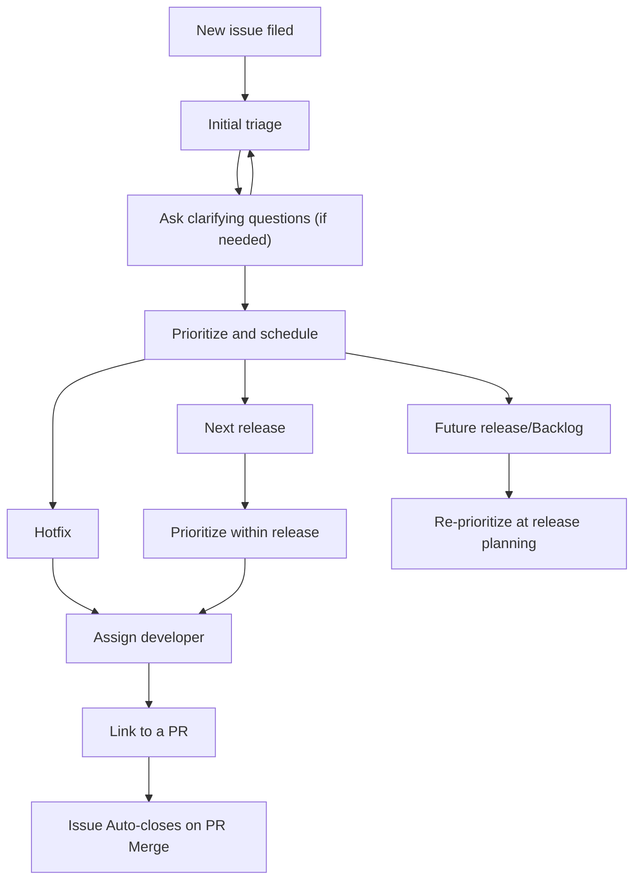

# Issue Triage

## Overview

Summary of the issue triage methodology used for __PROJECT_NAME__

### Intended audience

Developers | Project Leads

### See also

- [Issues](maintainers/work-management/issues.md)

## Triage goals

__PROJECT_NAME__ is continuously triaging new issues and re-triaging existing issues frequently. This is to ensure that high priority issues are remedied in a timely manner and the community receives frequent updates on a filed issue.

## Triage process

### Timing 

- Label and prioritize new issues within **5 business days**
- Re-prioritize existing issues **every week** using the project's issue tracking boards

### Tracking boards

For each project there is one GitHub Project that contains multiple views, and can be filtered on the fly to understand the ongoing work, such as:
- Roadmap
- Open Bugs
- Feature Requests

See [Release Board](maintainers/work-management/github_projects.md) for a deep dive on the project boards.

> **Note**
> 
> In leveraging the tracking boards for issue management, project leads can _schedule_ issues by placing them in the appropriate release and then _prioritize_ issues by either a project column, label, or dragging & sorting the issues from highest priority at the top of the column to lowest at the bottom.

By maintaining the issues in the GitHub Project, filers and the community will see updates to the issue and can get a sense of when they can expect feedback. For example, on a given issue a user may see the release set as `Product Backlog`. This allows the filer or the community to comment on if they believe the issue should be addressed faster.

## Process cycle

The general process cycle for every issue is:

Issues can be `closed as not planned` during the `Initial triage` step and will be appropriately documented as to why. Examples include: duplicate issues, issues determined to be out of scope, and/or issues that won't be fixed.

### New issue filed

New issues should be filed with an issue template from the project. This ensures issue quality and helps identify and move issues to the correct project views for triage.

### Finding issues

Issues that do not have a `Release` value in the GitHub Project require triage.

### Initial triage

__PROJECT_LEAD: DEFINE WHO/WHEN HERE__

1. Ensure the issue type is correct, i.e. is the issue really a bug or is it a feature request?
2. Review the content of the issue, has the filer provided all of the needed information for that issue type? If not, ask for clarification
3. Add any relevant [project fields](maintainers/work-management/github_projects.md)
4. Consider adding good first issue or help wanted labels to the issue if applicable
5. Set the `Release` in the project to the decided release, this removes it from the triage view in the projects

### Assigning developers

Developers should be assigned to issues they are responsible for delivering. Try to limit overcommitting developers. A general rule is to limit active development to **5 or fewer** issues.

> **Warning**
> 
> This is crucial for community involvement as an assigned issue looks like the issue is covered.

### Link to PR

Every [Pull Request](maintainers/work-management/prs.md) should have the issue number in the descriptions of the PR with `Closes #[issue number]` so when the PR is merged the issue that created the PR will automatically close as well and they will be linked in the project.
