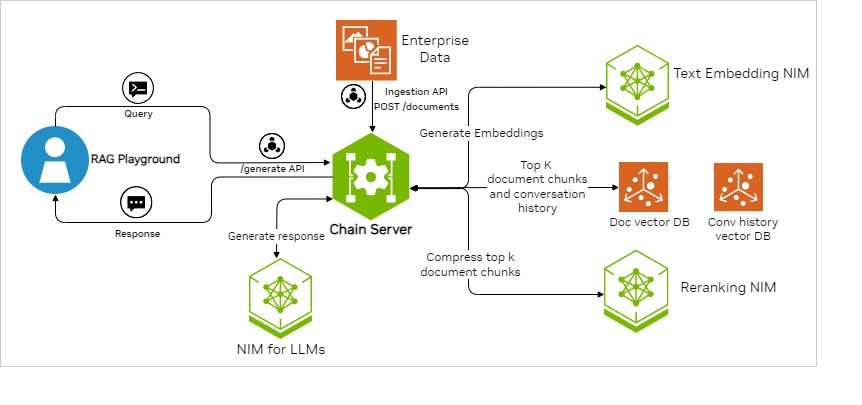

<!--
  SPDX-FileCopyrightText: Copyright (c) 2023 NVIDIA CORPORATION & AFFILIATES. All rights reserved.
  SPDX-License-Identifier: Apache-2.0
-->

# Multi-Turn RAG Example

## Example Features

This example showcases multi-turn conversational AI in a RAG pipeline.
The chain server stores the conversation history and knowledge base in a vector database and retrieves them at runtime to understand contextual queries.

The example supports ingestion of PDF and text files.
The documents are ingested in a dedicated document vector store, multi_turn_rag.
The prompt for the example is tuned to act as a document chat bot.
To maintain the conversation history, the chain server stores the previously asked query and the model's generated answer as a text entry in a different and dedicated vector store for conversation history, conv_store.
Both of these vector stores are part of a LangChain [LCEL](https://python.langchain.com/docs/expression_language/) chain as LangChain Retrievers.
When the chain is invoked with a query, the query passes through both the retrievers.
The retriever retrieves context from the document vector store and the closest-matching conversation history from conversation history vector store. The document chunks retrieved from the document vector store are then passed through a reranker model to determine the most relevant top_k context. The context is then passed onto the LLM prompt for response generation.
Afterward, the chunks are added into the LLM prompt as part of the chain.

|          Model          |        Embedding        |        Ranking (Optional)        | Framework | Vector Database |  File Types  |
| ----------------------- | ----------------------- | -------------------------------- | --------- | --------------- | ------------ |
| meta/llama3-8b-instruct | nvidia/nv-embedqa-e5-v5 | nvidia/nv-rerankqa-mistral-4b-v3 | LangChain | Milvus          | TXT, PDF, MD |



## Prerequisites

Complete the [common prerequisites](../../../../docs/common-prerequisites.md).

## Build and Start the Containers

1. Export your NVIDIA API key as an environment variable:

   ```text
   export NVIDIA_API_KEY="nvapi-<...>"
   ```

1. Start the containers:

   ```console
   cd RAG/examples/advanced_rag/multi_turn_rag/
   docker compose up -d --build
   ```

   *Example Output*

   ```output
   ✔ Network nvidia-rag                               Created
   ✔ Container milvus-etcd                            Running
   ✔ Container milvus-minio                           Running
   ✔ Container milvus-standalone                      Running
   ✔ Container chain-server                           Started
   ✔ Container rag-playground                         Started
   ```

1. Confirm the containers are running:

   ```console
   docker ps --format "table {{.ID}}\t{{.Names}}\t{{.Status}}"
   ```

   *Example Output*

   ```output
   CONTAINER ID   NAMES               STATUS
   dd4fc3da6c9c   rag-playground      Up About a minute
   ac1f039a1db8   chain-server        Up About a minute
   cd0a57ee20e0   milvus-standalone   Up 2 hours
   a36370e7ed75   milvus-minio        Up 2 hours (healthy)
   a796a4e59b68   milvus-etcd         Up 2 hours (healthy)
   ```

1. Open a web browser and access <http://localhost:8090> to use the RAG Playground.

   Refer to [Using the Sample Web Application](../../../../docs/using-sample-web-application.md)
   for information about uploading documents and using the web interface.

## Next Steps

- [Vector Database Customizations](../../../../docs/vector-database.md)
- Stop the containers by running `docker compose down`.
- Use the [RAG Application: Multi Turn Agent](https://registry.ngc.nvidia.com/orgs/ohlfw0olaadg/teams/ea-participants/helm-charts/rag-app-multiturn-chatbot)
  Helm Chart to deploy this example in Kubernetes.
