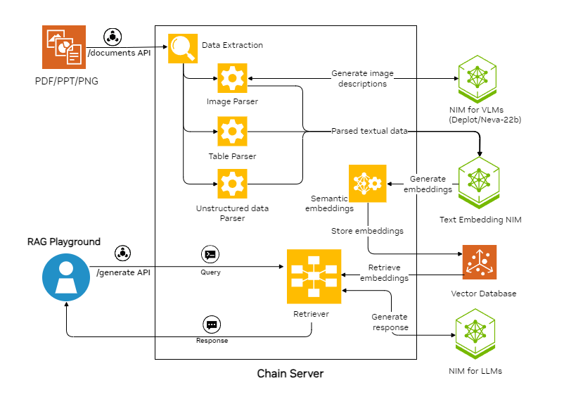

<!--
  SPDX-FileCopyrightText: Copyright (c) 2023 NVIDIA CORPORATION & AFFILIATES. All rights reserved.
  SPDX-License-Identifier: Apache-2.0
-->

# Multimodal RAG Example

## Example Features

This example demonstrates how work with multimodal data.
It showcases multimodal parsing of documents - images, tables, text through multimodal LLM APIs residing in Nvidia API Catalog. The example generates image descriptions using VLMs as shown in the diagram below.
The example works with PDF, PPTX, and PNG files.
The chain server extracts information from the files such as graphs and plots, as well as text and tables.

| Model                   | Embedding                | Framework | Vector Database | File Types     |
| ----------------------- | ------------------------ | --------- | --------------- | -------------- |
| meta/llama3-8b-instruct for response generation, google/Deplot for graph to text convertion and Neva-22B for image to text convertion | nvidia/nv-embedqa-e5-v5  | LangChain | Milvus          | PDF, PPTX, PNG |



## Prerequisites

Complete the [common prerequisites](../../../../docs/common-prerequisites.md).

## Build and Start the Containers

1. Export your NVIDIA API key as an environment variable:

   ```text
   export NVIDIA_API_KEY="nvapi-<...>"
   ```

1. Start the containers:

   ```console
   cd RAG/examples/advanced_rag/multimodal_rag/
   docker compose up -d --build
   ```

   *Example Output*

   ```output
    ✔ Network nvidia-rag           Created
    ✔ Container rag-playground     Started
    ✔ Container milvus-minio       Started
    ✔ Container chain-server       Started
    ✔ Container milvus-etcd        Started
    ✔ Container milvus-standalone  Started
   ```

1. Confirm the containers are running:

   ```console
   docker ps --format "table {{.ID}}\t{{.Names}}\t{{.Status}}"
   ```

   *Example Output*

   ```output
   CONTAINER ID   NAMES               STATUS
   39a8524829da   rag-playground      Up 2 minutes
   bfbd0193dbd2   chain-server        Up 2 minutes
   ec02ff3cc58b   milvus-standalone   Up 3 minutes
   6969cf5b4342   milvus-minio        Up 3 minutes (healthy)
   57a068d62fbb   milvus-etcd         Up 3 minutes (healthy)
   ```

1. Open a web browser and access <http://localhost:8090> to use the RAG Playground.

   Refer to [Using the Sample Web Application](../../../../docs/using-sample-web-application.md)
   for information about uploading documents and using the web interface.

## Next Steps

- [Vector Database Customizations](../../../../docs/vector-database.md)
- Stop the containers by running `docker compose down`.
- Use the [RAG Application: Multimodal Chatbot](https://registry.ngc.nvidia.com/orgs/ohlfw0olaadg/teams/ea-participants/helm-charts/rag-app-multimodal-chatbot)
  Helm chart to deploy this example in Kubernetes.