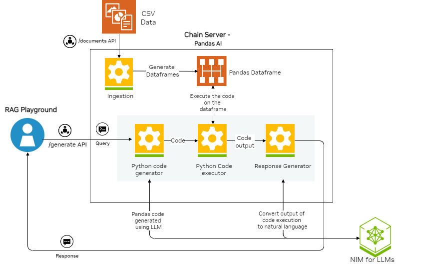

<!--
  SPDX-FileCopyrightText: Copyright (c) 2023 NVIDIA CORPORATION & AFFILIATES. All rights reserved.
  SPDX-License-Identifier: Apache-2.0
-->

# Structured Data RAG

## Example Features

This example demonstrates how to use RAG with structured CSV data.

This example uses models from the NVIDIA API Catalog.
This approach does not require embedding models or vector database solutions.
Instead, the example uses [PandasAI](https://docs.pandas-ai.com/en/latest/) to manage the workflow.

For ingestion, the query server loads the structured data from a CSV file into a Pandas dataframe.
The query server can ingest multiple CSV files, provided the files have identical columns.
Ingestion of CSV files with differing columns is not supported and results in an exception.

The core functionality uses a PandasAI agent to extract information from the dataframe.
This agent combines the query with the structure of the dataframe into an LLM prompt.
The LLM then generates Python code to extract the required information from the dataframe.
Subsequently, this generated code is executed on the dataframe and yields an output dataframe.

To demonstrate the example, sample CSV files are available.
These are part of the structured data example Helm chart and represent a subset of the [Microsoft Azure Predictive Maintenance](https://www.kaggle.com/datasets/arnabbiswas1/microsoft-azure-predictive-maintenance) from Kaggle.
The CSV data retrieval prompt is specifically tuned for three CSV files from this dataset: `PdM_machines.csv`, `PdM_errors.csv`, and `PdM_failures.csv`.
The CSV files to use are specified in the `docker-compose.yaml` file by updating the environment variable `CSV_NAME`.
The default value is `PdM_machines`, but can be changed to `PdM_errors` or `PdM_failures`.

| Model                    | Embedding                | Framework | Vector Database | File Types |
| ------------------------ | ------------------------ | --------- | --------------- | ---------- |
| meta/llama3-70b-instruct | None | Custom    | None            | CSV        |



## Prerequisites

Complete the [common prerequisites](../../../../docs/common-prerequisites.md).

## Build and Start the Containers

1. Export your NVIDIA API key as an environment variable:

   ```text
   export NVIDIA_API_KEY="nvapi-<...>"
   ```

1. Start the containers:

   ```console
   cd RAG/examples/advanced_rag/structured_data_rag/
   docker compose up -d --build
   ```

   *Example Output*

   ```output
    ✔ Network nvidia-rag           Created
    ✔ Container rag-playground     Started
    ✔ Container milvus-minio       Started
    ✔ Container chain-server       Started
    ✔ Container milvus-etcd        Started
    ✔ Container milvus-standalone  Started
   ```

1. Confirm the containers are running:

   ```console
   docker ps --format "table {{.ID}}\t{{.Names}}\t{{.Status}}"
   ```

   *Example Output*

   ```output
   CONTAINER ID   NAMES               STATUS
   39a8524829da   rag-playground      Up 2 minutes
   bfbd0193dbd2   chain-server        Up 2 minutes
   ec02ff3cc58b   milvus-standalone   Up 3 minutes
   6969cf5b4342   milvus-minio        Up 3 minutes (healthy)
   57a068d62fbb   milvus-etcd         Up 3 minutes (healthy)
   ```

1. Open a web browser and access <http://localhost:8090> to use the RAG Playground.

   Refer to [Using the Sample Web Application](../../../../docs/using-sample-web-application.md)
   for information about uploading documents and using the web interface.

## Next Steps

- [Vector Database Customizations](../../../../docs/vector-database.md)
- Stop the containers by running `docker compose down`.
- Use the [RAG Application: Structured Data Agent](https://registry.ngc.nvidia.com/orgs/ohlfw0olaadg/teams/ea-participants/helm-charts/rag-app-structured-data-chatbot)
  Helm chart to deploy this example in Kubernetes.
