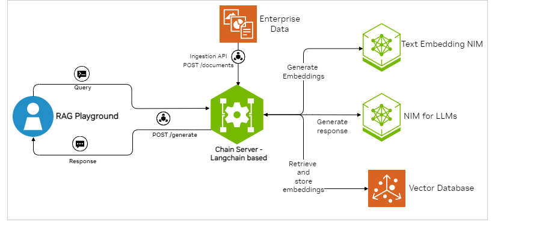

<!--
  SPDX-FileCopyrightText: Copyright (c) 2023 NVIDIA CORPORATION & AFFILIATES. All rights reserved.
  SPDX-License-Identifier: Apache-2.0
-->

# Basic RAG Using LangChain

## Example Features

This example deploys a basic RAG pipeline for chat Q&A and serves inferencing from an NVIDIA API Catalog endpoint.
You do not need a GPU on your machine to run this example.

| Model                    | Embedding                | Framework | Vector Database | File Types   |
| ------------------------ | ------------------------ | --------- | --------------- | ------------ |
| meta/llama3-70b-instruct | nvidia/nv-embedqa-e5-v5 | LangChain | Milvus          | TXT, PDF, MD |



## Prerequisites

Complete the [common prerequisites](../../../../docs/common-prerequisites.md).

## Build and Start the Containers

1. Export your NVIDIA API key as an environment variable:

   ```text
   export NVIDIA_API_KEY="nvapi-<...>"
   ```

1. Start the containers:

   ```console
   cd RAG/examples/basic_rag/langchain/
   docker compose up -d --build
   ```

   *Example Output*

   ```output
    ✔ Network nvidia-rag           Created
    ✔ Container rag-playground     Started
    ✔ Container milvus-minio       Started
    ✔ Container chain-server       Started
    ✔ Container milvus-etcd        Started
    ✔ Container milvus-standalone  Started
   ```

1. Confirm the containers are running:

   ```console
   docker ps --format "table {{.ID}}\t{{.Names}}\t{{.Status}}"
   ```

   *Example Output*

   ```output
   CONTAINER ID   NAMES               STATUS
   39a8524829da   rag-playground      Up 2 minutes
   bfbd0193dbd2   chain-server        Up 2 minutes
   ec02ff3cc58b   milvus-standalone   Up 3 minutes
   6969cf5b4342   milvus-minio        Up 3 minutes (healthy)
   57a068d62fbb   milvus-etcd         Up 3 minutes (healthy)
   ```

1. Open a web browser and access <http://localhost:8090> to use the RAG Playground.

   Refer to [Using the Sample Web Application](../../../../docs/using-sample-web-application.md)
   for information about uploading documents and using the web interface.

## Next Steps

- [Vector Database Customizations](../../../../docs/vector-database.md)
- Stop the containers by running `docker compose down`.
