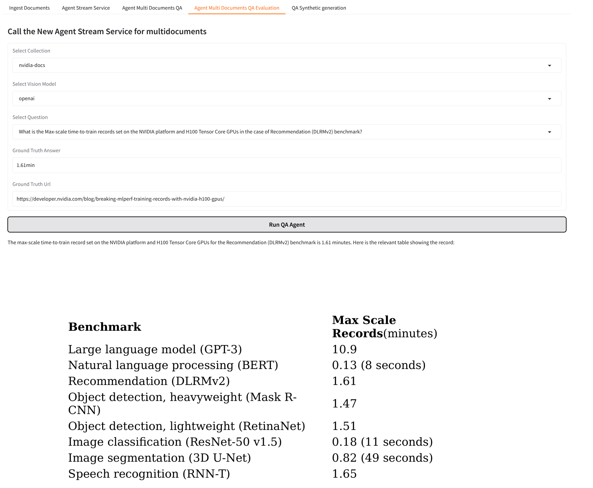
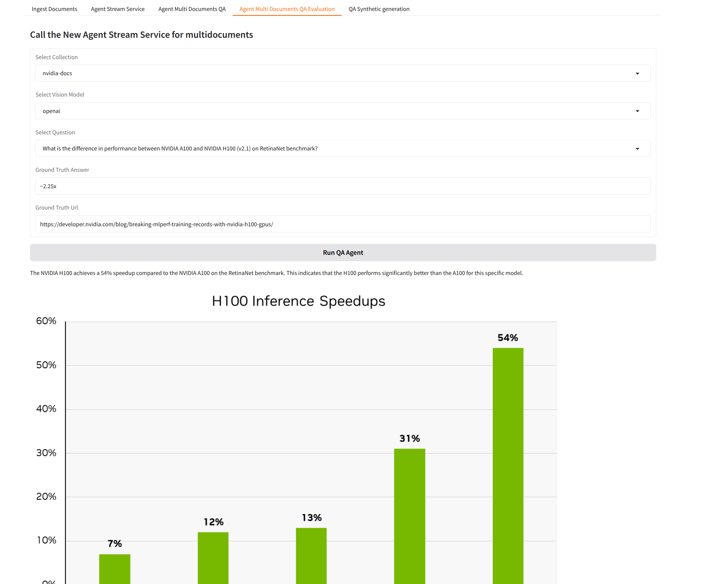

# Introduction

This is a multimodal retrieval using long context. You will be able to ingest HTML documents and ask questions about the document. The tool will allow you to find answers inside the images and the tables.

Here is an example:




The tool uses an openai vision model or an nvidia vision model (llama v3.2 90B)


### Setup details

There are two setups that need to be spun up:

- Langgraph that runs the agent
- Mongodb and langserve that run the database and some services that can be tested along with the Gradio UI to test

The idea is that you have a gradio UI that allows you to ingest html documents and then you can query the agent that is provided by langgraph.


# QuickStart

In this setup we will launch the langgraph agent in dev mode on the host machine and the rest of the setup will be hosted in docker containers, configured through docker compose.
You can also launch langgraph with the containers with `langgraph up`, in that case you don't need an extra .env.lg file (see below)

## Langgraph setup in the host machine

Run this command from the root of the repository (the one with the  `langgraph.json` and `docker-compose.yml` files)

Install a venv:

```shell
python3 -m venv lb-venv
source ./lg-venv/bin/activate
pip install -r requirements.txt
```


## Create the env files

You need to create two .env files (one for the docker compose and one for the langgraph agent)

### .env

Create a .env file in the root directory of this repository (the one with the `langgraph.json` and `docker-compose.yml` files)

```shell
MONGO_INITDB_ROOT_USERNAME=admin
MONGO_INITDB_ROOT_PASSWORD=secret
MONGO_HOST=mongodb
MONGO_PORT=27017
OPENAI_API_KEY=
LANGCHAIN_API_KEY=
LANGSMITH_API_KEY=
LANGGRAPH_CLOUD_LICENSE_KEY=
NVIDIA_API_KEY=
IMAGES_HOST=localhost
AGENTS_HOST=
AGENTS_PORT=2024
```

Normally LANGCHAIN_API_KEY and LANGSMITH_API_KEY have the same value. 

AGENTS_HOST is the IP address of the host where you are running docker. It could be the IP address of your PC for instance.

### .env.lg

We need this because we want to launch langgraph in dev mode, so to be able to reach mongodb from inside the langgraph agent we need to set its hostname to the localhost. 

It should be located in the root of the repository (the one with the `langgraph.json` and `docker-compose.yml` files)

```shell
MONGO_INITDB_ROOT_USERNAME=admin
MONGO_INITDB_ROOT_PASSWORD=secret
MONGO_HOST=localhost
MONGO_PORT=27017
OPENAI_API_KEY=
LANGCHAIN_API_KEY=
LANGSMITH_API_KEY=
LANGGRAPH_CLOUD_LICENSE_KEY=
NVIDIA_API_KEY=
IMAGES_HOST=localhost
AGENTS_HOST=localhost
AGENTS_PORT=2024
```

# Launch the mongodb and gradio services

Update the `.env` file adding your API Keys.

Launch the docker compose services

```shell
docker compose up --build
```
then you can connect to `http://localhost:7860` to ingest documents

# Launch langgraph

```bash
langgraph dev --host 0.0.0.0
```

## Test Langgraph

```bash
curl --request POST \
    --url http://localhost:2024/runs/stream \
    --header 'Content-Type: application/json' \
    --data '{
    "assistant_id": "agent",
    "input": {
        "messages": [
            {
                "role": "user",
                "content": "What is the harness?"
            }
        ]
    },
    "metadata": {},
    "config": {
        "configurable": {
            "collection_name": "test",
            "document_id": "8eb8f7396e4fe72595e6577c35a7a587"
        }
    },
    "multitask_strategy": "reject",
    "stream_mode": [
        "values"
    ]
}'

```


