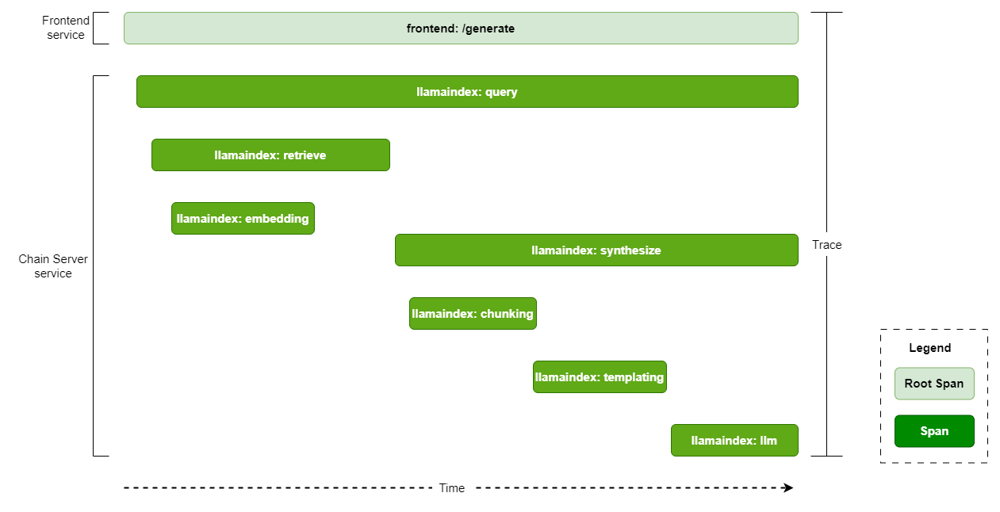
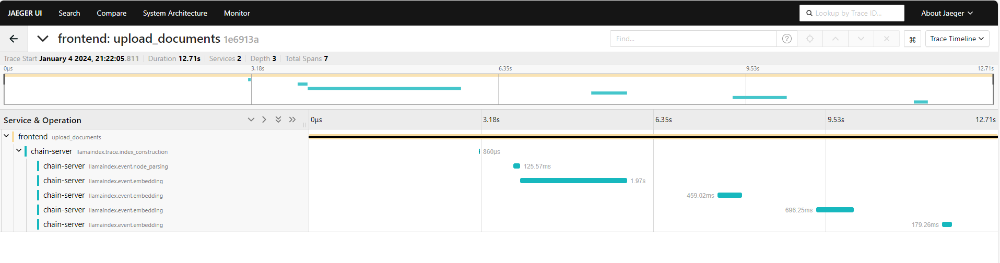
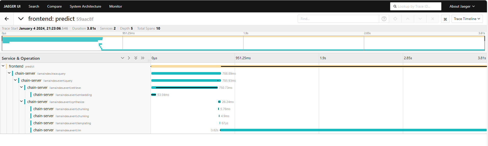
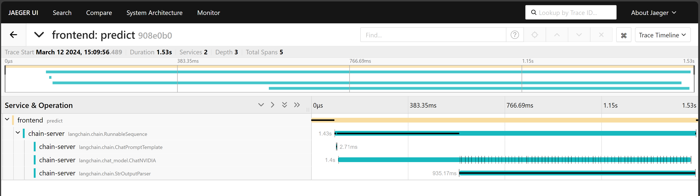
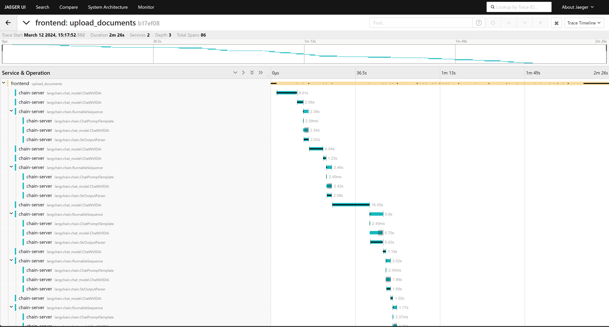
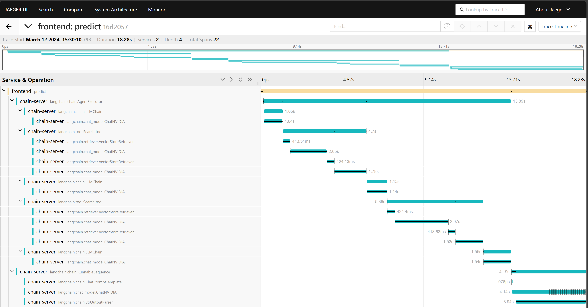

<!--
  SPDX-FileCopyrightText: Copyright (c) 2024 NVIDIA CORPORATION & AFFILIATES. All rights reserved.
  SPDX-License-Identifier: Apache-2.0
-->

# Observability Tool

<!-- TOC -->

* [Introduction](#introduction)
* [Key Terms](#key-terms)
* [Prerequisites](#prerequisites)
* [Build and Start the Containers](#build-and-start-the-containers)
* [Example Traces](#example-traces)
    * [LlamaIndex Traces](#llamaindex-traces)
    * [LangChain Traces](#langchain-traces)
* [Instrumenting the RAG Playground](#instrumenting-the-rag-playground)
* [Instrumenting the Chain Server](#instrumenting-the-chain-server)
* [Adding Observability to RAG Applications](#adding-observability-to-rag-applications)
    * [Setup](#setup)
    * [LangChain](#langchain)
    * [LLamaIndex](#llamaindex)

<!-- /TOC -->

## Introduction

Observability is a crucial aspect that facilitates the monitoring and comprehension of the internal state and behavior of a system or application.
Applications based on RAG are intricate systems that encompass the interaction of several components.
To enhance the performance of these RAG-based applications, observability is an efficient mechanism for both monitoring and debugging.

The following containers add the software components that enable observability. You can add containers and observability to any of the examples, such as using local GPUs, NVIDIA API Catalog Models, Query Decomposition, Multi-turn, and Multimodal.

- OpenTelemetry Collector: Receives, processes, and exports the traces.
- Jaeger: Acts as an OpenTelemetry backend that provides storage, query service, and visualizer.
  You can configure any other OTLP-compatible backend such as [Zipkin](https://zipkin.io/), [Prometheus](https://prometheus.io/), and so on.
  To configure an alternative backend, refer to [Configuration](https://opentelemetry.io/docs/collector/configuration/) in the OpenTelemetry documentation.
- Cassandra: Provides persistent storage for traces.
  Jaeger supports several more [storage backends](https://www.jaegertracing.io/docs/1.18/deployment/#storage-backends) such as ElasticSearch, Kafka, and Badger.
  For a large scale, production deployment, the Jaeger team recommends ElasticSearch over Cassandra.

## Key Terms

<dl>
<dt>Span</dt>
<dd>A unit of work within a system, encapsulating information about a specific operation (Eg. LLM call, embedding generation etc).</dd>

<dt>Traces</dt>
<dd>The recording of a request as it goes through a system, tracking every service the request comes in contact with.
Multiple spans make a trace logically bound by parent-child relationship.</dd>

<dt>Root Span</dt>
<dd>The first span in a trace, denoting the beginning and end of the entire operation.</dd>

<dt>Span Attributes</dt>
<dd>Key-value pairs a Span may consist of to provide additional context or metadata.</dd>

<dt>Collectors</dt>
<dd>Components that process and export telemetry data from instrumented applications.</dd>

<dt>Context</dt>
<dd>Signifies current location within the trace hierarchy.
The context determines whether a new span initiates a trace or connects to an existing parent span.</dd>

<dt>Services</dt>
<dd>Microservices that generates telemetry data.</dd>
</dl>

The following diagram shows a typical trace for query that uses a knowledge base and identifies the spans and root span.



## Prerequisites

Complete the [common prerequisites](../../../docs/common-prerequisites.md)

## Build and Start the Containers

1. In the Generative AI Examples repository, edit the `RAG/tools/observability/configs/otel-collector-config.yaml` and `RAG/tools/observability/configs/jaeger.yaml` files.

   Refer to [configuration](https://opentelemetry.io/docs/collector/configuration/) in the OpenTelemetry documentation and the [Jaeger all-in-one with Cassandra](https://www.jaegertracing.io/docs/1.52/cli/#jaeger-all-in-one-cassandra)
   reference in the Jaeger documentation.

1. Start an example to observe.

   1. Replace the path in the change directory command with the example you want to observe:

      ```console
      cd RAG/examples/basic_rag/langchain
      USERID=$(id -u) docker compose up -d --build
      ```

   1. Edit the `docker-compose.yaml` file and set following environment variables in the Chain Server and RAG Playground services:

      ```yaml
      environment:
        OTEL_EXPORTER_OTLP_ENDPOINT: http://otel-collector:4317
        OTEL_EXPORTER_OTLP_PROTOCOL: grpc
        ENABLE_TRACING: true
      ```

   1. Start the example containers:

      ```console
      USERID=$(id -u) docker compose up -d --build
      ```

1. Start the observability services:

   ```console
   cd RAG/tools/observability
   docker compose --env-file compose.env up -d --build
   ```

   *Example Output*

   ```output
   ✔ Container otel-collector              Started
   ✔ Container cassandra                   Started
   ✔ Container compose-cassandra-schema-1  Started
   ✔ Container jaeger                      Started
   ```

1. Access the Jaeger web interface at `http://host-ip:16686` from your web browser.


## Example Traces

### LlamaIndex Traces

The following screenshots show traces of LlamaIndex based examples from the Jaeger web interface.

- Upload document trace
  
- User query using knowledge base trace
  

### LangChain Traces

- NVIDIA API Catalog Example: User query without using knowledge base
  
- Multimodal example: Upload document with graphs and images
  
- Query decomposition example: User query using knowledge base
  

## Instrumenting the RAG Playground

The [tracing.py](../../src/rag_playground/default/tracing.py) module in the frontend application code performs the instrumentation.
At high level, the code performs the following:

- Sets up the OpenTelemetry configurations for resource name, frontend, span processor, and context propagator.
- Provides instrumentation decorator functions, `instrumentation_wrapper` and `predict_instrumentation_wrapper`, for abstracting away the opentelemetry configurations and managing trace context across different services.
  The API functions in [chat_client.py](../../src/rag_playground/default/chat_client.py) use the decorator functions to create new span contexts.
  The decorator functions inject the span contexts into the headers of the requests made to the chain server and export the span information and extracted attributes to the OpenTelemetry collector.

## Instrumenting the Chain Server

The [tracing.py](../../src/chain_server/tracing.py) module in the chain server application code performs the instrumentation.
At high level, the code performs the following:

- Sets up the OpenTelemetry configurations for resource name, chain-server, span processor, and context propagator.
- Initializes the LlamaIndex OpenTelemetry callback handler in [opentelemetry_callback.py](./llamaindex/opentelemetry_callback.py).
  The callback handler uses [LlamaIndex callbacks](https://docs.llamaindex.ai/en/stable/module_guides/observability/callbacks/root.html) to track various events such as LLM calls, chunking, embedding, and so on.
- Provides an instrumentation decorator functions, `llamaindex_instrumentation_wrapper`, `langchain_instrumentation_method_wrapper` and `langchain_instrumentation_class_wrapper` for abstracting away the OpenTelemetry configurations and managing the context.
  The API functions in [server.py](../../src/chain_server/server.py) use the decorator function to extract the trace context that is present in requests from the frontend service and attach it in the new span created by the chain-server.

You can use the decorator function, `llamaindex_instrumentation_wrapper`, to instrument any LlamaIndex application as long as you set the LlamaIndex OpenTelemetry callback handler, `opentelemetry_callback.py`, as global handler in the application.

Similarly, you can use the decorator functions `langchain_instrumentation_method_wrapper` and `langchain_instrumentation_class_wrapper` for instrumenting any LangChain applications as long as you set the LangChain OpenTelemetry callback handler, `opentelemetry_callback.py`, in the [tracing.py](../../src/chain_server/tracing.py) module.


## Adding Observability to RAG Applications

To extend the observability support to other LLM and RAG applications using the
[LangChain callback handlers](./langchain/opentelemetry_callback.py)
or [LlamaIndex callback handlers](./llamaindex/opentelemetry_callback.py),
refer to the following sections.


### Setup

```python
# Import the dependencies
from opentelemetry import trace
from opentelemetry.sdk.resources import SERVICE_NAME, Resource
from opentelemetry.sdk.trace import TracerProvider
from opentelemetry.sdk.trace.export import SimpleSpanProcessor
from opentelemetry.exporter.otlp.proto.grpc.trace_exporter import OTLPSpanExporter
from opentelemetry.trace.propagation.tracecontext import TraceContextTextMapPropagator

# Setup the tracer
OTEL_EXPORTER_OTLP_ENDPOINT = "localhost:4317"
resource = Resource.create({SERVICE_NAME: "sample_service"})
provider = TracerProvider(resource=resource)
processor = SimpleSpanProcessor(OTLPSpanExporter(endpoint=OTEL_EXPORTER_OTLP_ENDPOINT, insecure=True))
provider.add_span_processor(processor)
trace.set_tracer_provider(provider)
tracer = trace.get_tracer("sample_tracer")
```

### LangChain

1. Copy the LangChain OpenTelemetry callback handler, [opentelemetry_callback.py](./langchain/opentelemetry_callback.py), module in your project.
For example copy it in `utils/observability` directory.

2. Instantiate the LangChain OpenTelemetry callback handler:

   ```python
   from utils.observability.opentelemetry_callback import OpenTelemetryCallbackHandler
   otel_handler = OpenTelemetryCallbackHandler(tracer)
   ```

3. Use the OTEL handler.

   - Simple Sequential Chain

     ```python
     from langchain.chains import LLMChain, SimpleSequentialChain
     from langchain.prompts import PromptTemplate
     from langchain_openai import OpenAI

     llm = OpenAI()
     template = """You are a playwright. Given the title of play, it is your job to write a synopsis for that title.
         Title: {title}
         Playwright: This is a synopsis for the above play:"""
     prompt_template = PromptTemplate(input_variables=["title"], template=template)
     synopsis_chain = LLMChain(llm=llm, prompt=prompt_template)
     template = """You are a play critic from the New York Times. Given the synopsis of play, it is your job to write a review for that play.
         Play Synopsis:
         {synopsis}
         Review from a New York Times play critic of the above play:"""
     prompt_template = PromptTemplate(input_variables=["synopsis"], template=template)
     review_chain = LLMChain(llm=llm, prompt=prompt_template)
     overall_chain = SimpleSequentialChain(
         chains=[synopsis_chain, review_chain],
     )

     # invoke
     review = overall_chain.invoke("Tragedy at sunset on the beach", {"callbacks":[otel_handler]}) # add the otel handler to the run method
     # run
     review = overall_chain.run("Tragedy at sunset on the beach", callbacks=[otel_handler]) # add the otel handler to the run method
     ```

   - Sequential Chain in LangChain Expression Language (LCEL)

     ```python
     from operator import itemgetter
     from langchain_openai import ChatOpenAI
     from langchain.prompts import ChatPromptTemplate
     from langchain.schema import StrOutputParser

     prompt1 = ChatPromptTemplate.from_template("what is the city {person} is from?")
     prompt2 = ChatPromptTemplate.from_template(
         "what country is the city {city} in? respond in {language}"
     )
     model = ChatOpenAI()
     chain1 = prompt1 | model | StrOutputParser()
     chain2 = (
         {"city": chain1, "language": itemgetter("language")}
         | prompt2
         | model
         | StrOutputParser()
     )

     chain2.invoke({"person": "obama", "language": "spanish"}, config={"callbacks":[otel_handler]})
     ```

   - Agent

     ```python
     from langchain.agents import AgentExecutor, load_tools, create_openai_functions_agent
     from langchain_openai import ChatOpenAI
     from langchain import hub

     llm = ChatOpenAI(model="gpt-3.5-turbo", temperature=0)
     tools = load_tools(["serpapi"])
     prompt = hub.pull("hwchase17/openai-functions-agent")
     agent = create_openai_functions_agent(llm, tools, prompt)
     agent_executor = AgentExecutor(agent=agent, tools=tools)

     agent_executor.invoke({"input": "What is Langfuse?"}, config={"callbacks":[otel_handler]})
     ```

### LLamaIndex

1. Copy the LangChain OpenTelemetry Callback handler, [opentelemetry_callback.py](./llamaindex/opentelemetry_callback.py), module in your project. For example copy it in `utils/observability`
directory.

2. Import `OpenTelemetryCallbackHandler`:

   ```python
   from utils.observability.opentelemetry_callback import OpenTelemetryCallbackHandler
   otel_handler = OpenTelemetryCallbackHandler(tracer)
   ```

3. Use the OTEL handler.

   1. Download data:

      ```python
      !mkdir -p 'data/paul_graham/'
      !wget 'https://raw.githubusercontent.com/run-llama/llama_index/main/docs/examples/data/paul_graham/paul_graham_essay.txt' -O 'data/paul_graham/paul_graham_essay.txt'
      ```

   1. Set the callback handler:

      ```python
      from llama_index.core.callbacks import CallbackManager
      from llama_index.core import SummaryIndex
      from llama_index.core import SimpleDirectoryReader

      docs = SimpleDirectoryReader("./data/paul_graham").load_data()

      # Option 1: Explicitly use callback handler in the query engine
      callback_manager = CallbackManager([otel_handler])
      index = SummaryIndex.from_documents(docs, callback_manager=callback_manager)
      query_engine = index.as_query_engine()

      # OR

      # Option 2: Set OpenTelemetry handler as global callback handler
      import llama_index
      llama_index.global_handler = OpenTelemetryCallbackHandler(tracer)
      index = SummaryIndex.from_documents(docs)
      query_engine = index.as_query_engine()
      ```

