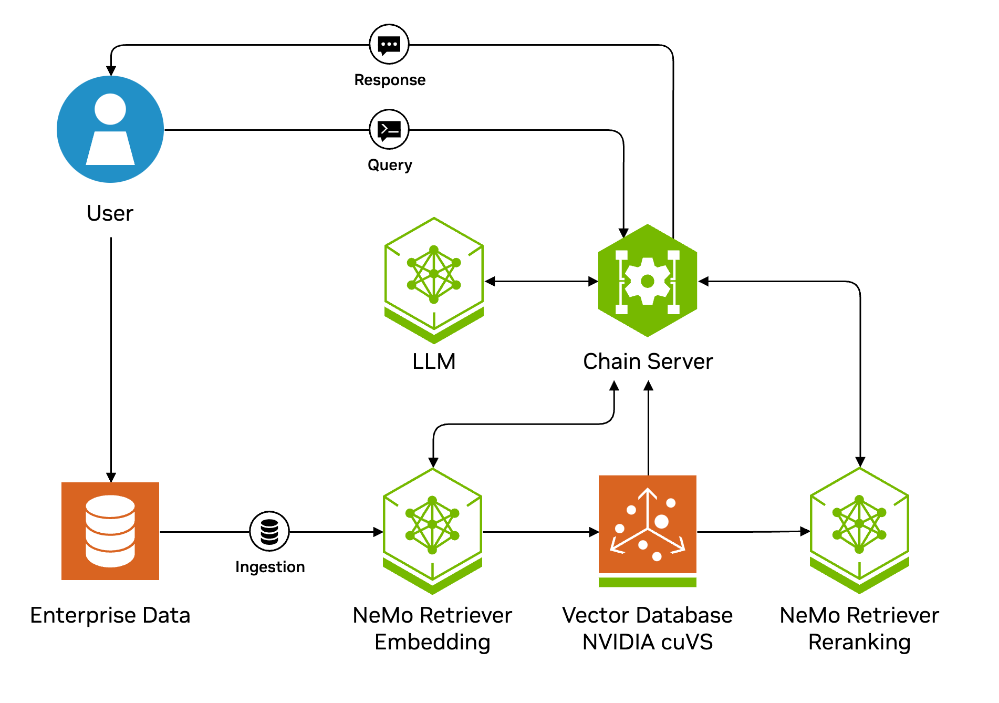

<h1>NVIDIA RAG Blueprint</h1>

Use the following documentation to learn about the NVIDIA RAG Blueprint.

- [Overview](#overview)
- [Key Features](#key-features)
- [Target Audience](#target-audience)
- [Software Components](#software-components)
- [Technical Diagram](#technical-diagram)
- [Minimum System Requirements](#minimum-system-requirements)
  - [OS Requirements](#os-requirements)
  - [Deployment Options](#deployment-options)
  - [Driver versions](#driver-versions)
  - [Hardware Requirements](#hardware-requirements)
  - [Minimum hardware requirements for self hosting all NVIDIA NIM microservices](#minimum-hardware-requirements-for-self-hosting-all-nvidia-nim-microservices)
- [Next Steps](#next-steps)
- [Available Customizations](#available-customizations)
- [Inviting the community to contribute](#inviting-the-community-to-contribute)
- [License](#license)

## Overview

This blueprint serves as a reference solution for a foundational Retrieval Augmented Generation (RAG) pipeline.
One of the key use cases in Generative AI is enabling users to ask questions and receive answers based on their enterprise data corpus.
This blueprint demonstrates how to set up a RAG solution that uses NVIDIA NIM and GPU-accelerated components.
By default, this blueprint leverages locally-deployed NVIDIA NIM microservices to meet specific data governance and latency requirements.
However, you can replace these models with your NVIDIA-hosted models available in the [NVIDIA API Catalog](https://build.nvidia.com).

## Key Features
- Multimodal data extraction support with text, tables, charts, and infographics
- Hybrid search with dense and sparse search
- Multilingual and cross-lingual retrieval
- Reranking to further improve accuracy
- GPU-accelerated Index creation and search
- Multi-turn conversations. Opt-in query rewriting for better accuracy.
- Multi-session support
- Telemetry and observability
- Opt-in for query rewriting to improve multiturn accuracy
- Opt-in for reflection to improve accuracy
- Opt-in for guardrailing conversations
- Opt-in image captioning with vision language models (VLMs)
- Sample user interface
- OpenAI-compatible APIs
- Decomposable and customizable

## Target Audience

This blueprint is for:

- **Developers**: Developers who want a quick start to set up a RAG solution with a path-to-production with the NVIDIA NIM.

## Software Components

The following are the default components included in this blueprint:

* NVIDIA NIM Microservices
   * Response Generation (Inference)
      * [NIM of meta/llama-3.1-70b-instruct](https://build.nvidia.com/meta/llama-3_1-70b-instruct)
    * Retriever Models
      * [NIM of nvidia/llama-3_2-nv-embedqa-1b-v2]( https://build.nvidia.com/nvidia/llama-3_2-nv-embedqa-1b-v2)
      * [NIM of nvidia/llama-3_2-nv-rerankqa-1b-v2](https://build.nvidia.com/nvidia/llama-3_2-nv-rerankqa-1b-v2)
      * [NeMo Retriever Page Elements NIM](https://build.nvidia.com/nvidia/nemoretriever-page-elements-v2)
      * [NeMo Retriever Table Structure NIM](https://build.nvidia.com/nvidia/nemoretriever-table-structure-v1)
      * [NeMo Retriever Graphic Elements NIM](https://build.nvidia.com/nvidia/nemoretriever-graphic-elements-v1)
      * [PaddleOCR NIM](https://build.nvidia.com/baidu/paddleocr)

  * Optional NIMs

    * [Llama 3.1 NemoGuard 8B Content Safety NIM](https://build.nvidia.com/nvidia/llama-3_1-nemoguard-8b-content-safety)
    * [Llama 3.1 NemoGuard 8B Topic Control NIM](https://build.nvidia.com/nvidia/llama-3_1-nemoguard-8b-topic-control)
    * [Mixtral 8x22B Instruct 0.1](https://build.nvidia.com/mistralai/mixtral-8x22b-instruct)
    * [Llama 3.2 11B Vision Instruct NIM](https://build.nvidia.com/meta/llama-3.2-11b-vision-instruct)
    * [NeMo Retriever Parse NIM](https://build.nvidia.com/nvidia/nemoretriever-parse)

* RAG Orchestrator server - Langchain based
* Milvus Vector Database - accelerated with NVIDIA cuVS
* Ingestion - [Nvidia-Ingest](https://github.com/NVIDIA/nv-ingest/tree/main) is leveraged for ingestion of files. NVIDIA-Ingest is a scalable, performance-oriented document content and metadata extraction microservice. Including support for parsing PDFs, Word and PowerPoint documents, it uses specialized NVIDIA NIM microservices to find, contextualize, and extract text, tables, charts and images for use in downstream generative applications.
* File Types: File types supported by Nvidia-Ingest are supported by this blueprint. This includes `.pdf`, `.pptx`, `.docx` having images. Image captioning support is turned off by default to improve latency, so questions about images in documents will yield poor accuracy. Files with following extensions are supported:
  - pdf
  - docx
  - pptx
  - jpeg
  - png
  - svg
  - tiff
  - txt

We provide Docker Compose scripts that deploy the microservices on a single node.
When you are ready for a large-scale deployment,
you can use the included Helm charts to deploy the necessary microservices.
You use sample Jupyter notebooks with the JupyterLab service to interact with the code directly.

The Blueprint contains sample data from the [NVIDIA Developer Blog](https://github.com/NVIDIA-AI-Blueprints/rag/blob/main/data/dataset.zip) and also some [sample multimodal data](./data/multimodal/).
You can build on this blueprint by customizing the RAG application to your specific use case.

We also provide a sample user interface named `rag-playground`.

## Technical Diagram

  

  
  

The image represents the architecture and workflow. Here's a step-by-step explanation of the workflow from end-user perspective:

1. **User Interaction via RAG Playground or APIs**:
   - The user interacts with this blueprint by typing queries into the sample UI microservice named as **RAG Playground**. These queries are sent to the system through the `POST /generate` API exposed by the RAG server microservice. There are separate [notebooks](./notebooks/) available which showcase API usage as well.

2. **Query Processing**:
   - The query enters the **RAG Server**, which is based on LangChain. An optional **Query Rewriter** component may refine or decontextualize the query for better retrieval results at this stage. An optional NeMoGuardrails component can be enabled as well to help filter out queries at input of the pipeline.

3. **Retrieval of Relevant Documents**:
   - The refined query is passed to the **Retriever** module if the **RAG Server microservice**. This component queries the **Milvus Vector Database microservice**, which stores embeddings of the data, generated using **NeMo Retriever Embedding microservice**. The retriever module identifies the top K most relevant chunks of information related to the query.

4. **Reranking for Precision**:
   - The top K chunks are passed to the optional **NeMo Retriever reranking microservice**. The reranker narrows down the results to the top N most relevant chunks, improving precision.

5. **Response Generation**:
   - The top N chunks are injected in the prompt and sent to the **Response Generation** module, which leverages **NeMo LLM inference Microservice** to generate a natural language response based on the retrieved information. Optionally, a reflection module can be enabled which makes additional LLM calls to improve the response by verifying its groundness based on retrieved context at this stage. NeMo guardrails can also be enabled at this stage to guardrail the output against toxicity.

6. **Delivery of Response**:
   - The generated response is sent back to the **RAG Playground**, where the user can view the answer to their query as well as check the output of the retriever module using the `Citations` option.

7. **Ingestion of Data**:
   - Separately, unstructured data is ingested into the system via the `POST /documents` API using the **Ingestor server microservice**. This data is preprocessed, split into chunks and stored in the **Milvus Vector Database** using **Nvingest microservice** which is called from the ingestor microservice.

This modular design ensures efficient query processing, accurate retrieval of information, and easy customization.

## Minimum System Requirements

### OS Requirements
Ubuntu 22.04 OS

### Deployment Options
- [Docker](./docs/quickstart.md#deploy-with-docker-compose)
- [Kubernetes](./docs/quickstart.md#deploy-with-helm-chart)

### Driver versions

- GPU Driver -  530.30.02 or later
- CUDA version - 12.6 or later

### Hardware Requirements
By default, this blueprint deploys the referenced NIM microservices locally. For this, you will require a minimum of:
 - 4xH100
 - 6xA100
The blueprint can be also modified to use NIM microservices hosted by NVIDIA in [NVIDIA API Catalog](https://build.nvidia.com/explore/discover).

Following are the hardware requirements for each component.
The reference code in the solution (glue code) is referred to as as the "pipeline".

The overall hardware requirements depend on whether you
[Deploy With Docker Compose](./docs/quickstart.md#deploy-with-docker-compose) or [Deploy With Helm Chart](./docs/quickstart.md#deploy-with-helm-chart).

### Minimum hardware requirements for self hosting all NVIDIA NIM microservices

**The NIM and hardware requirements only need to be met if you are self-hosting them with default settings of RAG.**
See [Using self-hosted NVIDIA NIM microservices](./docs/quickstart.md#deploy-with-docker-compose).

- **Pipeline operation**: 1x L40 GPU or similar recommended. It is needed for Milvus vector store database, as GPU acceleration is enabled by default.
- **LLM NIM**: [Meta Llama 3.1 70B Instruct Support Matrix](https://docs.nvidia.com/nim/large-language-models/latest/support-matrix.html#llama-3-1-70b-instruct)
  - For improved paralleled performance, we recommend 8x or more H100s/A100s for LLM inference.
  - The pipeline can share the GPU with the LLM NIM, but it is recommended to have a separate GPU for the LLM NIM for optimal performance.
- **Embedding NIM**: [Llama-3.2-NV-EmbedQA-1B-v2 Support Matrix](https://docs.nvidia.com/nim/nemo-retriever/text-embedding/latest/support-matrix.html#llama-3-2-nv-embedqa-1b-v2)
  - The pipeline can share the GPU with the Embedding NIM, but it is recommended to have a separate GPU for the Embedding NIM for optimal performance.
- **Reranking NIM**: [llama-3_2-nv-rerankqa-1b-v2 Support Matrix](https://docs.nvidia.com/nim/nemo-retriever/text-reranking/latest/support-matrix.html#llama-3-2-nv-rerankqa-1b-v2)
- **NVIDIA NIM for Image OCR**: [baidu/paddleocr](https://docs.nvidia.com/nim/ingestion/table-extraction/latest/support-matrix.html#supported-hardware)
- **NVIDIA NIMs for Object Detection**:
  - [NeMo Retriever Page Elements v2](https://docs.nvidia.com/nim/ingestion/object-detection/latest/support-matrix.html#nemo-retriever-page-elements-v2)
  - [NeMo Retriever Graphic Elements v1](https://docs.nvidia.com/nim/ingestion/object-detection/latest/support-matrix.html#nemo-retriever-graphic-elements-v1)
  - [NeMo Retriever Table Structure v1](https://docs.nvidia.com/nim/ingestion/object-detection/latest/support-matrix.html#nemo-retriever-table-structure-v1)

## Next Steps

- Do the procedures in [Get Started](./docs/quickstart.md) to deploy this blueprint
- See the [OpenAPI Specification](./docs/api_reference/openapi_schema.json)
- Explore notebooks that demonstrate how to use the APIs [here](./notebooks/)
- Explore [observability support](./docs/observability.md)
- Explore [best practices for enhancing accuracy or latency](./docs/accuracy_perf.md)
- Explore [migration guide](./docs/migration_guide.md) if you are migrating from rag v1.0.0 to this version.

## Available Customizations

The following are some of the customizations that you can make after you complete the steps in [Get Started](/docs/quickstart.md).

- [Change the Inference or Embedding Model](docs/change-model.md)
- [Customize Prompts](docs/prompt-customization.md)
- [Customize LLM Parameters at Runtime](docs/llm-params.md)
- [Support Multi-Turn Conversations](docs/multiturn.md)
- [Enable Self-Reflection to improve accuracy](docs/self-reflection.md)
- [Enable Query rewriting to Improve accuracy of Multi-Turn Conversations](docs/query_rewriter.md)
- [Enable Image captioning support for ingested documents](docs/image_captioning.md)
- [Enable NeMo Guardrails for guardrails at input/output](docs/nemo-guardrails.md)
- [Enable hybrid search for milvus](docs/hybrid_search.md)
- [Enable text-only ingestion of files](docs/text_only_ingest.md)

## Inviting the community to contribute

We're posting these examples on GitHub to support the NVIDIA LLM community and facilitate feedback.
We invite contributions!
To open a GitHub issue or pull request, see the [contributing guidelines](./CONTRIBUTING.md).

## License

This NVIDIA NVIDIA AI BLUEPRINT is licensed under the [Apache License, Version 2.0.](./LICENSE) This project will download and install additional third-party open source software projects and containers. Review [the license terms of these open source projects](./LICENSE-3rd-party.txt) before use.

The software and materials are governed by the NVIDIA Software License Agreement (found at https://www.nvidia.com/en-us/agreements/enterprise-software/nvidia-software-license-agreement/) and the Product-Specific Terms for NVIDIA AI Products (found at https://www.nvidia.com/en-us/agreements/enterprise-software/product-specific-terms-for-ai-products/), except that models are governed by the AI Foundation Models Community License Agreement (found at NVIDIA Agreements | Enterprise Software | NVIDIA Community Model License) and NVIDIA dataset is governed by the NVIDIA Asset License Agreement found [here](./data/LICENSE.DATA).

For Meta/llama-3.1-70b-instruct model the Llama 3.1 Community License Agreement, for nvidia/llama-3.2-nv-embedqa-1b-v2model the Llama 3.2 Community License Agreement, and for the nvidia/llama-3.2-nv-rerankqa-1b-v2 model the Llama 3.2 Community License Agreement. Built with Llama.
