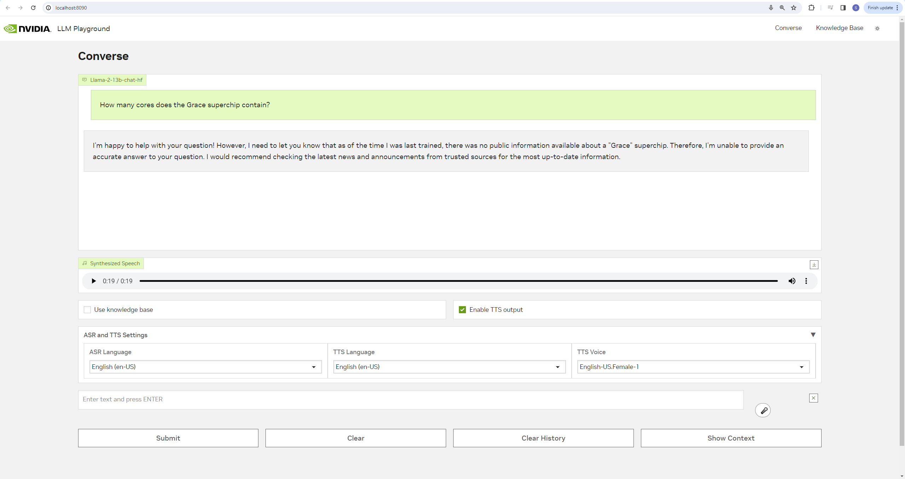
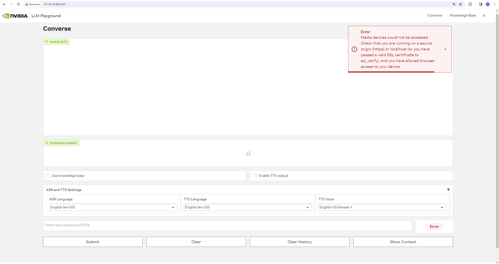
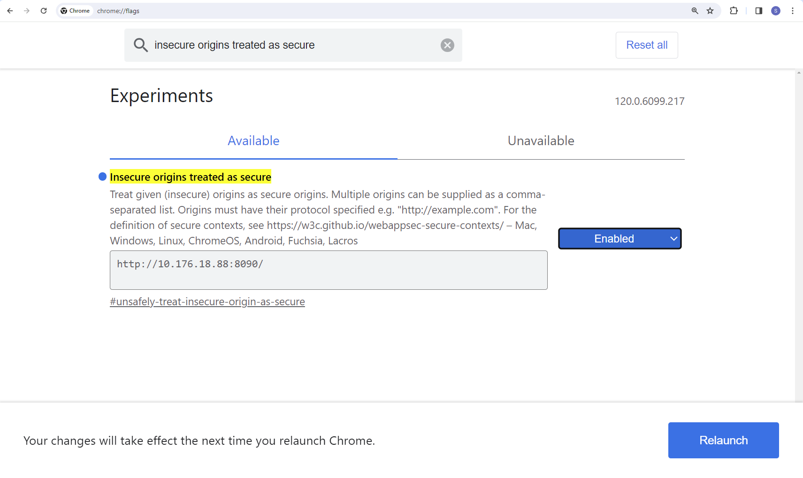
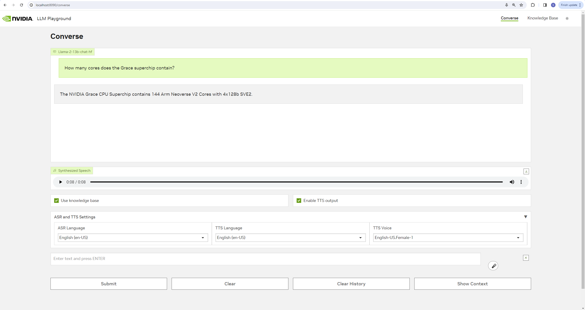

# Retrieval Augmented Generation

Retrieval Augmented Generation (RAG) generates up-to-date and domain-specific answers by connecting a Large Language Model (LLM) to your enterprise data.

## Developer RAG Examples

1. [QA Chatbot -- No-GPU using NVIDIA AI Foundation](#1-qa-chatbot----nvidia-ai-foundation-inference-endpoint)
2. [QA Chatbot -- A100/H100/L40S](#2-qa-chatbot----a100h100l40s-gpu)
3. [QA Chatbot -- Multi-GPU](#3-qa-chatbot-multi-gpu----a100h100l40s)
4. [QA Chatbot -- Quantized LLM model](#4-qa-chatbot-with-quantized-llm-model----a100h100l40s)
5. [QA Chatbot -- Task Decomposition](#5-qa-chatbot-with-task-decomposition-example----a100h100l40s)
6. [QA Chatbot -- NemoTron Model](#6-qa-chatbot----nemotron-model)

<hr>

### 1: QA Chatbot -- NVIDIA AI Foundation inference endpoint

This example deploys a developer RAG pipeline for chat QA and serves inferencing via the NVIDIA AI Foundation endpoint.

Developers get free credits for 10K requests to any of the available models.

<table class="tg">
<thead>
  <tr>
    <th class="tg-6ydv">Model</th>
    <th class="tg-6ydv">Embedding</th>
    <th class="tg-6ydv">Framework</th>
    <th class="tg-6ydv">Description</th>
    <th class="tg-6ydv">Multi-GPU</th>
    <th class="tg-6ydv">TRT-LLM</th>
    <th class="tg-6ydv">NVIDIA AI Foundation</th>
    <th class="tg-6ydv">Triton</th>
    <th class="tg-6ydv">Vector Database</th>
  </tr>
</thead>
<tbody>
  <tr>
    <td class="tg-knyo">mixtral_8x7b</td>
    <td class="tg-knyo">nvolveqa_40k</td>
    <td class="tg-knyo">Langchain</td>
    <td class="tg-knyo">QA chatbot</td>
    <td class="tg-knyo">NO</td>
    <td class="tg-knyo">NO</td>
    <td class="tg-knyo">YES</td>
    <td class="tg-knyo">NO</td>
    <td class="tg-knyo">FAISS</td>
  </tr>
</tbody>
</table>

#### 1.1 Prepare the environment

This example uses NVIDIA AI Foundation inference endpoint.

1. Follow steps 1 - 5 in the ["Prepare the environment" section of example 02](#21-prepare-the-environment).

#### 1.2 Deploy

Follow [these instructions](../docs/rag/aiplayground.md) to sign up for an NVIDIA AI Foundation developer account and deploy this  example.

<hr>

### 2: QA Chatbot -- A100/H100/L40S GPU

This example deploys a developer RAG pipeline for chat QA and serves inferencing via the NeMo Framework inference container.
> ⚠️ **NOTE**: This example requires an A100, H100, or L40S GPU. Refer to the [support matrix](../docs/rag/support_matrix.md) to understand memory requirements for the model you are deploying.

<table class="tg">
<thead>
  <tr>
    <th class="tg-6ydv">Model</th>
    <th class="tg-6ydv">Embedding</th>
    <th class="tg-6ydv">Framework</th>
    <th class="tg-6ydv">Description</th>
    <th class="tg-6ydv">Multi-GPU</th>
    <th class="tg-6ydv">TRT-LLM</th>
    <th class="tg-6ydv">NVIDIA AI Foundation</th>
    <th class="tg-6ydv">Triton</th>
    <th class="tg-6ydv">Vector Database</th>
  </tr>
</thead>
<tbody>
  <tr>
    <td class="tg-knyo">llama-2</td>
    <td class="tg-knyo">e5-large-v2</td>
    <td class="tg-knyo">Llamaindex</td>
    <td class="tg-knyo">QA chatbot</td>
    <td class="tg-knyo">NO</td>
    <td class="tg-knyo">YES</td>
    <td class="tg-knyo">NO</td>
    <td class="tg-knyo">YES</td>
    <td class="tg-knyo">Milvus</td>
  </tr>
</tbody>
<tbody>
  <tr>
    <td class="tg-knyo">llama-2</td>
    <td class="tg-knyo">e5-large-v2</td>
    <td class="tg-knyo">Llamaindex</td>
    <td class="tg-knyo">QA chatbot</td>
    <td class="tg-knyo">NO</td>
    <td class="tg-knyo">YES</td>
    <td class="tg-knyo">NO</td>
    <td class="tg-knyo">YES</td>
    <td class="tg-knyo">pgvector</td>
  </tr>
</tbody>
</table>


#### 2.1 Prepare the environment

1. Install [Docker Engine and Docker Compose.](https://docs.docker.com/engine/install/ubuntu/)

2. Verify NVIDIA GPU driver version 535 or later is installed.

    **Note**: This step is not required for Nvidia AI foundation workflow

``` $ nvidia-smi --query-gpu=driver_version --format=csv,noheader
535.129.03

$ nvidia-smi -q -d compute

==============NVSMI LOG==============

Timestamp                                 : Sun Nov 26 21:17:25 2023
Driver Version                            : 535.129.03
CUDA Version                              : 12.2

Attached GPUs                             : 1
GPU 00000000:CA:00.0
    Compute Mode                          : Default
```
Reference: [NVIDIA Container Toolkit](https://docs.nvidia.com/datacenter/cloud-native/container-toolkit/latest/install-guide.html) and [NVIDIA Linux driver installation instructions](https://docs.nvidia.com/datacenter/tesla/tesla-installation-notes/index.html)

3. Clone the Generative AI examples Git repository.

> ⚠️ **NOTE**: This example requires Git Large File Support (LFS)

```
sudo apt -y install git-lfs
git clone git@github.com:NVIDIA/GenerativeAIExamples.git
cd GenerativeAIExamples/
git lfs pull
```

4. Verify the NVIDIA container toolkit is installed and configured as the default container runtime.

    **Note**: This step is not required for Nvidia AI foundation workflow

```
$ cat /etc/docker/daemon.json
{
    "default-runtime": "nvidia",
    "runtimes": {
        "nvidia": {
            "path": "/usr/bin/nvidia-container-runtime",
            "runtimeArgs": []
        }
    }
}

$ sudo docker run --rm --runtime=nvidia --gpus all ubuntu nvidia-smi -L
GPU 0: NVIDIA A100 80GB PCIe (UUID: GPU-d8ce95c1-12f7-3174-6395-e573163a2ace)
```

5. Create an NGC Account and API Key.

Please refer to [instructions](https://docs.nvidia.com/ngc/gpu-cloud/ngc-overview/index.html) to create account and generate NGC API key.

Login to `nvcr.io` using the following command:

```
docker login nvcr.io
```

6. [Optional] Enable Riva ASR and TTS.

    a. To launch a Riva server locally, please refer to the instructions in the [Riva Quick Start Guide](https://docs.nvidia.com/deeplearning/riva/user-guide/docs/quick-start-guide.html).

    - In the provided `config.sh` script, set `service_enabled_asr=true` and `service_enabled_tts=true`, and select the desired ASR and TTS languages by adding the appropriate language codes to `asr_language_code` and `tts_language_code`.

    - Once the server is running, assign its IP address (or hostname) and port (50051 by default) to `RIVA_API_URI` in `deploy/compose/compose.env`.

    b. Alternatively, you can use a hosted Riva API endpoint. You might need to obtain an API key and/or Function ID for access.

    - In `deploy/compose/compose.env`, make the following assignments as necessary:
    ```
    export RIVA_API_URI="<Riva API address/hostname>:<Port>"
    export RIVA_API_KEY="<Riva API key>"
    export RIVA_FUNCTION_ID="<Riva Function ID>"
    ```

Reference:
- [Docker installation instructions (Ubuntu)](https://docs.docker.com/engine/install/ubuntu/)
- [NVIDIA Container Toolkit Installation instructions](https://docs.nvidia.com/datacenter/cloud-native/container-toolkit/latest/install-guide.html)

#### 2.2 Deploy

##### Downloading the model
You can download the model either from huggingface or meta.

The steps mentioned here explains how to download from meta. If you are interested in downloading the model checkpoints from huggingface, follow the steps [here](../docs/rag/hf_model_download.md) instead.

1. Clone the Llama Github.

```
git clone https://github.com/facebookresearch/llama.git
cd llama/
```

2. Fill out Meta's [Llama request access form](https://ai.meta.com/resources/models-and-libraries/llama-downloads/).

3. Download the model weights.

- Select the <b>Llama 2</b> and <b>Llama Chat</b> text boxes.
- After verifying your email, Meta will email you a download link.
- Download the llama-2-13b-chat model when prompted.

```
$ ./download.sh
Enter the URL from email: < https://download.llamameta.net/… etc>

Enter the list of models to download without spaces (7B,13B,70B,7B-chat,13B-chat,70B-chat), or press Enter for all: 13B-chat
```

4. Copy the tokenizer to the model directory.

```
$ mv tokenizer* llama-2-13b-chat/

$ ls ~/git/llama/llama-2-13b-chat/
checklist.chk  consolidated.00.pth  consolidated.01.pth  params.json  tokenizer.model  tokenizer_checklist.chk
```

##### Deploying the model

1. Set the absolute path to the model location in <i>compose.env</i>.

```
$ cd ~/git/GenerativeAIExamples

$ grep MODEL deploy/compose/compose.env | grep -v \#
export MODEL_DIRECTORY="/home/nvidia/git/llama/llama-2-13b-chat/"
export MODEL_ARCHITECTURE="llama"
export MODEL_NAME="Llama-2-13b-chat"
```

2. Deploy the developer RAG example via Docker compose using milvus vector store, steps to deploy RAG example with pgvector vector store is [here](#deploying-with-pgvector-vector-store).

> ⚠️ **NOTE**: It may take up to 5 minutes for the Triton server to start. The `-d` flag starts the services in the background.

```
$ source deploy/compose/compose.env;  docker compose -f deploy/compose/docker-compose.yaml build

$ docker compose -f deploy/compose/docker-compose.yaml up -d

$ docker ps --format "table {{.ID}}\t{{.Names}}\t{{.Status}}"
CONTAINER ID   NAMES                  STATUS
256da0ecdb7b   llm-playground         Up 48 minutes
2974aa4fb2ce   chain-server           Up 48 minutes
4a8c4aebe4ad   notebook-server        Up 48 minutes
5be2b57bb5c1   milvus-standalone      Up 48 minutes (healthy)
ecf674c8139c   llm-inference-server   Up 48 minutes (healthy)
a6609c22c171   milvus-minio           Up 48 minutes (healthy)
b23c0858c4d4   milvus-etcd            Up 48 minutes (healthy)
```

Reference:
- [Meta Llama README](https://github.com/facebookresearch/llama/blob/main/README.md)
- [Meta Llama request access form](https://ai.meta.com/resources/models-and-libraries/llama-downloads/)

#### 2.3 Test

1. Connect to the sample web application at ``http://host-ip:8090``.

2. Check **[X] Enable TTS output** to allow the web app to read the answers to your queries aloud.

3. Select the desired ASR language (`English (en-US)` for this test), TTS language (`English (en-US)` for this test) and TTS voice from the dropdown menus below the checkboxes to utilize the web app's voice-to-voice interaction capabilities.

4. In the <B>Converse</B> tab, type "How many cores does the Grace superchip contain?" in the chat box and press <B>Submit</B>. Alternatively, click on the microphone button to the right of the text box and ask your query verbally.



5. If you encounter an error message reading "Media devices could not be accessed" when you first attempt to transcribe a voice query,



carry out the following steps:

  - Open ``chrome://flags`` in another browser tab.

  - Search for "insecure origins treated as secure".

  - Copy ``http://host-ip:8090`` into the associated text box.

  - Select "Enabled" in the adjacent dropdown menu.

  - Click on the "Relaunch" button at the bottom right of the page.

  - Grant ``http://host-ip:8090`` access to your microphone.



6.  Upload the sample data set to the <B>Knowledge Base</B> tab.

> ⚠️ **NOTE**: ``dataset.zip`` is located in the ``notebooks`` directory. Unzip the archive and upload the PDFs.

> There is a timeout of `10 mins` set for the ingestion process. Uploading large files may see ingestion failure depending on network bandwidth.

7. Return to **Converse** tab and check **[X] Use knowledge base**.

8. Retype (or re-transcribe) the question: "How many cores does the Grace superchip contain?"



> ⚠️ **NOTE**: Default prompts are optimized for llama chat model if you're using completion model then prompts need to be finetuned accordingly.

#### Learn More

Execute the Jupyter notebooks to explore optional features.

Note: Jupyter notebook is supported for [default flow](../deploy/compose/docker-compose.yaml) i.e. trt-llm with milvus.
1. In a web browser, open Jupyter at ``http://host-ip:8888``.

2. Execute the notebooks in order:

- [Enable streaming responses from the LLM](../notebooks/01-llm-streaming-client.ipynb)
- [Document QA with LangChain](../notebooks/02_langchain_simple.ipynb)
- [Document QA with LlamaIndex](../notebooks/03_llama_index_simple.ipynb)
- [Advanced Document QA with LlamaIndex](../notebooks/04_llamaindex_hier_node_parser.ipynb)
- [Document QA via REST FastAPI Server](../notebooks/05_dataloader.ipynb)

#### 2.4 Uninstall

To uninstall, stop and remove the running containers.

```
cd deploy/compose
source compose.env
docker compose down
docker compose ps -q
```

#### Deploying with [pgvector](https://github.com/pgvector/pgvector) vector store
2. Deploy the developer RAG example via Docker compose.

> ⚠️ **NOTE**: It may take up to 5 minutes for the Triton server to start. The `-d` flag starts the services in the background.

```
$ source deploy/compose/compose.env;  docker compose -f deploy/compose/docker-compose-pgvector.yaml build

$ docker compose -f deploy/compose/docker-compose-pgvector.yaml up -d

$ docker ps --format "table {{.ID}}\t{{.Names}}\t{{.Status}}"
CONTAINER ID   NAMES                  STATUS
0f6f091d892e   llm-playground         Up 22 hours
8d0ab09fcb98   chain-server           Up 22 hours
85bd98ba3b24   notebook-server        Up 22 hours
22f0d405b38b   llm-inference-server   Up 22 hours (healthy)
cbd3cf65ce7e   pgvector               Up 22 hours
```

After deployment is successful, you can follow steps from [Test](#23-test) to verify workflow.

<hr>

### 3: QA Chatbot Multi-GPU -- A100/H100/L40S

This example deploys a developer RAG pipeline for chat QA and serves inference via the NeMo Framework inference container across multiple GPUs.

<table class="tg">
<thead>
  <tr>
    <th class="tg-6ydv">Model</th>
    <th class="tg-6ydv">Embedding</th>
    <th class="tg-6ydv">Framework</th>
    <th class="tg-6ydv">Description</th>
    <th class="tg-6ydv">Multi-GPU</th>
    <th class="tg-6ydv">TRT-LLM</th>
    <th class="tg-6ydv">NVIDIA AI Foundation</th>
    <th class="tg-6ydv">Triton</th>
    <th class="tg-6ydv">Vector Database</th>
  </tr>
</thead>
<tbody>
  <tr>
    <td class="tg-knyo">llama-2</td>
    <td class="tg-knyo">e5-large-v2</td>
    <td class="tg-knyo">Llamaindex</td>
    <td class="tg-knyo">QA chatbot</td>
    <td class="tg-knyo">YES</td>
    <td class="tg-knyo">YES</td>
    <td class="tg-knyo">NO</td>
    <td class="tg-knyo">YES</td>
    <td class="tg-knyo">Milvus</td>
  </tr>
</tbody>
</table>

#### 3.1 Prepare the environment

1. Follow the steps in the ["Prepare the environment" section of example 02](#21-prepare-the-environment).

#### 3.2 Deploy

1.  Follow steps 1 - 4 in the ["Deploy" section of example 02](#downloading-the-model) to stage the model weights.

2. Find the GPU device ID. You can check this using `nvidia-smi` command.

3. Assign LLM inference to specific GPUs by specifying the GPU ID(s) in the [docker compose file](../deploy/compose/docker-compose.yaml).

```
    deploy:
      resources:
        reservations:
          devices:
            - driver: nvidia
              # count: ${INFERENCE_GPU_COUNT:-all} # Comment this out
              device_ids: ["0"]
              capabilities: [gpu]
```

4. Follow steps in the ["Deploy the model" section of example 02](#deploying-the-model) to deploy via Docker compose.

#### 3.3 Test

1. Follow steps 1 - 5 in the ["Test" section of example 02](#23-test).

2. Verify the correct GPU is serving the model using `nvidia-smi`.

#### 3.4 Uninstall

1. To unintstall, follow the ["Uninstall" steps in example 02"](#24-uninstall).

<hr>


### 4: QA Chatbot with Quantized LLM model -- A100/H100/L40S

This example deploys a developer RAG pipeline for chat QA and serves inference via the NeMo Framework inference container across multiple GPUs using a quantized version of Llama-7b-chat model.

<table class="tg">
<thead>
  <tr>
    <th class="tg-6ydv">Model</th>
    <th class="tg-6ydv">Embedding</th>
    <th class="tg-6ydv">Framework</th>
    <th class="tg-6ydv">Description</th>
    <th class="tg-6ydv">Multi-GPU</th>
    <th class="tg-6ydv">TRT-LLM</th>
    <th class="tg-6ydv">NVIDIA AI Foundation</th>
    <th class="tg-6ydv">Triton</th>
    <th class="tg-6ydv">Vector Database</th>
  </tr>
</thead>
<tbody>
  <tr>
    <td class="tg-knyo">llama-2-7b-chat</td>
    <td class="tg-knyo">e5-large-v2</td>
    <td class="tg-knyo">Llamaindex</td>
    <td class="tg-knyo">QA chatbot</td>
    <td class="tg-knyo">YES</td>
    <td class="tg-knyo">YES</td>
    <td class="tg-knyo">NO</td>
    <td class="tg-knyo">YES</td>
    <td class="tg-knyo">Milvus</td>
  </tr>
</tbody>
</table>

#### 4.1 Prepare the environment

1. Follow the steps in the ["Prepare the environment" section of example 02](#21-prepare-the-environment).


#### 4.2 Deploy
1. [Download Llama2-7b chat Chat Model Weights](#downloading-the-model) from huggingface as meta checkpoint does not have the required files to quantize it.

> ⚠️ **NOTE**: For this initial version only 7B chat model is supported on A100/H100/L40 GPUs.


1. For quantization of the Llama2 model using AWQ, first clone the [TensorRT-LLM](https://github.com/NVIDIA/TensorRT-LLM/tree/release/0.5.0) repository separately and checkout release/v0.5.0.

   - Also copy the Llama2 model directory downloaded earlier to the TensorRT-LLM repo

```
  git clone https://github.com/NVIDIA/TensorRT-LLM.git
  cp -r <path-to-Llama2-model-directory> TensorRT-LLM/
  cd TensorRT-LLM/
  git checkout release/0.5.0
```

3. Now setup the TensorRT-LLM repo seprately using steps [here](https://github.com/NVIDIA/TensorRT-LLM/blob/release/0.5.0/docs/source/installation.md)

4. Once the model is downloaded and TensorRT-LLM repo is setup, we can quantize the model using the TensorRT-LLM container.

  - Follow the steps from [here](https://github.com/NVIDIA/TensorRT-LLM/tree/v0.5.0/examples/llama#awq) to quantize using AWQ, run these commands inside the container.

  - While running the quantization script, make sure to point `--model_dir` to your downloaded Llama2 model directory

  - Once the quantization is completed, copy the generated PyTorch (.pt) file inside the model directory

  ```
   cp <quantized-checkpoint>.pt <model-dir>
  ```

5. Now, we will come back our repository, follow the steps below to deploy this quantized model using the inference server.

  - Update [compose.env](../deploy/compose/compose.env) with `MODEL_DIRECTORY` pointing to Llama2 model directory containing the quantized checkpoint.

  - Make sure the qantized PyTorch model (.pt) file generated using above steps is present inside the MODEL_DIRECTORY.


  - Uncomment the QUANTIZATION variable which specifies quantization as "int4_awq" inside the [compose.env](../deploy/compose/compose.env).
  ```
    export QUANTIZATION="int4_awq"
  ```

6. Deploy the developer RAG example via Docker compose.

> ⚠️ **NOTE**: It may take up to 5 minutes for the Triton server to start. The `-d` flag starts the services in the background.

```
$ source deploy/compose/compose.env;  docker compose -f deploy/compose/docker-compose.yaml build

$ docker compose -f deploy/compose/docker-compose.yaml up -d

$ docker ps --format "table {{.ID}}\t{{.Names}}\t{{.Status}}"
CONTAINER ID   NAMES                  STATUS
256da0ecdb7b   llm-playground         Up 48 minutes
2974aa4fb2ce   chain-server           Up 48 minutes
4a8c4aebe4ad   notebook-server        Up 48 minutes
5be2b57bb5c1   milvus-standalone      Up 48 minutes (healthy)
ecf674c8139c   llm-inference-server   Up 48 minutes (healthy)
a6609c22c171   milvus-minio           Up 48 minutes (healthy)
b23c0858c4d4   milvus-etcd            Up 48 minutes (healthy)
```

#### 4.3 Test

1. Follow steps 1 - 5 in the ["Test" section of example 02](#23-test).

#### 4.4 Uninstall

1. To uninstall, follow the ["Uninstall" steps in example 02"](#24-uninstall).

<hr>

### 5: QA Chatbot with Task Decomposition example -- A100/H100/L40S

This example deploys a recursive Task Decomposition example for chat QA. It uses the llama2-70b chat model (via the NVIDIA AI Foundation endpoint) for inference.

It showcases how to perform RAG when the agent needs to access information from several different files/chunks or perform some computation on the answers. It uses a custom langchain agent that recursively breaks down the user's questions into subquestions that it attempts to answer. It has access to 2 tools - search (which performs standard RAG on a subquestion) and math (which poses a math question to the LLM). The agent continues to break down the question into sub-questions until it has the answers it needs to formulate the final answer.

<table class="tg">
<thead>
  <tr>
    <th class="tg-6ydv">Model</th>
    <th class="tg-6ydv">Embedding</th>
    <th class="tg-6ydv">Framework</th>
    <th class="tg-6ydv">Description</th>
    <th class="tg-6ydv">Multi-GPU</th>
    <th class="tg-6ydv">TRT-LLM</th>
    <th class="tg-6ydv">NVIDIA AI Foundation</th>
    <th class="tg-6ydv">Triton</th>
    <th class="tg-6ydv">Vector Database</th>
  </tr>
</thead>
<tbody>
  <tr>
    <td class="tg-knyo">llama2_70b</td>
    <td class="tg-knyo">nvolveqa_40k</td>
    <td class="tg-knyo">Langchain</td>
    <td class="tg-knyo">QA chatbot</td>
    <td class="tg-knyo">NO</td>
    <td class="tg-knyo">NO</td>
    <td class="tg-knyo">YES</td>
    <td class="tg-knyo">NO</td>
    <td class="tg-knyo">FAISS</td>
  </tr>
</tbody>
</table>

#### 5.1 Prepare the environment

1. Follow the steps in the ["Prepare the environment" section of example 02](#21-prepare-the-environment).


#### 5.2 Deploy

1.  Follow the ["Deploy" section of example 01](#downloading-the-model) to setup your API key

2. Change the RAG example in `deploy/compose/compose.env`.
    ```shell
    export RAG_EXAMPLE="query_decomposition_rag"
    ```

3. Change the LLM in `deploy/compose/docker-compose-nv-ai-foundation.yaml` to `llama2_70b`.
    ```yaml
    query:
      container_name: chain-server
      ...
      environment:
        APP_LLM_MODELNAME: llama2_70b
        ...
    ```

4. Deploy the Query Decomposition RAG example via Docker compose.

```
$ source deploy/compose/compose.env;  docker compose -f deploy/compose/docker-compose-nv-ai-foundation.yaml build

$ docker compose -f deploy/compose/docker-compose-nv-ai-foundation.yaml up -d

$ docker ps --format "table {{.ID}}\t{{.Names}}\t{{.Status}}"
CONTAINER ID   NAMES                  STATUS
256da0ecdb7b   llm-playground         Up 48 minutes
2974aa4fb2ce   chain-server           Up 48 minutes
```

#### 5.3 Test

1. Connect to the sample web application at ``http://host-ip:8090``.

2. Upload 2 text documents in the <B>Knowledge Base</B> tab. The documents can contain different information - for example, one document can contain a company's revenue analysis for Q3 2023 and the other can contain a similar analysis for Q4 2023.

3. Return to the **Converse** tab and check **[X] Use knowledge base**.

4. Enter the question: "Which is greater - NVIDIA's datacenter revenue for Q4 2023 or the sum of its datacenter and gaming revenues for Q3 2023?" and hit submit to get the answer.

#### 5.4 Uninstall

1. To uninstall, follow the ["Uninstall" steps in example 02"](#24-uninstall).

<hr>

### 6: QA Chatbot -- NemoTron Model

This example deploys a developer RAG pipeline for chat QA and serves inference via the NeMo Framework inference container using NeMoTron model and showcases inference using sample notebook.


#### 6.1 Prepare the environment

1. Follow the steps in the ["Prepare the environment" section of example 02](#21-prepare-the-environment).

> ⚠️ **NOTE**: This example requires at least 100GB of GPU memory or two  A100 GPUs for locally deploying the nemotron model.


#### 6.2 Deploy

1. Download [NeMoTron chat checkpoint](https://huggingface.co/nvidia/nemotron-3-8b-chat-4k-sft) from HuggingFace

```
git-lfs clone https://huggingface.co/nvidia/nemotron-3-8b-chat-4k-sft
```

2. Make sure the absolute model path of nemotron-3-8b-chat-4k-sft model is updated in `/GenerativeAIExamples/deploy/compose/compose.env`. Set the below values in `compose.env` file.

```
export MODEL_DIRECTORY="/home/nvidia/nemotron-3-8b-chat-4k-sft" # Example path
export MODEL_ARCHITECTURE="gptnext"
export MODEL_NAME="nemotron-3-8b-chat-4k-sft"
```

3. Build and deploy the nemotron workflow

```
source deploy/compose/compose.env
docker compose -f deploy/compose/docker-compose-nemotron.yaml build
docker compose -f deploy/compose/docker-compose-nemotron.yaml up -d
```
4. Check the deployment status by printing logs of `llm-inference-server` container

Successful TRT-LLM conversion and Triton Inference Server deployment logs will display the following message
```
I0107 03:03:38.638311 260 http_server.cc:3558] Started HTTPService at 0.0.0.0:8000
I0107 03:03:38.679626 260 http_server.cc:187] Started Metrics Service at 0.0.0.0:8002
```

#### 6.3 Test

1. Run `02_langchain_simple.ipynb` for Document Question-Answering with LangChain based using NeMoTron model.

[Optional] Run `00-llm-non-streaming-nemotron.ipynb` to send request to LLM.

> ⚠️ **NOTE**:
- Nemotron models do not support streaming in this release.

<hr>

### Learn More

To deep dive into different components and workflow used by the examples, please refer to the [Developer Guide.](../docs/README.md)
