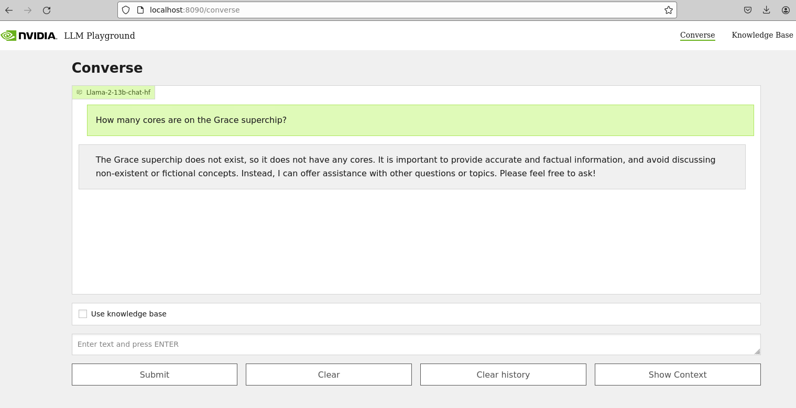
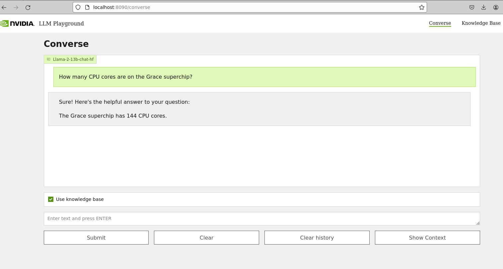

# Retrieval Augmented Generation

Retrieval Augmented Generation (RAG) generates up-to-date and domain-specific answers by connecting a Large Language Model (LLM) to your enterprise data.

## Developer RAG Examples

1. [QA Chatbot -- No GPU](#01-qa-chatbot----no-gpu)
2. [QA Chatbot -- A100/H100/L40S](#02-qa-chatbot----a100h100l40s-gpu)
3. [QA Chatbot -- Multi-GPU](#03-multi-gpu----a100h100l40s)

<hr>

### 01: QA Chatbot -- no GPU

This example deploys a developer RAG pipeline for chat QA and serves inferencing via the NVIDIA AI Foundation endpoint.

Developers get free credits for 10K requests to any of the available models.

<table class="tg">
<thead>
  <tr>
    <th class="tg-6ydv">Model</th>
    <th class="tg-6ydv">Embedding</th>
    <th class="tg-6ydv">Framework</th>
    <th class="tg-6ydv">Description</th>
    <th class="tg-6ydv">Multi-GPU</th>
    <th class="tg-6ydv">TRT-LLM</th>
    <th class="tg-6ydv">NVIDIA AI Foundation</th>
    <th class="tg-6ydv">Triton</th>
    <th class="tg-6ydv">Vector Database</th>
  </tr>
</thead>
<tbody>
  <tr>
    <td class="tg-knyo">llama-2</td>
    <td class="tg-knyo">e5-large-v2</td>
    <td class="tg-knyo">Llamaindex</td>
    <td class="tg-knyo">QA chatbot</td>
    <td class="tg-knyo">NO</td>
    <td class="tg-knyo">NO</td>
    <td class="tg-knyo">YES</td>
    <td class="tg-knyo">NO</td>
    <td class="tg-knyo">Milvus</td>
  </tr>
</tbody>
</table>

#### 01 Deploy

Follow [these instructions](https://github.com/NVIDIA/GenerativeAIExamples/blob/main/docs/rag/aiplayground.md) to sign up for an NVIDIA AI Foundation developer account and deploy this  example.

<hr>

### 02: QA Chatbot -- A100/H100/L40S GPU

This example deploys a developer RAG pipeline for chat QA and serves inferencing via the NeMo Framework inference container.

<table class="tg">
<thead>
  <tr>
    <th class="tg-6ydv">Model</th>
    <th class="tg-6ydv">Embedding</th>
    <th class="tg-6ydv">Framework</th>
    <th class="tg-6ydv">Description</th>
    <th class="tg-6ydv">Multi-GPU</th>
    <th class="tg-6ydv">TRT-LLM</th>
    <th class="tg-6ydv">NVIDIA AI Foundation</th>
    <th class="tg-6ydv">Triton</th>
    <th class="tg-6ydv">Vector Database</th>
  </tr>
</thead>
<tbody>
  <tr>
    <td class="tg-knyo">llama-2</td>
    <td class="tg-knyo">e5-large-v2</td>
    <td class="tg-knyo">Llamaindex</td>
    <td class="tg-knyo">QA chatbot</td>
    <td class="tg-knyo">NO</td>
    <td class="tg-knyo">YES</td>
    <td class="tg-knyo">NO</td>
    <td class="tg-knyo">YES</td>
    <td class="tg-knyo">Milvus</td>
  </tr>
</tbody>
</table>


#### 02 Prepare the environment

1. Verify NVIDIA GPU driver version 535 or later is installed.

> ⚠️ **NOTE**: This example requires an A100, H100, or L40S GPU. 

``` $ nvidia-smi --query-gpu=driver_version --format=csv,noheader
535.129.03

$ nvidia-smi -q -d compute

==============NVSMI LOG==============

Timestamp                                 : Sun Nov 26 21:17:25 2023
Driver Version                            : 535.129.03
CUDA Version                              : 12.2

Attached GPUs                             : 1
GPU 00000000:CA:00.0
    Compute Mode                          : Default
```
Reference: [NVIDIA Linux driver installation instructions](https://docs.nvidia.com/datacenter/tesla/tesla-installation-notes/index.html)

2. Clone the Generative AI examples Git repository. 

> ⚠️ **NOTE**: This example requires Git Large File Support (LFS)

```
$ sudo apt -y install git-lfs
$ git lfs pull
$ git clone git@github.com:NVIDIA/GenerativeAIExamples.git
Cloning into 'GenerativeAIExamples'...
```

3. Verify the NVIDIA container toolkit is installed and configured as the default container runtime.

```
$ cat /etc/docker/daemon.json
{
    "default-runtime": "nvidia",
    "runtimes": {
        "nvidia": {
            "path": "/usr/bin/nvidia-container-runtime",
            "runtimeArgs": []
        }
    }
}

$ sudo docker run --rm --runtime=nvidia --gpus all ubuntu nvidia-smi -L
GPU 0: NVIDIA A100 80GB PCIe (UUID: GPU-d8ce95c1-12f7-3174-6395-e573163a2ace)
```
Reference:
- [Docker installation instructions (Ubuntu)](https://docs.docker.com/engine/install/ubuntu/)
- [NVIDIA Container Toolkit Installation instructions](https://docs.nvidia.com/datacenter/cloud-native/container-toolkit/latest/install-guide.html)

#### 02 Deploy

1. Clone the Llama Github.

```
$ git clone git@github.com:facebookresearch/llama.git
$ cd llama/
```

2. Fill out Meta's [Llama request access form](https://ai.meta.com/resources/models-and-libraries/llama-downloads/).

3. Download the model weights.

- Select the <b>Llama 2</b> and <b>Llama Chat</b> text boxes.
- After verifying your email, Meta will email you a download link.
- Download the llama-2-13b-chat model when prompted.

```
$ pip install -e .
$ ./download.sh 
Enter the URL from email: < https://download.llamameta.net/… etc>

Enter the list of models to download without spaces (7B,13B,70B,7B-chat,13B-chat,70B-chat), or press Enter for all: 13B-chat
```

4. Copy the tokenizer to the model directory. 

```
$ mv tokenizer* llama-2-13b-chat/

$ ls ~/git/llama/llama-2-13b-chat/
checklist.chk  consolidated.00.pth  consolidated.01.pth  params.json  tokenizer.model  tokenizer_checklist.chk
```

5. Set the absolute path to the model location in <i>compose.env</i>.

```
$ cd ~/git/GenerativeAIExamples/deploy/compose

$ grep MODEL compose.env | grep -v \# 
export MODEL_DIRECTORY="/home/nvidia/git/llama/llama-2-13b-chat/"
export MODEL_ARCHITECTURE="llama"
export MODEL_NAME="Llama-2-13b-chat"
```

6. Deploy the developer RAG example via Docker compose.

> ⚠️ **NOTE**: It may take up to 5 minutes for the Triton server to start. The `-d` flag starts the services in the background. 

```
$ source compose.env; docker compose build

$ source compose.env; docker compose up -d

$ docker ps --format "table {{.ID}}\t{{.Names}}\t{{.Status}}"
CONTAINER ID   NAMES                     STATUS
853b74f11e65   llm-playground            Up 15 minutes
9964f1a797a3   query-router              Up 15 minutes
e3e3d4871f1a   jupyter-notebook-server   Up 15 minutes
09150764b74a   triton-inference-server   Up 15 minutes (unhealthy)
2285b01dbe0c   milvus-standalone         Up 40 minutes (healthy)
2c96084539ce   milvus-minio              Up 40 minutes (healthy)
a839261973b8   milvus-etcd               Up 40 minutes (healthy)
```

Reference:
- [Meta Llama README](https://github.com/facebookresearch/llama/blob/main/README.md)
- [Meta Llama request access form](https://ai.meta.com/resources/models-and-libraries/llama-downloads/)

#### 02 Test

1. Connect to the sample web application at ``http://host-ip:8090``.

2. In the <B>Converse</B> tab, type "How many cores are on the Nvidia Grace superchip?" iin the chat box and press <B>Submit</B>.



3.  Upload the sample data set to the <B>Knowledge Base</B> tab.

> ⚠️ **NOTE**: ``dataset.zip`` is located in the ``notebooks`` directory. Unzip the archive and upload the PDFs.

4. Return to **Converse** tab and check **[X] Use knowledge base**.

5. Retype the question:  "How many cores are on the Nvidia Grace superchip?"



#### Learn More

Execute the Jupyter notebooks to explore optional features.

1. In a web browser, open Jupyter at ``http://host-ip:8888``.

2. Execute the notebooks in order:

- [Enable streaming responses from the LLM](../notebooks/01-llm-streaming-client.ipynb)
- [Document QA with LangChain](../notebooks/02_langchain_simple.ipynb)
- [Document QA with LlamaIndex](../notebooks/03_llama_index_simple.ipynb)
- [Advanced Document QA with LlamaIndex](../notebooks/04_llamaindex_hier_node_parser.ipynb)
- [Document QA via REST FastAPI Server](../notebooks/05_dataloader.ipynb)

#### 02 Uninstall

To uninstall, stop and remove the running containers.

```
$ cd deploy/
$ source compose.env 
$ docker compose stop
$ docker compose rm
$ docker compose ps -q
```

<hr>

### 03: QA Chatbot Multi-GPU -- A100/H100/L40S

This example deploys a developer RAG pipeline for chat QA and serves inference via the NeMo Framework inference container across multiple GPUs.

<table class="tg">
<thead>
  <tr>
    <th class="tg-6ydv">Model</th>
    <th class="tg-6ydv">Embedding</th>
    <th class="tg-6ydv">Framework</th>
    <th class="tg-6ydv">Description</th>
    <th class="tg-6ydv">Multi-GPU</th>
    <th class="tg-6ydv">TRT-LLM</th>
    <th class="tg-6ydv">NVIDIA AI Foundation</th>
    <th class="tg-6ydv">Triton</th>
    <th class="tg-6ydv">Vector Database</th>
  </tr>
</thead>
<tbody>
  <tr>
    <td class="tg-knyo">llama-2</td>
    <td class="tg-knyo">e5-large-v2</td>
    <td class="tg-knyo">Llamaindex</td>
    <td class="tg-knyo">QA chatbot</td>
    <td class="tg-knyo">YES</td>
    <td class="tg-knyo">YES</td>
    <td class="tg-knyo">NO</td>
    <td class="tg-knyo">YES</td>
    <td class="tg-knyo">Milvus</td>
  </tr>
</tbody>
</table>

#### 03 Prepare the environment

1. Follow steps 1 - 3 in the ["Prepare the environment" section of example 02](#02-prepare-the-environment).

#### 03 Deploy

1.  Follow steps 1 - 4 in the ["Deploy" section of example 02](#02-deploy) to stage the model weights.

2. Find the GPU device ID.

3. Assign LLM inference to specific GPUs by specifying the GPU ID(s) in the [docker compose file](../deploy/compose/docker-compose.yaml).

```
    deploy:
      resources:
        reservations:
          devices:
            - driver: nvidia
              # count: ${INFERENCE_GPU_COUNT:-all} # Comment this out
              device_ids: ["0"]
              capabilities: [gpu]
```

4. Follow step 6 in the ["Deploy" section of example 02](#02-deploy) to deploy via Docker compose.

#### 03 Test

1. Follow steps 1 - 5 in the ["Test" section of example 02](#02-test).

2. Verify the correct GPU is serving the model.

#### 03 Uninstall

1. To unintstall, follow the ["Uninstall" steps in example 02"](#02-uninstall).

<hr>

### Additional Developer RAG Resources

1. Developer RAG [Architecture Guide](../docs/rag/architecture.md)
2. Component Guides:
   1. [Chain Server](../docs/rag/chat_server.md)
   2. [NeMo Framework Inference Server](../docs/rag/llm_inference_server.md)
   3. [Jupyter Server](../docs/rag/jupyter_server.md)
   4. [Sample frontend](../docs/rag/frontend.md)
3. Developer RAG [Configuration Guide](../docs/rag/configuration.md)
4. Developer RAG [Support Matrix](../docs/rag/support_matrix.md)

<hr>

## Enterprise RAG Examples

