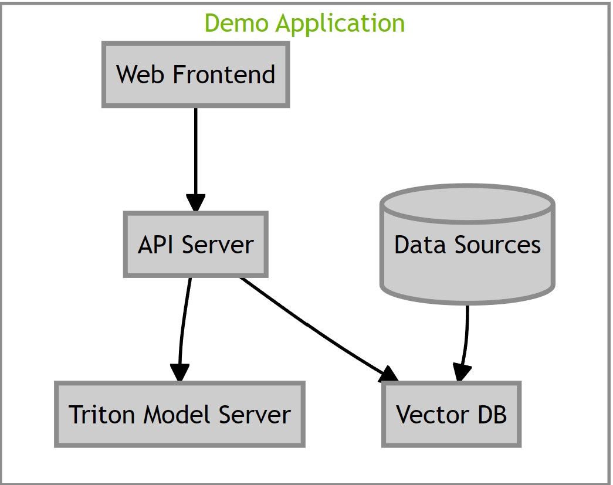
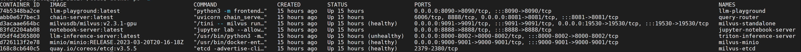

# Retrieval Augmented Generation

## Project Details
**Project Goal**: A reference Retrieval Augmented Generation(RAG) workflow for a chatbot to question answer off public press releases & tech blogs. It performs document ingestion & Q&A interface using open source models deployed on any cloud or customer datacenter, leverages the power of GPU-accelerated Milvus for efficient vector storage and retrieval, along with TRT-LLM, to achieve lightning-fast inference speeds with custom LangChain LLM wrapper.

## Components
- **LLM**: [Llama2](https://ai.meta.com/llama/) - 7b-chat, 13b-chat, and 70b-chat all supported. 13b-chat and 70b-chat generate good responses.
- **LLM Backend**: Nemo framework inference container with Triton inference server & TRT-LLM backend for speed.
- **Vector DB**: Milvus because it's GPU accelerated.
- **Embedding Model**: [e5-large-v2](https://huggingface.co/intfloat/e5-large-v2) since it is one of the best embedding model available at the moment.
- **Framework(s)**: LangChain and LlamaIndex.

This reference workflow uses a variety of components and services to customize and deploy the RAG based chatbot. The following diagram illustrates how they work together. Refer to the [detailed architecture guide](../docs/rag/architecture.md) to understand more about these components and how they are tied together.




*Note:*
We've used [Llama2](https://ai.meta.com/llama/) and [e5-large-v2](https://huggingface.co/intfloat/e5-large-v2) models as example defaults in this workflow, you should ensure that both the LLM and embedding model are appropriate for your use case, and validate that they are secure and have not been tampered with prior to use.

# Getting Started
This section covers step by step guide to setup and try out this example workflow.

## Prerequisites
Before proceeding with this guide, make sure you meet the following prerequisites:

- You should have at least one NVIDIA GPU. For this guide, we used an A100 data center GPU.

    - NVIDIA driver version 535 or newer. To check the driver version run: ``nvidia-smi --query-gpu=driver_version --format=csv,noheader``.
    - If you are running multiple GPUs they must all be set to the same mode (ie Compute vs. Display). You can check compute mode for each GPU using
    ``nvidia-smi -q -d compute``

### Setup the following

- Docker and Docker-Compose are essential. Please follow the [installation instructions](https://docs.docker.com/engine/install/ubuntu/).

        Note:
            Please do **not** use Docker that is packaged with Ubuntu as the newer version of Docker is required for proper Docker Compose support.

            Make sure your user account is able to execute Docker commands.


- NVIDIA Container Toolkit is also required. Refer to the [installation instructions](https://docs.nvidia.com/datacenter/cloud-native/container-toolkit/install-guide.html).


- NGC Account and API Key

    - Please refer to [instructions](https://docs.nvidia.com/ngc/gpu-cloud/ngc-overview/index.html) to create account and generate NGC API key.
    - Docker login to `nvcr.io` using the following command:
      ```
        docker login nvcr.io
      ```

- git-lfs
    - Make sure you have [git-lfs](https://git-lfs.github.com) installed.

- You can download Llama2 Chat Model Weights from [Meta](https://ai.meta.com/resources/models-and-libraries/llama-downloads/) or [HuggingFace](https://huggingface.co/meta-llama/Llama-2-13b-chat-hf/). You can skip this step [if you are interested in using cloud based LLM's using Nvidia AI Playground](#using-nvdia-cloud-based-llm).

    **Note for checkpoint downloaded using Meta**:

    - When downloading model weights from Meta, you can follow the instructions up to the point of downloading the models using ``download.sh``. There is no need to deploy the model using the steps mentioned in the repository. We will use Triton to deploy the model.

    - Meta will download two additional files, namely `tokenizer.model` and `tokenizer_checklist.chk`, outside of the model checkpoint directory. Ensure that you copy these files into the same directory as the model checkpoint directory.

    **Using Cloud based Nvidia AI Foundational models**:

    - Instead of deploying the models on-prem if you will like to use LLM models deployed from NVIDIA AI Playground then follow the instructions from [here.](../docs/rag/aiplayground.md)

    **Using Quantized models**:

    - In this workflow, we will be leveraging a Llama2 (7B parameters) chat model, which requires 38 GB of GPU memory.  <br>
    IMPORTANT:  For this initial version of the workflow only 7B chat model is supported on A100 and H100 GPUs.

    - We also support quantization of LLama2 model using AWQ, which changes model precision to INT4, thereby reducing memory usage. Checkout the steps [here](../docs/rag/llm_inference_server.md) to enable quantization.


## Install Guide

NVIDIA TensorRT LLM providex state of the art performance for running LLM inference. Follow the below steps from the root of this project to setup the RAG example with TensorRT LLM and Triton deployed locally.

###  Step 1: Set Environment Variables

Modify ``compose.env`` in the ``deploy/compose`` directory to set your environment variables. The following variables are required as shown below for using a llama based model.

    # full path to the local copy of the model weights
    export MODEL_DIRECTORY="$HOME/src/Llama-2-13b-chat-hf"

    # the architecture of the model. eg: llama
    export MODEL_ARCHITECTURE="llama"

    # the name of the model being used - only for displaying on frontend
    export MODEL_NAME="llama-2-13b-chat"

    # [OPTIONAL] the config file for chain server
    APP_CONFIG_FILE=/dev/null


### Step 2: Build and Start Containers
- Pull lfs files. This will pull large files from repository.
    ```
        git lfs pull
    ```
- Run the following command to build containers.
    ```
        source deploy/compose/compose.env;  docker compose -f deploy/compose/docker-compose.yaml build
    ```

- Run the following command to start containers.
    ```
        source deploy/compose/compose.env; docker compose -f deploy/compose/docker-compose.yaml up -d
    ```
    > ⚠️ **NOTE**: It will take a few minutes for the containers to come up and may take up to 5 minutes for the Triton server to be ready. Adding the `-d` flag will have the services run in the background. ⚠️

- Run ``docker ps -a``. When the containers are ready the output should look similar to the image below.
    

    **Note**:
    - Default prompts are optimized for llama chat model if you're using completion model then prompts need to be finetuned accordingly.

#### Multi GPU deployment

By default the LLM model will be deployed using all available GPU's of the system. To use some specific GPU's you can provide the GPU ID(s) in the [docker compose file](../deploy/compose/docker-compose.yaml) under `llm` service's `deploy` section:


    deploy:
      resources:
        reservations:
          devices:
            - driver: nvidia
              # count: ${INFERENCE_GPU_COUNT:-all} # Comment this out
              device_ids: ["0"] # Provide the device id of GPU. It can be found using `nvidia-smi` command
              capabilities: [gpu]


### Step 3: Experiment with RAG in JupyterLab

This AI Workflow includes Jupyter notebooks which allow you to experiment with RAG.

- Using a web browser, type in the following URL to open Jupyter

    ``http://host-ip:8888``

- Locate the [LLM Streaming Client notebook](../notebooks/01-llm-streaming-client.ipynb) which demonstrates how to stream responses from the LLM.

- Proceed with the next 4 notebooks:

    - [Document Question-Answering with LangChain](../notebooks/02_langchain_simple.ipynb)

    - [Document Question-Answering with LlamaIndex](../notebooks/03_llama_index_simple.ipynb)

    - [Advanced Document Question-Answering with LlamaIndex](../notebooks/04_llamaindex_hier_node_parser.ipynb)

    - [Interact with REST FastAPI Server](../notebooks/05_dataloader.ipynb)

### Step 4: Run the Sample Web Application
A sample chatbot web application is provided in the workflow. Requests to the chat system are wrapped in FastAPI calls.

- Open the web application at ``http://host-ip:8090``.

- Type in the following question without using a knowledge base: "How many cores are on the Nvidia Grace superchip?"

    **Note:** the chatbot mentions the chip doesn't exist.

- To use a knowledge base:

    - Click the **Knowledge Base** tab and upload the file [dataset.zip](../notebooks/dataset.zip).

- Return to **Converse** tab and check **[X] Use knowledge base**.

- Retype the question:  "How many cores are on the Nvidia Grace superchip?"

# RAG Evaluation

## Prerequisites
Make sure the corps comm dataset is loaded into the vector database using the [Dataloader](../notebooks/05_dataloader.ipynb) notebook as part of step-3 of setup.

This workflow include jupyter notebooks which allow you perform evaluation of your RAG application on the sample dataset and they can be extended to other datasets as well.
Setup the workflow by building and starting the containers by following the steps [outlined here using docker compose.](#step-2-build-and-start-containers)

After setting up the workflow follow these steps:

- Using a web browser, type in the following URL to open Jupyter Labs

    ``http://host-ip:8889``

- Locate the [synthetic data generation](../evaluation/01_synthetic_data_generation.ipynb) which demonstrates how to generate synthetic data of question answer pairs for evaluation

- Proceed with the next 3 notebooks:

    - [Filling generated answers](../evaluation/02_filling_RAG_outputs_for_Evaluation.ipynb)

    - [Ragas evaluation with NVIDIA AI playground](../evaluation/03_eval_ragas.ipynb)

    - [LLM as a Judge evaluation with NVIDIA AI playground](../evaluation/04_Human_Like_RAG_Evaluation-AIP.ipynb)


# Learn More
1. [Architecture Guide](../docs/rag/architecture.md): Detailed explanation of different components and how they are tried up together.
2. Component Guides: Component specific features are enlisted in these sections.
   1. [Chain Server](../docs/rag/chat_server.md)
   2. [NeMo Framework Inference Server](../docs/rag/llm_inference_server.md)
   3. [Jupyter Server](../docs/rag/jupyter_server.md)
   4. [Sample frontend](../docs/rag/frontend.md)
3. [Configuration Guide](../docs/rag/configuration.md): This guide covers different configurations available for this workflow.
4. [Support Matrix](../docs/rag/support_matrix.md): This covers GPU, CPU, Memory and Storage requirements for deploying this workflow.
