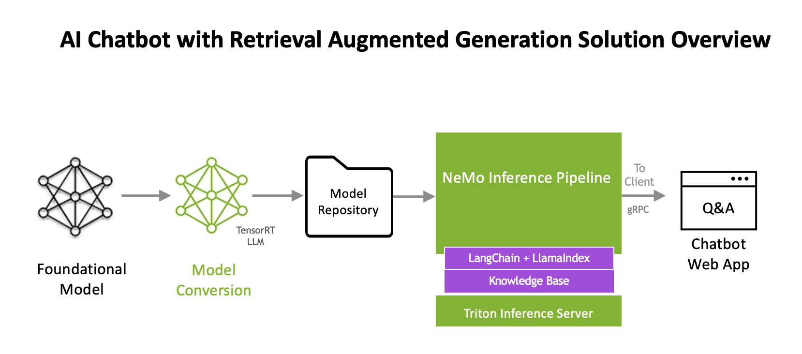
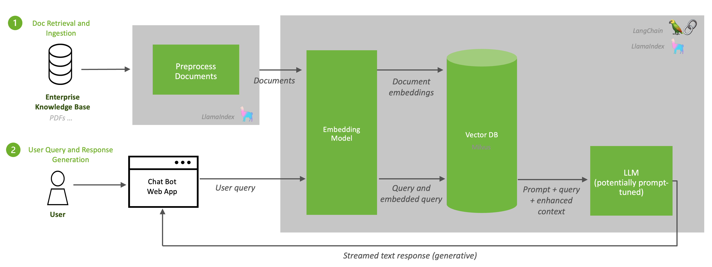

Overview
=================================

Generative AI enables users to quickly generate new content based on a variety of inputs and is a powerful tool for streamlining the workflow of creatives, engineers, researchers, scientists, and more. The use cases and possibilities span all industries and individuals. Generative AI models can produce novel content like stories, emails, music, images, and videos.

Here at NVIDIA, we like to utilize our own products to make our lives easier, so we have used generative AI to create an NVIDIA chatbot enhanced with retrieval augmented generation (RAG). This chatbot is designed to assist an NVIDIA employee with answering public relations related questions. The sample dataset includes the last two years of NVIDIA press releases and corporate blog posts. Our development and deployment of that chatbot is the guide to this reference generative AI workflow.

Generative AI starts with foundational models trained on vast quantities of unlabeled data. **Large language models (LLMs)** are trained on an extensive range of textual data online. These LLMs can understand prompts and generate novel, human-like responses. Businesses can build applications to leverage this capability of LLMs; for example creative writing assistants for marketing, document summarization for legal teams, and code writing for software development.

To create true business value from LLMs, these foundational models need to be tailored to your enterprise use case. In this workflow, we  use [RAG](https://blog.langchain.dev/tutorial-chatgpt-over-your-data/) with [Llama2](https://github.com/facebookresearch/llama/), an open source model from Meta, to achieve this. Augmenting an existing AI foundational model provides an advanced starting point and a low-cost solution that enterprises can leverage to generate accurate and clear responses to their specific use case.

This RAG-based reference chatbot workflow contains:

   - [NVIDIA NeMo framework](https://docs.nvidia.com/nemo-framework/user-guide/latest/index.html) - part of NVIDIA AI Enterprise solution
   - [NVIDIA TensorRT-LLM](https://developer.nvidia.com/tensorrt) - for low latency and high throughput inference for LLMs
   - [LangChain](https://github.com/langchain-ai/langchain/) and [LlamaIndex](https://www.llamaindex.ai/) for combining language model components and easily constructing question-answering from a company's database
   - [Sample Jupyter Notebooks](jupyter_server.md) and [chatbot web application/API calls](./frontend.md) so that you can test the chat system in an interactive manner
   - [Milvus](https://milvus.io/docs/install_standalone-docker.md) - Generated embeddings are stored in a vector database. The vector DB used in this workflow is Milvus. Milvus is an open-source vector database capable of NVIDIA GPU accelerated vector searches.
   - [e5-large-v2 model](https://huggingface.co/embaas/sentence-transformers-e5-large-v2) from huggingface to generate the embeddings.
   - [Llama2](https://github.com/facebookresearch/llama/), an open source model from Meta, to formulate natural responses.

This RAG chatbot workflow provides a reference for you to build your own enterprise AI solution with minimal effort. This AI workflow was designed to be deployed as a Developer experience using Docker Compose on an NVIDIA AI Enterprise-supported platform, which can be deployed on-prem or using a cloud service provider (CSP). Workflow components are used to deploy models and inference pipeline, integrated together with the additional components as indicated in the diagram below:



NVIDIA AI Components
======================
This reference workflow uses a variety of NVIDIA AI components to customize and deploy the RAG-based chatbot example.

   - NVIDIA TensorRT-LLM
   - NVIDIA NeMo Inference Server

The following sections describe these NVIDIA AI components further.

**NVIDIA TensorRT-LLM Optimization**

A LLM can be optimized using TensorRT-LLM. NVIDIA NeMo uses TensorRT for LLMs (TensorRT-LLM), for deployment which accelerates and maximizes inference performance on the latest LLMs.
In this workflow, we will be leveraging a Llama 2 (13B parameters) chat model. We will convert the foundational model to TensorRT format using TensorRT-LLM for optimized inference.

**NVIDIA NeMo Framework Inference Server**

With NeMo Framework Inference Server, the optimized LLM can be deployed for high-performance, cost-effective, and low-latency inference. NVIDIA NGC is used as model storage in this workflow, but you are free to choose different model storage solutions like MLFlow or AWS SageMaker.
The Triton Inference Server uses models stored in a model repository, available locally to serve inference requests. Once they are available in Triton, inference requests are sent from a client application. Python and C++ libraries provide APIs to simplify communication. Clients send HTTP/REST requests directly to Triton using HTTP/REST or gRPC protocols.

Within this workflow, the Llama2 LLM was optimized using NVIDIA TensorRT for LLMs (TRT-LLM) which accelerates and maximizes inference performance on the latest LLMs.

Inference Pipeline
====================
To get started with the inferencing pipeline, we will first connect the customized LLM to a sample proprietary data source. This knowledge can come in many forms: product specifications, HR documents, or finance spreadsheets. Enhancing the model’s capabilities with this knowledge can be done with RAG.

Since foundational LLMs are not trained on your proprietary enterprise data and are only trained up to a fixed point in time, they need to be augmented with additional data. RAG consists of two processes. First, *retrieval* of data from document repositories, databases, or APIs that are all outside of the foundational model’s knowledge. Second, is the *generation* of responses via Inference. The example used within this workflow is a corporate communications co-pilot that could either ingest source data from storage or by scraping. The following graphic describes an overview of this inference pipeline:


**Document Ingestion and Retrieval**

RAG begins with a knowledge base of relevant up-to-date information. Since data within an enterprise is frequently updated,  the ingestion of documents into a knowledge base should be a recurring process and scheduled as a job. Next, content from the knowledge base is passed to an embedding model (e5-large-v2, in the case of this workflow), which converts the content to vectors (referred to as “embeddings”). Generating embeddings is a critical step in RAG; it allows for the dense numerical representations of textual information. These embeddings are stored in a vector database, in this case Milvus, which is [RAFT accelerated](https://developer.nvidia.com/blog/accelerating-vector-search-using-gpu-powered-indexes-with-rapids-raft).

**User Query and Response Generation**

When a user query is sent to the inference server, it is converted to an embedding using the embedding model. This is the same embedding model used to convert the documents in the knowledge base (e5-large-v2, in the case of this workflow). The database performs a similarity/semantic search to find the vectors that most closely resemble the user’s intent and provides them to the LLM as enhanced context. Since Milvus is RAFT accelerated, the similarity serach is optimized on the GPU. Lastly, the LLM is used to generate a full answer that’s streamed to the user. This is all done with ease via [LangChain](https://github.com/langchain-ai/langchain/) and [LlamaIndex](https://www.llamaindex.ai)

The following diagram illustrates the ingestion of documents and generation of responses.



LangChain allows you to write LLM wrappers for your own custom LLMs, so we have provided a sample wrapper for streaming responses from a TensorRT-LLM Llama 2 model running on Triton Inference Server. This wrapper allows us to leverage LangChain’s standard interface for interacting with LLMs while still achieving vast performance speedup from TensorRT-LLM and scalable and flexible inference from Triton Inference Server.

A sample chatbot web application is provided in the workflow so that you can test the chat system in an interactive manner. Requests to the chat system are wrapped in API calls, so these can be abstracted to other applications.

An additional method of customization in the AI Workflow inference pipeline is via a prompt template. A prompt template is a pre-defined recipe for generating prompts for language models. They may contain instructions, few-shot examples, and context appropriate for a given task. In our example, we prompt our model to generate safe and polite responses.


**Triton Model Server**

The Triton Inference Server uses models stored in a model repository, available locally to serve inference requests. Once they are available in Triton, inference requests are sent from a client application. Python and C++ libraries provide APIs to simplify communication. Clients send HTTP/REST requests directly to Triton using HTTP/REST or gRPC protocols.

Within this workflow, the Llama2 LLM was optimized using NVIDIA TensorRT for LLMs (TRT-LLM) which accelerates and maximizes inference performance on the latest LLMs.

**Vector DB**

Milvus is an open-source vector database built to power embedding similarity search and AI applications. It makes unstructured data from API calls, PDFs, and other documents more accessible by storing them as embeddings.
When content from the knowledge base is passed to an embedding model (e5-large-v2), it converts the content to vectors (referred to as “embeddings”). These embeddings are stored in a vector database. The vector DB used in this workflow is Milvus. Milvus is an open-source vector database capable of NVIDIA GPU accelerated vector searches.

*Note::*
```
If needed, see Milvus's [documentation](https://milvus.io/docs/install_standalone-docker.md/) for how a Docker Compose file can be configured for Milvus.
```