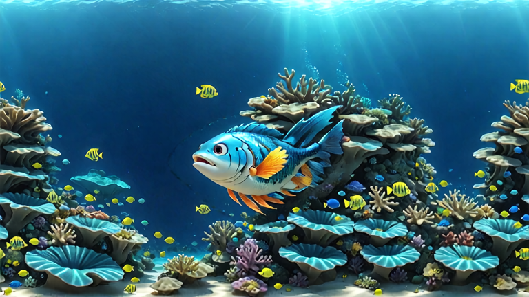

# SPDX-FileCopyrightText: Copyright (c) 2023-2024 NVIDIA CORPORATION & AFFILIATES. All rights reserved.
# SPDX-License-Identifier: Apache-2.0
#
# Licensed under the Apache License, Version 2.0 (the "License");
# you may not use this file except in compliance with the License.
# You may obtain a copy of the License at
#
# http://www.apache.org/licenses/LICENSE-2.0
#
# Unless required by applicable law or agreed to in writing, software
# distributed under the License is distributed on an "AS IS" BASIS,
# WITHOUT WARRANTIES OR CONDITIONS OF ANY KIND, either express or implied.
# See the License for the specific language governing permissions and
# limitations under the License.

# **Draw with AI**

## **Demo Overview**

This workflow showcases how NVIDIA GPU supports AI generations with control nets, Loras, and the connection between different applications all at the same time. Accelerated by NVIDIA Blackwell, drawings come to life interactively!  

## **Key Points**

* The ability to connect between AI generative processes and the sketch input from other applications like Adobe Photoshop, makes it easy to integrate with users’ current workflows.
* Combined with text prompting, Control Nets give us the control we need over the generations. This is what makes our sketch guide the design of the generation
* To turn the sketches into any style, Loras are applied. An amazing example of how finetuning can help the user define a style.

NVIDIA GPUs help run all these processes simultaneously in order to generate interactively, as the user sketches their vision.

