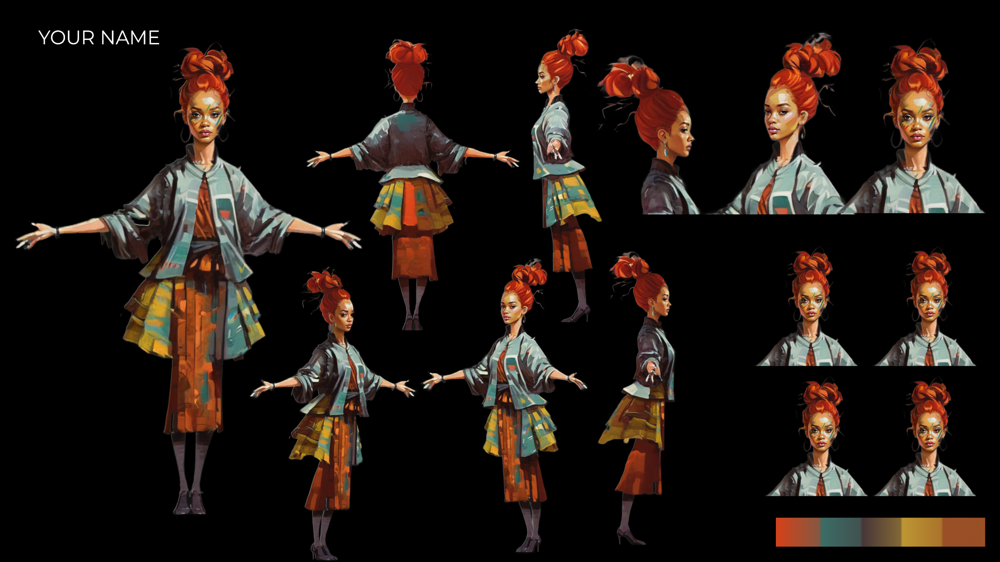

# **Personalized Character**

## **Demo Overview**

This workflow leverages Generative AI to turn any person into an illustrated character. It chains together 5 distinct AI workflows to produce character sheets and an animated turntable video. On an NVIDIA GPU, running on a powerful workstation, all of this content can be composed in  just under 1.5 minutes. 

Finally everything comes together though compositing automation and SAM . Customized background elements, text and generated assets come together to create the final composition.

## **Key Points**

* Generate a specific character in a T-pose, based off of real life images - Using Instant ID & IP Adapter Face, Controlnet Open Pose and Stable Diffusion XL \

* Generate a full body character in multiple angles using Diffusers based Multi View
* Upscale Illustrations and create high quality faces with Generative AI upscale methods, Face Detailer and Face Detection Ultralytics , and SD Ultimate Upscale. 
* Create unique character expressions for your character sheet using Live Portrait
* Extract Key colors and elements from the scene using AI color extractors 
