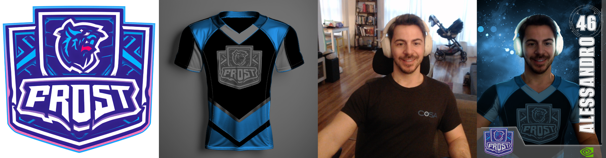

# SPDX-FileCopyrightText: Copyright (c) 2023-2024 NVIDIA CORPORATION & AFFILIATES. All rights reserved.
# SPDX-License-Identifier: Apache-2.0
#
# Licensed under the Apache License, Version 2.0 (the "License");
# you may not use this file except in compliance with the License.
# You may obtain a copy of the License at
#
# http://www.apache.org/licenses/LICENSE-2.0
#
# Unless required by applicable law or agreed to in writing, software
# distributed under the License is distributed on an "AS IS" BASIS,
# WITHOUT WARRANTIES OR CONDITIONS OF ANY KIND, either express or implied.
# See the License for the specific language governing permissions and
# limitations under the License.

# **Virtual Athlete**

This workflow is using Generative AI and automated compositing to allow users to design a custom esports jersey based off of their own colors, style selections, identity and team logo design. This will ultimately composite all together into a nice esport trading card

## **Key Points**

* Generate a specific logo based on user input name - using FLUX and FLUX LoRA
* Create a custom realistic Jersey and put it on the person - Using SAM ( Segment anything Models) , In Context Lora, And Clip Vision with Flux Redux, Flux Turbo and Flux Dev Fill.
* Relight the scene to the user selected colors Using IC- Relight and Stable Diffusion 1.5
* Creating an export card layout  with user name and random number, as well as their custom logo
