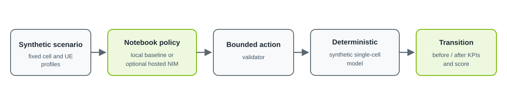

<!--
SPDX-FileCopyrightText: Copyright (c) 2026 NVIDIA CORPORATION & AFFILIATES. All rights reserved.
SPDX-License-Identifier: Apache-2.0
-->

# 5G Network Operator Agent with NVIDIA NIM

This self-contained notebook shows an agent-style observe, act, validate, and score loop over a deterministic synthetic single-cell model. Local baselines work without credentials; a hosted NVIDIA NIM policy is optional.

The example is educational. It is not a network controller, does not train a policy, does not use recorded playback, and does not connect to a live RAN or claim physical-network fidelity.

## What it demonstrates

- Inspect initial cell and UE KPIs from a fixed synthetic scenario.
- Choose exactly one of four bounded actions on each of four turns.
- Validate every action before applying it.
- Inspect a complete before/action/after transition and decomposed score.
- Compare noop and scripted-relief baselines on the identical scenario and horizon.
- Optionally compare one OpenAI-compatible hosted NVIDIA NIM policy.
- Optionally export one JSON-safe rollout.

## Limitations and non-claims

The calculations are intentionally small and inspectable, not standards-level or physically faithful. The bundled result covers one synthetic scenario and four-turn horizon; it is not evidence of model quality, network performance, production readiness, or learned improvement. There is no recorded replay, database, external network telemetry, training, checkpoint, or physical actuation path.

## Prerequisites

- Python 3.10 or newer.
- No GPU or credential for the local baselines.
- An existing NVIDIA API key only for the optional hosted section.

## Quick start

Run from the repository root:

```bash
python3 -m venv .venv
source .venv/bin/activate
python -m pip install --upgrade pip
python -m pip install -r community/5g-network-operator-agent/requirements.txt
jupyter lab community/5g-network-operator-agent/5g_network_operator_agent.ipynb
```

Run all cells from top to bottom. With no API key, the notebook completes every offline section and skips only hosted-policy evaluation.

## Optional hosted NVIDIA NIM

Copy the template or set variables in the shell without putting a key in the notebook:

```bash
cp community/5g-network-operator-agent/.env.example community/5g-network-operator-agent/.env
export NVIDIA_API_KEY="your-api-key"
export NVIDIA_MODEL="nvidia/nemotron-3-super-120b-a12b"
```

The model override is optional. The default endpoint is `https://integrate.api.nvidia.com/v1`, and the default model is `nvidia/nemotron-3-super-120b-a12b`. The adapter requests one tool call and treats missing, multiple, malformed, non-object, or request-error output as an explicit rejected action with a finite penalty; it never silently substitutes `noop`.

## Files and architecture

- `5g_network_operator_agent.ipynb`: offline-first walkthrough, strict hosted adapter, assertions, comparison, transition inspection, and opt-in export.
- `network_environment.py`: standard-library-only synthetic environment and policies.
- `tests/test_network_environment.py`: focused environment and episode tests.
- `requirements.txt`: bounded Python dependencies for the notebook and verification.
- `.env.example`: empty optional hosted configuration.
- `assets/architecture.svg`: data and decision flow.



## Bounded actions

| Action | Bounds |
| --- | --- |
| `set_scheduler_policy` | `PF`, `RR`, or `MAX_CI` |
| `set_prb_cap` | One observed UE; `max_prb_pct` from 10 to 100 |
| `set_ul_power_control` | `p0_dbm` from -100 to -70 and `alpha` from 0.4 to 1.0 |
| `noop` | No arguments and no control change |

## Scoring

Each after-state score is the exact sum of five non-positive costs; zero is ideal and more-negative is worse:

- `-0.45 × unmet_ratio`;
- `-0.20 × (1 - Jain fairness)` over UE satisfaction ratios;
- `-0.25 × SLA violations / UE count`;
- `-0.10 × max(0, (PRB utilization - 85) / 15)`; and
- `-0.25` for a rejected action, otherwise zero.

Only compare totals when the scenario and horizon are identical.

## Expected offline output

An offline run displays the initial UE and cell KPI tables, a four-action inventory, two baseline rows, a cumulative-score chart, parser assertions, and one full before/action/after transition with all score terms. It also prints:

```text
NVIDIA_API_KEY is not set; hosted-policy evaluation is skipped.
```

JSON export defaults to `EXPORT_ROLLOUT = False`. If explicitly enabled, the notebook writes `outputs/5g_network_operator_rollout.json`; `outputs/` is ignored.

## Verification

Run the focused tests and syntax check:

```bash
python -m pytest community/5g-network-operator-agent/tests -q
python -m py_compile community/5g-network-operator-agent/network_environment.py
```

Execute an output copy offline, leaving the source notebook unchanged:

```bash
env -u NVIDIA_API_KEY jupyter nbconvert --to notebook --execute \
  --output /tmp/5g_network_operator_agent.executed.ipynb \
  community/5g-network-operator-agent/5g_network_operator_agent.ipynb \
  --ExecutePreprocessor.timeout=180
jupyter nbconvert --clear-output --inplace \
  community/5g-network-operator-agent/5g_network_operator_agent.ipynb
```

If imports fail, confirm the virtual environment is active and reinstall `requirements.txt`. If the hosted section rejects a response, inspect its bounded action name and transition error; do not reinterpret it as a successful decision.

## Cleanup and security

```bash
deactivate
rm -rf .venv
rm -rf community/5g-network-operator-agent/outputs
```

Never commit `.env`, a real key, executed hosted outputs, prompts containing sensitive data, or exported rollouts that contain sensitive additions. The example reads only `NVIDIA_API_KEY` and the optional `NVIDIA_MODEL`; it does not print environment values. Revoke a key immediately if it is exposed.
