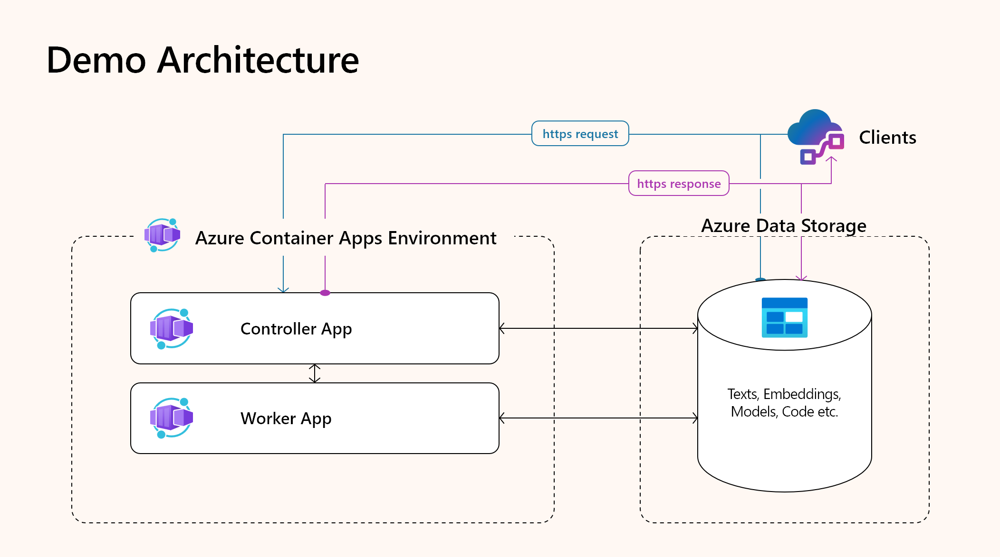
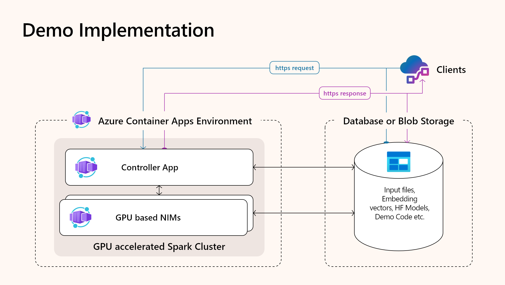

<!--
  SPDX-FileCopyrightText: Copyright (c) 2023 NVIDIA CORPORATION & AFFILIATES. All rights reserved.
  SPDX-License-Identifier: Apache-2.0
-->

# Serverless GPU Spark Embeddings on Azure Container Apps

This repository demonstrates how to generate embeddings for large volumes of text using a distributed Apache Spark cluster with NVIDIA GPU-accelerated workers. The solution runs on **Azure Container Apps (ACA)**, providing a secure, scalable, and serverless environment for GPU-based workloads with minimal infrastructure overhead.

At its core, this demo showcases how to combine:
- **NVIDIA Inference Microservices (NIM)** — pre-packaged, high-performance AI models delivered as Docker containers
- **Apache Spark** — for distributed processing and scalable embedding computation
- **ACA serverless orchestration** — enabling auto-scaling, simplified networking, and workload isolation

## Benefits of NVIDIA NIM

NIM provides a simple path to deploy AI models using a standardized API. Key advantages include:
- **Portability**: Deploy anywhere with full control and data security
- **Ease of Use**: Speed up time to market with prebuilt, continuously maintained microservices
- **Enterprise Support**: Stability, security patches, and production-level support
- **Performance**: Optimized throughput and lower total cost of ownership (TCO)

These benefits align with the strengths of Apache Spark:
- **Performance**: Faster iteration and insight generation
- **Scalability**: Native support for Big Data workloads
- **Cost Efficiency**: Lower infrastructure costs via parallelism and resource sharing

---

# Architecture

## Goals
- Provide reusable templates for multi-node GPU-accelerated Spark embedding pipelines
- Showcase ACA as a scalable and secure REST-based embedding service
- Support extensibility for downstream vector search and ANN indexing
- Use SQL Server–compatible input/output formats (via `sp_invoke_external_rest_endpoint`)

## Design Challenges
- ACA’s simplified resource model limits cluster customization and job isolation
- Strict networking rules complicate Spark master/worker communication and UI access
- Only one GPU is supported per ACA replica
- Most current ACA Spark implementations use a single-GPU architecture

## Current Architecture

- **Two ACA apps**: 
  - `Master`: CPU-based container with Ingress and REST endpoint
  - `Worker`: GPU-accelerated Spark container using A100 GPUs

- **Communication and storage**:
  - Internal virtual network links Master and Worker apps
  - Both apps mount a shared Azure File Share for code, data, and results

- **Modes of Operation**:
  - **Production Mode**: Handles async HTTP batch requests (e.g. Ollama, SQL Server 2025)
  - **Development Mode**: Interactive Jupyter interface for debugging and prototyping

- **Scaling**:
  - Workers auto-scale (0 to N) based on ACA GPU load triggers and HTTP request volume
  - Master always has 1 replica instance

---

# Implementation

## Components

- **Master App**
  - Based on `apache/spark:3.4.1` with extensions
  - Hosts Spark Master and async HTTP server using `aiohttp`
  - Exposes REST endpoint (port 8888) and Spark UI via port forwarding (2222, 8080)
  - Accepts both production (trigger mode) and development (Jupyter mode) workloads

- **Worker App**
  - Spark Worker built from the same container image
  - Uses A100 GPU and connects to Spark Master via internal VNet
  - Auto-starts Spark worker upon container launch
  - Shares volume with Master for model/code/data consistency

## Interaction Modes

- **Trigger Mode**
  - Handles external HTTP/HTTPS embedding requests
  - Supports `sp_invoke_external_rest_endpoint`, Ollama-compatible, and custom formats
  - Uses `spark-submit` to process batches and return embeddings in HTTP response

- **Jupyter Mode**
  - Provides an interactive Jupyter notebook interface
  - Runs on the same shared volume as production containers
  - Enables iterative development of embedding logic

  Mode switching is controlled by the `APP_MODE` environment variable and `switch-modes.sh`.

---

# Embedding Pipeline

- **Embedding Models**
  - Utilizes Hugging Face transformers with GPU acceleration via TensorRT, CUDA, or ONNX
  - Models run exclusively on GPU-based workers for scalability

- **Spark Integration**
  - GPU resource allocation is limited to 1 per worker (ACA constraint)
  - Embedding pipeline uses `spark-rapids-ml` (built from source for compatibility)
  - GPU discovery is handled by `getGpusResources.sh` under `/spark-rapids-ml/`

- **Batching & Throughput**
  - Batches dynamically split to ~1MB to satisfy HTTP size limits
  - Results streamed back to SQL Server or external clients
  - Embeddings are either written to SQL ("push" model) or returned directly ("pull" model)

---

# SQL Server Integration

- Compatible with **SQL Server 2025**'s new AI capabilities
- REST-based embedding service can be invoked using:
  - `sp_invoke_external_rest_endpoint`
  - External model declaration with `AI_GENERATE_EMBEDDINGS(...)`
- Output can be:
  - Written directly to SQL Server tables
  - Returned as HTTP response for downstream consumption

---

# Summary

This demo delivers an end-to-end solution for running serverless, GPU-accelerated embedding pipelines using Spark and Azure Container Apps. It is modular, scalable, and compatible with modern SQL Server inference workflows — making it a strong candidate for enterprise AI integration.

