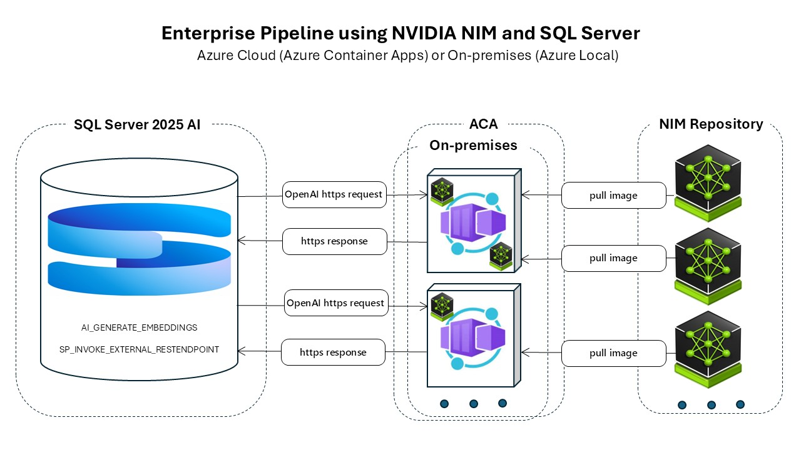

# **NVIDIA NIM with Microsoft SQL Server 2025 AI on Azure Cloud**  
# **and Azure Local**

---

## **Abstract**

Unlock newly announced AI features in **Microsoft SQL Server 2025** using **NVIDIA NIM microservices** for accelerated AI inference on both Azure Cloud and Azure Local.

This guide demonstrates efficient and secure integration of Microsoft SQL Server 2025 with **llama-nemotron-embed-1b-v2**, running in the cloud via Azure Container Apps and on-premises using Azure Local with Windows, WSL 2, and/or Ubuntu.

The guide provides an enterprise-level architecture and a demo implementation leveraging the latest versions of Microsoft SQL Server and Llama Nemotron Embed 2 model by NVIDIA.

---

## **Overview**

Microsoft SQL Server 2025 introduces several new features. One of the most notable is **AI Integration**, which includes:

- **AI-Enhanced Analytics:** Improved support for embedding and leveraging AI models, including new system stored procedures for scoring and prediction.
- **External REST Endpoints:** New T-SQL commands to invoke REST APIs (including AI services) directly from SQL Server.

Implementation of these features is mostly based on integration with Azure OpenAI.  
This repository demonstrates a new approach using **NVIDIA NIM microservices** to perform enterprise-level, secure, GPU-accelerated, Docker-based SQL Server inference with custom models on Azure Cloud and/or Azure Local.

---

## **Architecture**

Below is the proposed architecture:

*Image.1: Architecture Diagram*

**Key Points:**
- New AI functionality is based on secure (HTTPS) communication with external endpoints to SQL Server, which could be in the cloud or on-premises.
- SQL Server sends POST requests to endpoints and retrieves requested information (such as embeddings).
- External services should support existing communication protocols implanted in SQL Server (OpenAI, Ollama etc.)
- External services must provide secure, fast, standard responses using custom inference models, for both cloud and on-premises scenarios.
- Meets SQL Server requirements for security, performance, and ease of deployment.

**Highlights of the Proposed Approach**
- **NVIDIA NIM** provide optimized inference models running on GPU.
- NIMs use docker containers, simplifying deployment and ensuring compatibility across cloud and local Windows/Linux environments with NVIDIA GPU.
- **NVIDIA NIM** supports OpenAI standards.
- It provides secure, direct communication (TLS certificates for encryption and mutual trust) for on-premises deployment.
- For remote (cloud) deployment, **Azure Container Apps** are used, connecting directly to the NVIDIA NIM repository for always-up-to-date models.
- Inference models can be changed by customers

**Benefits:**
- Docker container orchestration (no infrastructure management)
- Flexible manual/automatic scaling
- Secure, Event-driven architecture (HTTPS requests)
- Cost efficiency (pay only for compute time and only for remote scenario)
- High developer productivity and simplicity. No extra development is required—just correct environment settings, parameters, certificates, and adherence to standards. No external library installations required.
- Managed, secure, scalable environment
- Simple provisioning and updates from NVIDIA NIM repository
- Multi-container support

---

# **Demo**

This section explains how to use the proposed architecture for **SQL Server 2025 AI** functionality with **NVIDIA llama-nemotron-embed-1b-v2**.

**Scenarios demonstrated:**

- **Remote (Azure Cloud):** Using Azure Container Apps as a wrapper for NVIDIA NIMs. SQL Server 2025 can be installed locally or on cloud.
- **On-premises (Azure Local):** Using Azure Local GPU-based VMs (Windows 11 VM and Ubuntu 24.04 VM). The same approach applies to other local GPU setups.

**Covers:**
- Windows Server, Windows 11, or Windows VM
- Azure Local with Windows VM, WSL 2, Docker Desktop, SQL Server 2025
- Linux or Linux VM, Azure Local with Linux VM, Docker, SQL Server 2025
- Hybrid: Windows VM and Linux VM (current demo)

## **Goals:**

The demo is trying to generalize and simplify an approach presented by the Microsoft SQL Server team on NVIDIA GTC 2025 conference. [Build Secure and Scalable Gen AI Applications With Databases and NVIDIA AI [S71521]](https://www.nvidia.com/en-us/on-demand/session/gtc25-S71521/)

In general, I am trying to reach the same goals using the latest NVIDIA and Azure technologies:

- How to use AI functionality in SQL Server 2025 using NVIDIA NIM inference microservices.
- The solution enables generating and storing AI model embeddings in SQL Server, making it possible to search for similar data using natural language prompts—even across multiple languages.
- The demo shows how to deploy and configure both the AI model (in NIM containers) and SQL Server in Azure Cloud and On-premises.
- It covers practical issues such as certificate management, REST API configuration, required payload parameters, etc.
- Provided scripts and procedures allow you to generate and store embeddings in the AdventureWorks database with AI functionality.

---

## **Demo Prerequisites**

- **Azure Local Windows VM:**
  - Windows 11 Enterprise multi-session 24H2 26100.6899
  - SQL Server 2025 (RC) – 17.0.950.3
  - SQL Server 2025 Management Studio 11.0.0 Preview 3.0
- **Ubuntu VM:**
  - Ubuntu 22.04.2 LTS
  - Dedicated IP (e.g., 192.168.10.218)
  - NVIDIA L4 GPU, Driver 580.82.07, CUDA 13.0
  - OpenSSL, NGC API key, port 8000 open

---

## [Local Demo Installation](local.md)

---

## [Remote Demo Installation](remote.md)

---

## **Running the Demo**

- SQL scripts to demonstrate SQL Server communication with NVIDIA NIM for remote and local scenarios are in the **scripts** folder.
- Database for the demo can be generated using **AdventureWorks.bacpac** (copy in **/data**).
- Run scripts in order (as in demo video):
<blockquote>
<ol type="1">
  <li>Create AdventureWorks database.</li>
  <li>Create <strong>ProductDescriptionEmbeddings</strong> table.</li>
  <li>Check the table and view embeddings with <strong>Select_Embeddings.sql</strong>.</li>
  <li>Run <strong>proc*.sql</strong> scripts to register in the demo database.</li>
  <li>Create or modify the External Model with the correct NIM location (local or remote).</li>
  <li>Execute demo scripts to populate embeddings via NVIDIA NIM.</li>
  <li>Verify using <strong>Select_Embeddings.sql</strong> again.</li>
  <li>Get all product embeddings using <strong>Get_all_embeddings.sql</strong>.</li>
  <li>Execute <strong>Run_Prompt.sql</strong> to demonstrate SQL Server cosine <code>vector_distance</code> usage for semantic search using different languages.</li>
</ol>
</blockquote>

&nbsp;

**Click the image above to play the demo.**

---

## **References**

- [NVIDIA NIM Documentation](https://docs.nvidia.com/nim/index.html)
- [Microsoft SQL Server 2025](https://learn.microsoft.com/en-us/sql/sql-server/what-s-new-in-sql-server-2025)
- [Azure Container Apps Documentation](https://learn.microsoft.com/en-us/azure/container-apps/)
- [NVIDIA GTC 2025 conference. "Build Secure and Scalable Gen AI Applications With Databases and NVIDIA AI"](https://www.nvidia.com/en-us/on-demand/session/gtc25-S71521/)

---

