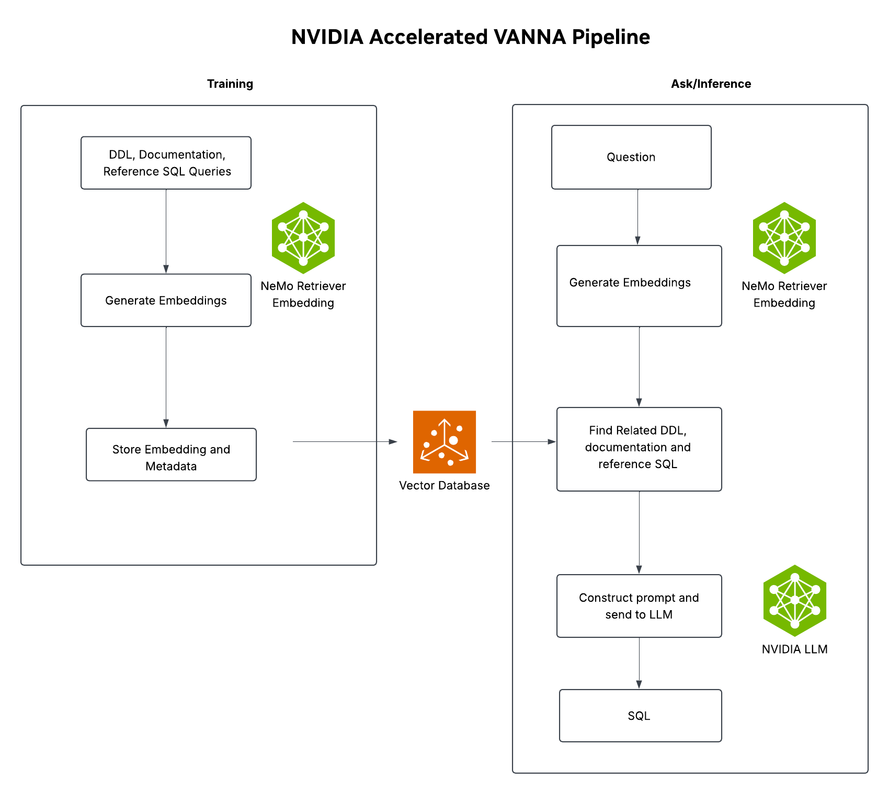

# Accelerating Text-to-SQL Inference with Vanna and NVIDIA AI Endpoints

This repository demonstrates how to optimize Vanna's open-source text-to-SQL pipeline using NVIDIA NIM and NeMo Retriever for faster and more efficient analytics.

## Overview

This project showcases how to leverage NVIDIA's AI endpoints to significantly accelerate text-to-SQL generation with Vanna, enabling faster natural language queries on databases.

## Features

- Integration with NVIDIA NIM for LLM-based SQL generation
- NeMo Retriever for efficient semantic search
- Training Vanna on domain specific data

## Requirements

- Python 3.10+
- NVIDIA API key (get yours at [https://build.nvidia.com/](https://build.nvidia.com/))
- Required Python packages:
  - vanna
  - langchain
  - langchain-nvidia-ai-endpoints
  - pymilvus[model]
  - pandas
  - numpy
  - sqlite3
  - openai
  - kagglehub

## Getting Started

1. Clone this repository
2. Install the required packages
3. Set your NVIDIA API key
4. Run the Jupyter notebook `vanna_with_NVIDIA.ipynb`

## Dataset

The notebook uses Steam game datasets from Kaggle:
- [Steam Games Dataset](https://www.kaggle.com/datasets/fronkongames/steam-games-dataset/data)
- [Games on Steam](https://www.kaggle.com/datasets/sujaykapadnis/games-on-steam/)

After preprocessing, the data is organized into three tables:
- `games`: Game information including name, price, reviews, etc.
- `categories`: Game categories
- `tags`: User-defined tags and their frequencies

## Pipeline

The NVIDIA-accelerated Vanna pipeline consists of:
1. Data preparation and ingestion
2. Vector DB setup with Milvus
3. Integration with NVIDIA LLM (Llama 3.1) and embedding models
4. SQL database setup and training
5. Natural language query to SQL conversion

## Example Queries

The notebook demonstrates several example queries:
- "Which 5 games have the most positive reviews and how many?"
- "Which indie game has the biggest player base?"
- "Which category has the maximum number of gamers and how many?"

## License

This project is licensed under the MIT License - see the LICENSE file for details. 