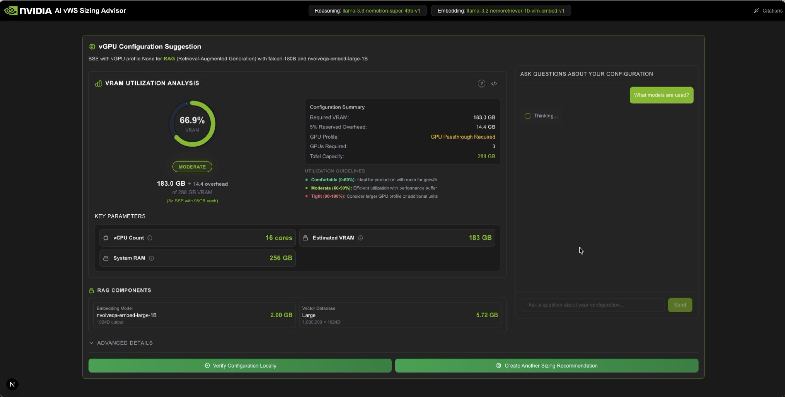
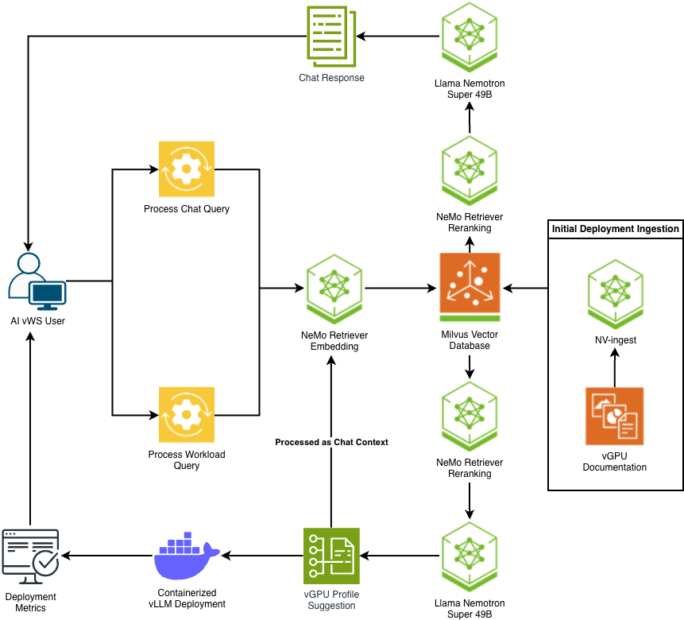
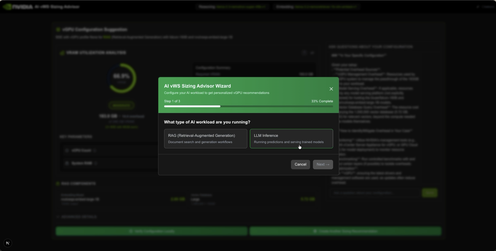
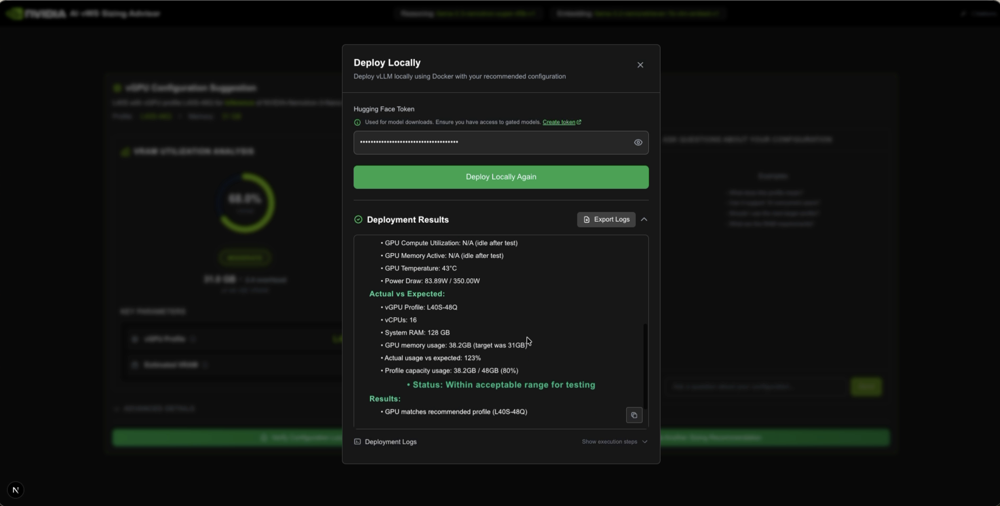

# AI vWS Sizing Advisor

<p align="center">
  
</p>

<p align="center">
  <strong>RAG-powered vGPU sizing recommendations for AI Virtual Workstations</strong><br>
  Powered by NVIDIA NeMo and Nemotron models
</p>

<p align="center">
  <a href="https://docs.nvidia.com/vgpu/toolkits/sizing-advisor/latest/intro.html">Official Documentation</a> •
  <a href="#demo">Demo</a> •
  <a href="#deployment">Deployment</a> •
  <a href="./CHANGELOG.md">Changelog</a>
</p>

---

## Overview

AI vWS Sizing Advisor is a RAG-powered tool that helps you determine the optimal NVIDIA vGPU sizing configuration for AI workloads on NVIDIA AI Virtual Workstation (AI vWS). Using NVIDIA vGPU documentation and best practices, it provides tailored recommendations for optimal performance and resource efficiency.

### Powered by NVIDIA Nemotron

This tool leverages **NVIDIA Nemotron models** for intelligent sizing recommendations:

- **[Llama-3.3-Nemotron-Super-49B](https://build.nvidia.com/nvidia/llama-3_3-nemotron-super-49b-v1)** — Powers the RAG backend for intelligent conversational sizing guidance
- **[Nemotron-3 Nano 30B](https://build.nvidia.com/nvidia/nvidia-nemotron-3-nano-30b-a3b-fp8)** — Default model for workload sizing calculations

### Key Capabilities

Enter your workload requirements and receive validated recommendations including:

- **vGPU Profile** — Recommended profile (e.g., L40S-24Q) based on your workload
- **Resource Requirements** — vCPUs, GPU memory, system RAM needed
- **Performance Estimates** — Expected latency, throughput, and time to first token
- **Live Testing** — Instantly deploy and validate your configuration locally using vLLM containers

The tool differentiates between RAG and inference workloads by accounting for embedding vectors and database overhead. It intelligently suggests GPU passthrough when jobs exceed standard vGPU profile limits.

---

## Application Workflow

The architecture follows a three-phase pipeline: document ingestion, RAG-based profile suggestion, and local deployment verification.

<p align="center">
  
</p>

---

## Demo

### Configuration Wizard

Configure your workload parameters including model selection, GPU type, quantization, and token sizes:

<p align="center">
  
</p>

### Local Deployment Verification

Validate your configuration by deploying a vLLM container locally and comparing actual GPU memory usage against estimates:

<p align="center">
  
</p>

---

## Deployment

**Requirements:** Ubuntu 22.04 LTS • NVIDIA GPU (L40S/L40/L4/A40, 24GB+ VRAM) • Driver 535+ • 32GB RAM • 50GB storage

```bash
# 1. Install dependencies (skip if already installed)
sudo apt update && sudo apt install -y docker.io npm
sudo usermod -aG docker $USER && newgrp docker

# 2. Clone and navigate
git clone https://github.com/NVIDIA/GenerativeAIExamples.git
cd GenerativeAIExamples/community/ai-vws-sizing-advisor

# 3. Set API key (get yours at https://build.nvidia.com/settings/api-keys)
export NGC_API_KEY="nvapi-your-key-here"
echo "${NGC_API_KEY}" | docker login nvcr.io -u '$oauthtoken' --password-stdin

# 4. Start backend (first run takes 3-5 min)
./scripts/start_app.sh

# 5. Start frontend (in new terminal)
cd frontend && npm install && npm run dev
```

> **Note:** A [HuggingFace token](https://huggingface.co/settings/tokens) is required for local deployment testing with gated models (e.g., Llama).

---

## Usage

1. **Select Workload Type:** RAG or Inference

2. **Enter Parameters:**
   - Model name (default: **Nemotron-3 Nano 30B FP8**)
   - GPU type
   - Prompt size (input tokens)
   - Response size (output tokens)
   - Quantization (FP16, FP8, INT8, INT4)
   - For RAG: Embedding model and vector dimensions

3. **View Recommendations:**
   - Recommended vGPU profiles
   - Resource requirements (vCPUs, RAM, GPU memory)
   - Performance estimates

4. **Test Locally** (optional):
   - Run local inference with a containerized vLLM server
   - View performance metrics
   - Compare actual results versus suggested profile configuration

---

## Management Commands

```bash
# Service Management
./scripts/status.sh           # Check status of all services
./scripts/restart_app.sh      # Restart RAG backend
./scripts/stop_app.sh         # Stop all services (with Docker cleanup)
./scripts/stop_app.sh --volumes     # Stop services and remove all data
./scripts/stop_app.sh --cleanup-images  # Stop services and clean Docker cache

# Logs
docker logs -f rag-server      # View RAG server logs
docker logs -f ingestor-server # View ingestion logs
```

### Stop Script Options

The stop script automatically performs Docker cleanup operations:
- Removes stopped containers
- Prunes unused volumes
- Cleans up unused networks
- Optionally removes dangling images (`--cleanup-images`)
- Optionally removes all data volumes (`--volumes`)

---

## Adding Documents to RAG Context

The tool includes NVIDIA vGPU documentation by default. To add your own:

```bash
# Copy document to docs directory
cp your-document.pdf ./vgpu_docs/

# Trigger ingestion
curl -X POST -F "file=@./vgpu_docs/your-document.pdf" http://localhost:8082/v1/ingest
```

**Supported formats:** PDF, TXT, DOCX, HTML, PPTX

---

## License

Licensed under the Apache License, Version 2.0.

Models governed by [NVIDIA AI Foundation Models Community License](https://docs.nvidia.com/ai-foundation-models-community-license.pdf) and [Llama 3.2 Community License](https://www.llama.com/llama3_2/license/).