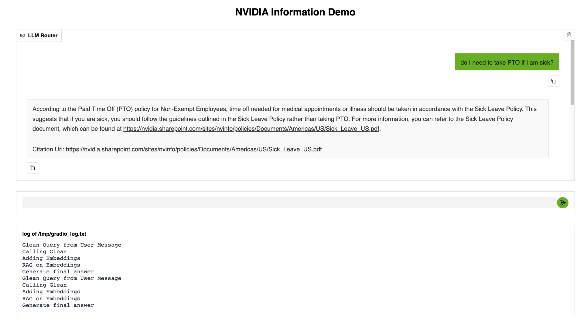
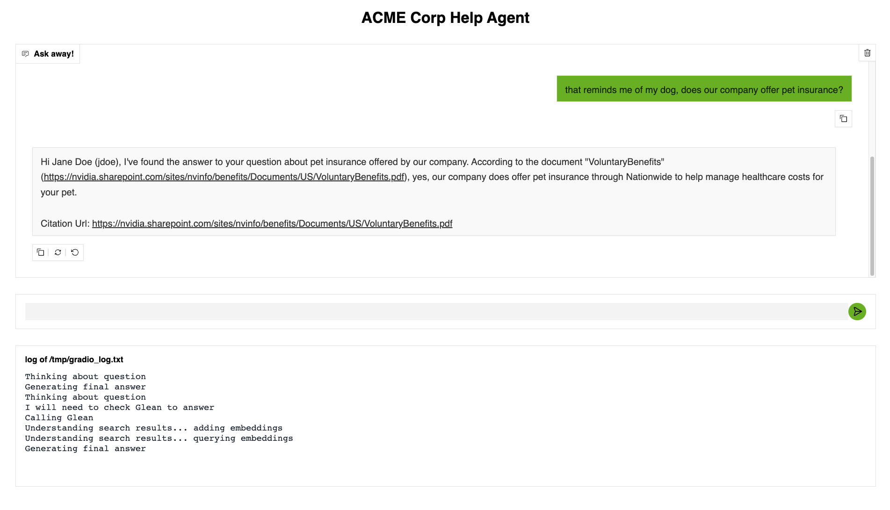

# NvBot Lite

This repository includes a demo of a simple chat bot that answers questions based on a company's internal knowledge share. 







The implementation includes:

- Gradio chat interface 
- Langgraph agent
- Nvidia NIMs for the main LLM as well as RAG Embeddings
- Chroma DB for a lightweight vector DB
- An internal knowledge base stored in Glean and available over the Glean Search API

This example uses NVIDIA NIMs which can be hosted completely on-premise, which combined with the Glean on-premise offering allows organizations to use LLMs for internal knowledge search, chat, and retrieval without any data leaving their environment.

A sample architecture that could be built by extending this example is shown below: 


## Pre-requisites 

- NVIDIA API key available at https://build.nvidia.com

```bash
export NVIDIA_API_KEY="nvapi-YOUR-KEY"
```
- Glean Search API and API Key

```bash
export GLEAN_API_KEY="YOUR-GLEAN-API-KEY"
export GLEAN_API_BASE_URL="https://your-org.glean.com/rest/api/v1"
```

## Getting Started 

-  Clone the repository and install necessary dependencies, we recommend using  `uv`

```bash
# from within the repository root
uv sync
```

- Run the chat app

```bash
uv run glean_example/src/app/app.py
```

