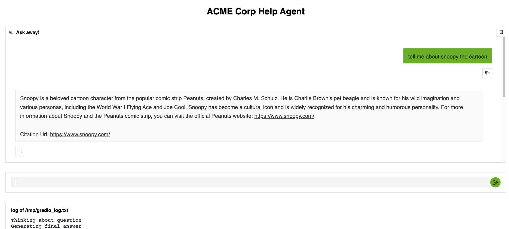
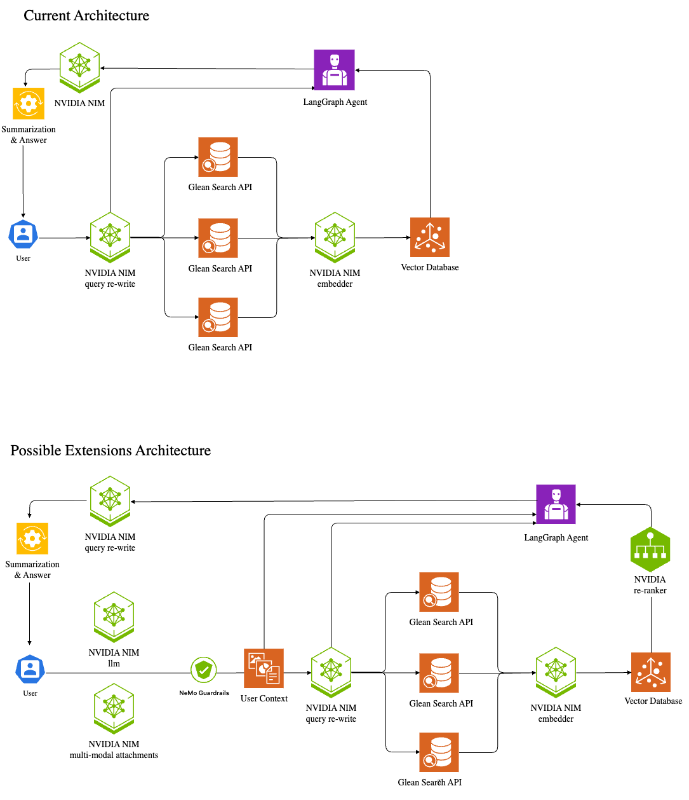

# Enterprise Knowledge Base Chatbot

This repository includes a demo of a simple chat bot that answers questions based on a company's internal knowledge repository. 



The implementation includes:

- Gradio chat interface 
- LangGraph agent
- NVIDIA NIM microservices
- Chroma DB for a lightweight vector DB
- An internal knowledge base stored in Glean and available over the Glean Search API

This example uses NVIDIA NIM microservices which can be hosted completely on-premise or in a company's private cloud, which combined with the Glean cloud-prem offering, allows organizations to create internal knowledge search, chat, and retrieval applications without any data leaving their environment.

The example architecture and possible extensions are shown below.



## Pre-requisites 

This example uses hosted NVIDIA NIMs for the foundational LLMs. In order to use these hosted LLMs you will need a NVIDIA API key which is available at https://build.nvidia.com.

```bash
export NVIDIA_API_KEY="nvapi-YOUR-KEY"
```

This example also requires a Glean instance and API key. We recommend using a development sandbox for initial testing.

```bash
export GLEAN_API_KEY="YOUR-GLEAN-API-KEY"
export GLEAN_API_BASE_URL="https://your-org.glean.com/rest/api/v1"
```

## Getting Started - Demo Application

-  Clone the repository and navigate to this example.

    ```bash
    git clone https://github.com/NVIDIA/GenerativeAIExamples
    cd GenerativeAIExamples/community/chat-and-rag-glean
    ```

-  Install the necessary dependencies, we recommend using  `uv` as Python installation and package manager.

    ```bash
    curl -LsSf https://astral.sh/uv/install.sh | sh # install uv
    uv python install  # install python
    uv sync  # install the dependencies for this project
    ```

- Run the chat app

    ```bash
    uv run glean_example/src/app/app.py
    ```

After running this command, open a browser window to `http://127.0.0.1:7860`. The web application allows a user to enter a prompt. The logs will show the main steps the application takes to answer the prompt. Full logs will be displayed in the terminal. 

### Customizing the LLMs

The specific LLMs used for the agent and embeddings are specified inside of the file `glean_example/src/agent.py`: 

```python
model = ChatNVIDIA(
    model="meta/llama-3.3-70b-instruct", api_key=os.getenv("NVIDIA_API_KEY")
)
embeddings = NVIDIAEmbeddings(
    model="nvidia/llama-3.2-nv-embedqa-1b-v2",
    api_key=os.getenv("NVIDIA_API_KEY"),
    truncate="NONE",
)
```


The main LLM used is `meta/llama-3.3-70b-instruct`. Update this model name to use a different LLM.

The main embedding model used is `meta/llama-3.2-nv-embedqa-1b-v2`. Update this model name to use a different embedding model.

### Using in a private network 

You may way to build an application similar to this demo that is hosted in your private environment so that no internal data leaves your systems.

- Ensure you are using the [Glean "Cloud-prem" option](https://help.glean.com/en/articles/10093412-glean-deployment-options). Update the `GLEAN_API_BASE_URL` to use your cloud-prem Glean installation. 
- Follow the appropriate [NVIDIA NIM deployment guide](https://docs.nvidia.com/nim/large-language-models/latest/deployment-guide.html) for your environment. You will need to deploy at least one NVIDIA NIM foundational LLM and one NVIDIA NIM embedding model. The result of following this guide will be two private URL endpoints.
- Update the file `glean_example/src/agent.py` to use the private endpoints: 

    ```python
    model = ChatNVIDIA(
        model="meta/llama-3.3-70b-instruct", 
        base_url="http://localhost:8000/v1", # Update to the URL where your NVIDIA NIM is running
        api_key=os.getenv("NVIDIA_API_KEY")
    )
    embeddings = NVIDIAEmbeddings(
        model="nvidia/llama-3.2-nv-embedqa-1b-v2",
        base_url="http://localhost:8000/v1", # Update to the URL where your NVIDIA NIM is running
        api_key=os.getenv("NVIDIA_API_KEY"),
        truncate="NONE",
    )
    ```


## Getting Started - Jupyter Notebook

Further details about the code, and an example that calls a chatbot without a web application, is available in the Jupyter Notebook `nvidia_nim_langgraph_glean_example.iypnb`.

```
uv run jupyter lab 
```