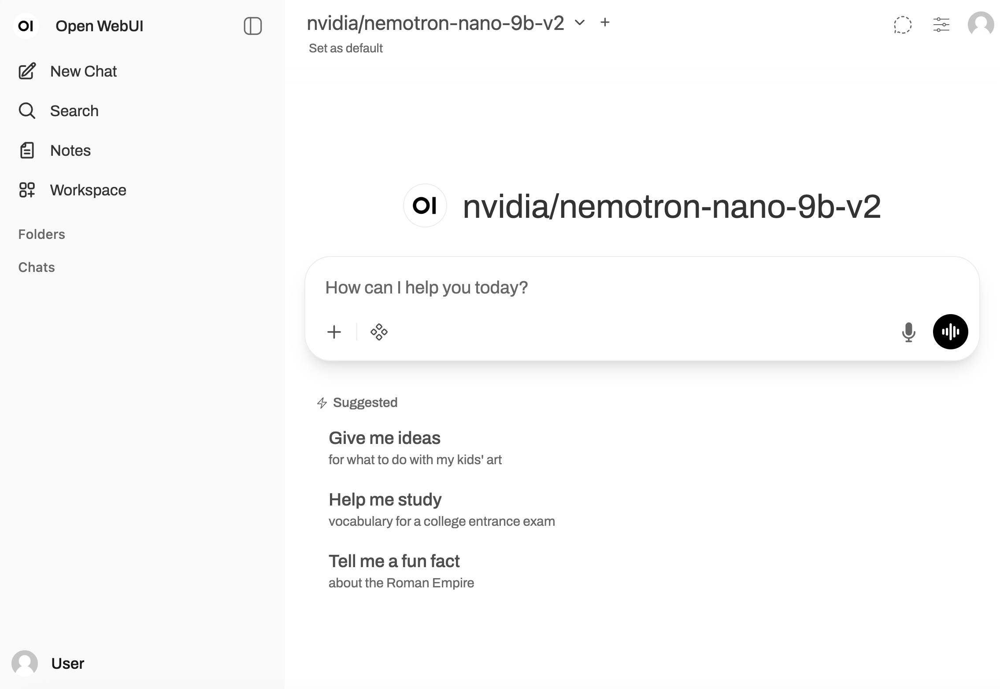

<!--
  SPDX-FileCopyrightText: Copyright (c) 2023 NVIDIA CORPORATION & AFFILIATES. All rights reserved.
  SPDX-License-Identifier: Apache-2.0

  Licensed under the Apache License, Version 2.0 (the "License");
  you may not use this file except in compliance with the License.
  You may obtain a copy of the License at

  http://www.apache.org/licenses/LICENSE-2.0

  Unless required by applicable law or agreed to in writing, software
  distributed under the License is distributed on an "AS IS" BASIS,
  WITHOUT WARRANTIES OR CONDITIONS OF ANY KIND, either express or implied.
  See the License for the specific language governing permissions and
  limitations under the License.
-->

# DGX Spark Demo

This demo showcases NVIDIA's Nemotron Nano 9B v2 model running locally via NIM (NVIDIA Inference Microservice) on DGX Spark, with OpenWebUI as the frontend interface.

## Overview

- **Model**: NVIDIA Nemotron Nano 9B v2
- **Runtime**: NVIDIA NIM
- **Frontend**: OpenWebUI
- **Hardware**: DGX Spark



## Prerequisites

- NVIDIA DGX Spark or compatible GPU hardware
- Docker installed with NVIDIA GPU support
- NGC API Key ([Get one here](https://ngc.nvidia.com/))
- Python 3.x (for OpenWebUI)

## Setup Instructions

### 1. Running Local NIM

First, set up and run the NVIDIA Inference Microservice with the Nemotron model:

```bash
# Set your NGC API key
export NGC_API_KEY="<your-ngc-api-key>"

# Set up cache directory
export LOCAL_NIM_CACHE=~/.cache/nim
mkdir -p "$LOCAL_NIM_CACHE"

# Run the NIM container
docker run -it --rm \
    --gpus all \
    --shm-size=16GB \
    -e NGC_API_KEY \
    -v "$LOCAL_NIM_CACHE:/opt/nim/.cache" \
    -u $(id -u) \
    -p 8000:8000 \
    nvcr.io/nim/nvidia/nvidia-nemotron-nano-9b-v2-dgx-spark:latest
```

The NIM service will be available at `http://localhost:8000`.

### 2. Installing OpenWebUI

Follow the official OpenWebUI installation guide:

[OpenWebUI Installation Guide](https://github.com/open-webui/open-webui?tab=readme-ov-file#how-to-install-)

### 3. Running OpenWebUI

Configure and start OpenWebUI to connect to your local NIM instance:

```bash
# Configure OpenWebUI to use the local NIM endpoint
export OPENAI_API_BASE_URL=http://0.0.0.0:8000/v1
export OPENAI_API_KEY=""
export ENABLE_MODEL_SELECTOR=false
export WEBUI_AUTH=False
export DEFAULT_MODEL="nvidia/nemotron-nano-9b-v2"

# Start OpenWebUI
open-webui serve --host 0.0.0.0 --port 8080
```

Access OpenWebUI at `http://localhost:8080` in your browser.

## Testing the Setup

To verify that the NIM service is running correctly, use the following curl command:

```bash
curl -X 'POST' \
  'http://localhost:8000/v1/chat/completions' \
  -H 'accept: application/json' \
  -H 'Content-Type: application/json' \
  -d '{
    "model": "nvidia/nemotron-nano-9b-v2",
    "messages": [{"role":"user", "content":"Which number is larger, 9.11 or 9.8?"}],
    "max_tokens": 128,
    "stream": true
  }'
```

You should receive a streaming response from the model.

## Architecture

```
┌─────────────┐     HTTP      ┌──────────────┐     API      ┌─────────────┐
│  User       │ ────────────> │  OpenWebUI   │ ──────────>  │  NIM        │
│  Browser    │               │  (Port 8080) │              │  (Port 8000)│
└─────────────┘               └──────────────┘              └─────────────┘
                                                                    │
                                                                    v
                                                             ┌─────────────┐
                                                             │  Nemotron   │
                                                             │  Nano 9B v2 │
                                                             └─────────────┘
```

## Troubleshooting

### NIM Container Issues
- Ensure you have sufficient GPU memory (the model requires significant VRAM)
- Verify your NGC API key is valid
- Check that Docker has access to GPU resources with `docker run --gpus all nvidia/cuda:11.0-base nvidia-smi`

### OpenWebUI Connection Issues
- Verify the NIM service is running: `curl http://localhost:8000/v1/models`
- Ensure the `OPENAI_API_BASE_URL` points to the correct endpoint
- Check firewall settings if accessing from a different machine

## Additional Resources

- [NIM Container for DGX Spark (NGC Catalog)](https://catalog.ngc.nvidia.com/orgs/nim/teams/nvidia/containers/nvidia-nemotron-nano-9b-v2-dgx-spark?version=1.0.0-variant)
- [NVIDIA NIM Documentation](https://docs.nvidia.com/nim/)
- [OpenWebUI Documentation](https://github.com/open-webui/open-webui)
- [Nemotron Model Information](https://build.nvidia.com/nvidia/nemotron-nano-9b-v2)

## License

Refer to NVIDIA's licensing terms for NIM and the Nemotron model.

