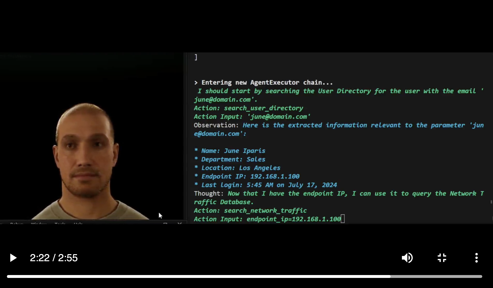
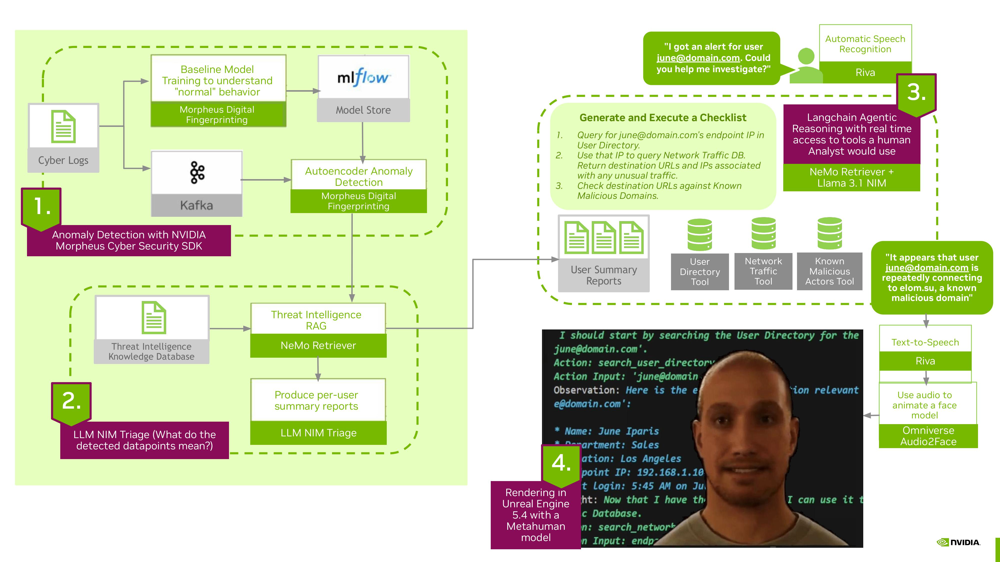
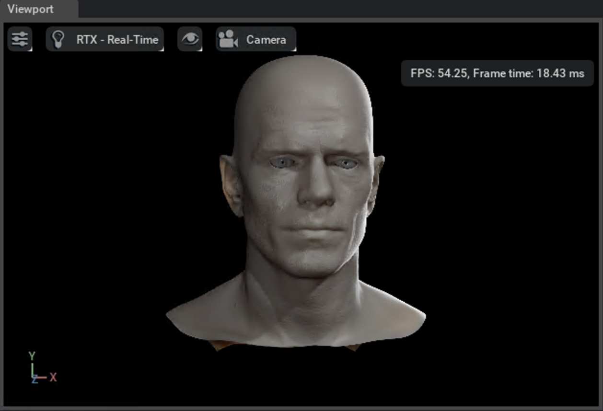
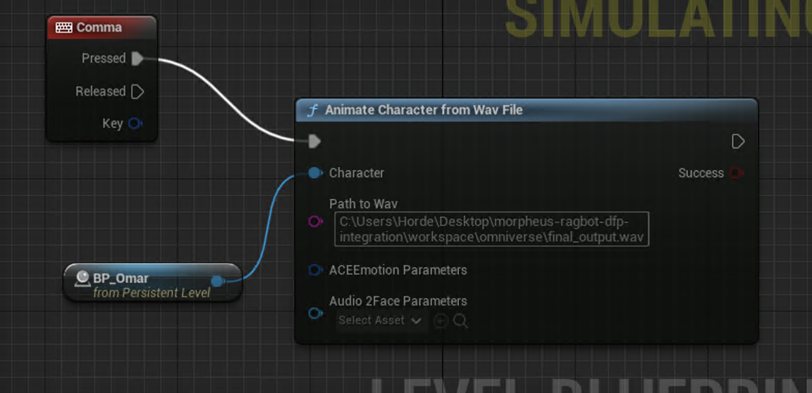
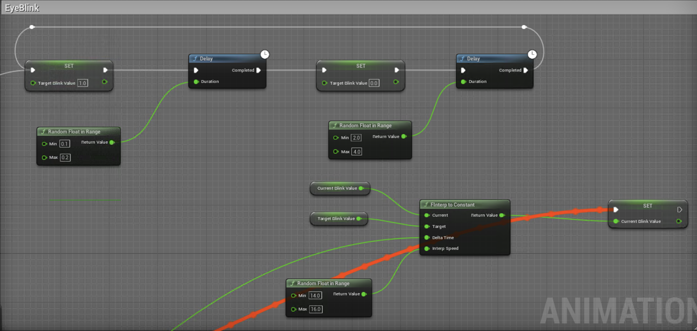
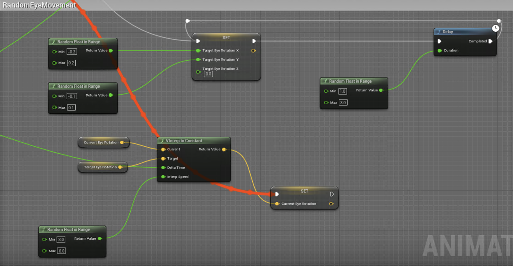

<!--
SPDX-FileCopyrightText: Copyright (c) 2022-2024, NVIDIA CORPORATION & AFFILIATES. All rights reserved.
SPDX-License-Identifier: Apache-2.0

Licensed under the Apache License, Version 2.0 (the "License");
you may not use this file except in compliance with the License.
You may obtain a copy of the License at

http://www.apache.org/licenses/LICENSE-2.0

Unless required by applicable law or agreed to in writing, software
distributed under the License is distributed on an "AS IS" BASIS,
WITHOUT WARRANTIES OR CONDITIONS OF ANY KIND, either express or implied.
See the License for the specific language governing permissions and
limitations under the License.
-->

# Creating a Digital-Human Security Analyst

## Project Overview and Goal
Every day, Security Operation Center (SOC) analysts receive an overwhelming amount of security alerts, from which they must triage out false positives and identify true security breaches. In this example, we create a RAG enabled co-pilot for this task. We cover the steps needed to make a co-pilot, which can be applied to any use case or industry where data retrieval and synthesis can be simple but tedious. We cover multi-step agentic reasoning, data ingestion for RAG, speech input/output, and face model animation.

__This project will walk you through a broad sample of NVIDIA technologies, and no prior knowledge is necessary:__
- [Morpheus](https://developer.nvidia.com/morpheus-cybersecurity) SDK with the [Digital Fingerprinting](https://www.nvidia.com/en-us/ai-data-science/ai-workflows/digital-fingerprinting/) (DFP) autoencoder workflow for anomaly detection in users
- [Riva Speech Services](https://www.nvidia.com/en-us/ai-data-science/products/riva/) (Text-to-Speech and Automatic Speech Recognition)
- [NeMo Retriever](https://www.nvidia.com/en-us/ai-data-science/products/nemo/) for Retrieval Augmented Generation (RAG)
- [Omniverse Audio2Face](https://www.nvidia.com/en-us/ai-data-science/audio2face/) for animating a Digital Human


This demo of the Analyst Morpheus project is running in Unreal Engine 5.4, using the default Metahuman model Omar.

[](./readme_media/analyst_morpheus_langchain_demo_small.mp4)


## Technical Overview
The co-pilot Analyst Morpheus uses a multi-step agentic reasoning workflow via langchain. The agent has access to several tools including a Network Traffic Database, a User Directory, a Threat Intelligence database, and other sources that mimic what a real-world SOC analyst would use. The agent also has access to an Alert Summaries Database of real-time security alerts generated by NVIDIA LLM NIMs in combination with NVIDIA Morpheus's Digital Fingerprinting workflow for anomaly detection. The goal is to exemplify how live data can be ingested into a RAG co-pilot workflow. We use Reranking and Embedding models from NeMo Retriever.

The digital human takes voice queries, which are transcribed into text via NVIDIA Riva Automatic Speech Recognition (ASR). The RAG text response is turned into audio output via NVIDIA Riva Text-to-Speech (TTS). This output is then used by Omniverse Audio2Face to animate a Metahuman face model, which is rendered in Unreal Engine. Optionally, you can render in the Omniverse Audio2Face App instead.


Read more about this project in the Spotlight Blog post [here]. [Link to blog coming soon!]



# Section 0: Configure API Keys
From build.nvidia.com, generate a [Llama 3.1 key](https://build.nvidia.com/explore/discover?snippet_tab=LangChain#llama-3_1-405b-instruct), a [Embedding API key](https://build.nvidia.com/nvidia/embed-qa-4?snippet_tab=LangChain), and a [Reranking API key](https://build.nvidia.com/nvidia/nv-rerankqa-mistral-4b-v3?snippet_tab=LangChain). Add all three keys to the `.env` file.

# Section 1 [OPTIONAL]: Data Preprocessing via Morpheus Digital Fingerprinting 
> **[!NOTE]**  
> Section 1 focuses on data preprocessing such as turning numerical data into natural language reports; specifically, we turn numerical anomaly scores into user summary reports. The RAG system will then use the summary reports as context. However, in this repo we include pre-generated summary reports, so you can choose to skip to Section 2 if you would like to just focus on the RAG and Digital Human aspects.

In order to create a co-pilot that has accurate and up-to-date knowledge of a specific organization's security operations landscape, we have to first devise a method for ingestion of alerts, logs, network traffic, and other data that an analyst would usually have access to. Taking a step back, we use the Morpheus SDK to train autoencoder models which will output numerical alerts when anomalous user activity is detected. We then use NVIDIA NIMs to create natural language summaries of such alerts on a per-user basis. Lastly, we upload the alert summaries into an asynchronous NeMo Retriever collection that serves as our RAG knowledge source.

Pull the 24.03 version of the Morpheus container image from NGC.

```bash
docker pull nvcr.io/nvidia/morpheus/morpheus:24.03-runtime
```

> **[!OPTIONAL]**  
> By default, this project code is configured by default to use the API found at build.nvidia.com. To switch to a self hosted NIM, generate a valid NIM key from [NGC](https://docs.nvidia.com/ngc/gpu-cloud/ngc-user-guide/index.html#ngc-api-keys) and pull the LLaMa-3-8b NIM 24.05 image: `docker pull nvcr.io/nim/meta/llama3-8b-instruct:1.0.0`. Uncomment the nim-llm portion of `docker-compose.yml`


> **[!OPTIONAL]** 
> In `docker-compose.yml`, you can also configure the number of GPUs to use under the `CUDA_VISIBLE_DEVICES` parameter.

Run the container.

```bash
docker compose up jupyter
```

Check that containers spun up successfully. You should see jupyter and mlflow.
```bash
docker compose ps
```

If you elected for a self hosted LLM NIM, you should also see nim-llm. Otherwise, try `docker compose up nim-llm`.


> **[!TROUBLESHOOTING]**  
>  If any of the containers don't spin up, ensure that the GPUs you're pointing to in the docker-compose.yml file have enough memory available. You can use `docker compose logs [container-name]` to check for issues.
> Also, if you have configured a non-default port for jupyter, be sure to manually forward your port.


Once inside the jupyter notebook, you will find the folders you would see in the open source Morpheus [github repo](https://github.com/nv-morpheus/Morpheus). Navigate to where our `security-analyst-digital-human` folder is mounted: examples/digital_fingerprinting/production/morpheus

### Train Baseline Models
First, we will need to train the baseline autoencoder models per entity (user) so that we can run inference with these models to detect anomalies in user behavior.

Open a new terminal in the jupyter notebook and type `bash` to open a new bash shell. Navigate to the path `/workspace/examples/digital_fingerprinting/production/morpheus`.
```bash
cd /workspace/examples/digital_fingerprinting/production/morpheus
```

From here, run the following commands to download some training data. We will be using azure logs; you can view the log features [here](https://github.com/nv-morpheus/Morpheus/blob/branch-24.10/models/data/columns_ae_azure.txt). If the reconstruction loss (which the Morpheus autoencoder class translates into a z-score for increased explanability) of any of these features is high past a configurable threshold, we will trigger an alert. For example, if the appIncrement feature describing the number of apps the user is using is higher than expected, we consider this anomalous.


```bash
pip install s3fs
./../../fetch_example_data.py azure
```

Now, we can run all cells in the training pipeline notebook `dfp_azure_training.ipynb` located in the `examples/digital_fingerprinting/production/morpheus/workspace` directory. This notebook may take several minutes to run.

### Run Inference to Generate User Summaries
Once baseline models are trained and stored in mlflow, we want to run our inference pipeline on validation azure logs to see if we can detect unusual user behavior. The `dfp_azure_chatbot.ipynb` notebook will output each feature and the corresponding z-score. We will aggregate all unusually high z-scores belonging to a particular user, and use this to generate a summary report using NIM LLMs. The goal is to provide an additional layer of natural language explainability. We will also _enrich_ this per-user summary with Threat Intelligence pulled from the Internet (stored at `upload_intel/intel/cyber_enrichment`).

We want to populate a vector database with our Threat Intelligence. To do so, we will use langchain and NVIDIA reranking and embedding APIs from [build.nvidia.com](https://build.nvidia.com/explore/discover).

> **[!OPTIONAL]**  
> You can also easily host your own reranking and embedding microservices. Read more [here](https://docs.nvidia.com/nim/nemo-retriever/text-embedding/latest/playbook.html).


Run all cells of the notebook. It may take several minutes. Alert summaries per user will be generated and uploaded to a *new* vector database.

> **[!TROUBLESHOOTING]**  
>  If you recieve a File Does Not Exist error, create the missing file (and any missing directories along the specified file path) in the Jupyter notebook.

> **[!OPTIONAL]**  
> This example project is currently configured to point to build.nvidia API for the Summary Inference Morpheus pipeline step. To use your self-hosted LLM NIM instead (which you have spun up in a previous optional step), edit the `chat_nvidia_service.py` file and add a `base_url` parameter to the ChatNVIDIA model instantiation. Point the `base_url` to your locally hosted model.

> **[!NOTE]**  
> Since we only have one anomalous user in our validation data (attacktarget@domain.com), we manually add two more example reports in the "RAG Upload to User Summaries Vector Database" section of the notebook. (You can view the example reports at `upload_intel/intel/user_summaries`).


# Section 2: Langchain Tools Using RAG

### Defining Tools
We will now move out of jupyter notebook for the remainder of this project. Inside the `ragbot` folder contains scripts that will drive the chatbot as well as give it access to the data sources a SOC analyst would typically have. This access is given in the form of Langchain Tools, which can be found in `ragbot/agent_tools.py`. There are currently five tools:

1. Access to a User Directory containing user email, full name, endpoint device IP, department, city
2. Access to a Network Traffic Database containing connections that detail destination url, timestamp, source IP, destination IP, source port, destination port, bytes sent, bytes received, protocol, user
3. Access to a Threat Intelligence Database containing known malicious URLs
4. Access to an Email Security Gateway, containing the content of emails flagged as malicious as well as corresponding users they were sent to and timestamp
5. Access to Alert Summaries, containing the per-user summaries (generated by our `dfp_azure_chatbot.ipynb` notebook)


### Creating Vector Databases for Each Tool
Each of these tools has a corresponding knowledge source text file which can be found in the `upload_intel/intel/tools` directory. Each tool is essentially a RAG query into the specific collection in which the relevant data is stored.

> **[!OPTIONAL]**  
> You can experiment with adding your own knowledge source and corresponding tool by adding your content to a new .txt file, then uploading it to a new Retriever collection. See `ragbot/agent_tools` to see how tools are defined.

> **[!NOTE]**  
> In addition to the five databases mentioned above, we will also be creating a "General Collection" which will contain the combined contents of all databases. The purpose is to achieve lower latency. If the end-user's query does not require multiple tools, then the LLM will not need to build a multi-step checklist to accomplish the query; the General Collection provides a single consolidated stop for the LLM. On the other hand, we also create separated collections for each tool for the purpose of modularity and retrieval accuracy during a multi-step inference.

# Section 3: Ragbot With Voice Input

### Set up Riva
Set up an instance of Riva by following this [Quick Start Guide](https://docs.nvidia.com/deeplearning/riva/user-guide/docs/quick-start-guide.html).

> **[!IMPORTANT]**
> You must have access to a Linux machine to deploy your Riva instance. See specifics at the top of the Riva Quick Start Guide.


### Configure Riva and API Keys
At this point, we recommend you to move to a __Windows environment__ if you are not in one already. Linux requires root permissions to run the keyboard library that is used in the `voice_ragbot.py` script, so trying to run `voice_ragbot.py` in Linux will need additional workarounds.

We are now ready to deploy the RAG-bot. Navigate to `ragbot/voice_ragbot.py`.

At the top of the script, we need to configure the IP and port of our Riva instance.
```bash
RIVA_IP_AND_PORT = "YOUR RIVA DEPLOYMENT IP AND PORT" #should be in format [IP]:[PORT]
```

# Section 4: Completing the Digital Human Using Audio2Face

### Run the Ragbot Script without Audio2Face
Install some requirements and run the `voice_ragbot.py` script:
```bash
pip install numpy nvidia-riva-client pandas soundfile sounddevice scipy keyboard protobuf==3.20.3 langchain langchain_openai langchain-nvidia-ai-endpoints
python3 voice_ragbot.py
```

> **[!NOTE]**
> You may run into an issue where sounddevice library requires the PortAudio library. Install the PortAudio library.

Use the 'Space' key to begin voice recording, and press 'Space' again to finish recording. Riva ASR will transcribe the speech input, which is sent to the llama3 API at build.nvidia. An LLM "router" decides if the query is one-step or multi-step. If the query is multi-step, it will be routed to a multi-step workflow. The "router" also decides if the query is requires Retriever context, in which case a retrieval step is inserted before the final answer generation. The final text output will be handed to Riva TTS to convert to audio, which is then saved as a .wav file. The script will keep running until the 'Escape' key is pressed.


## Option 1: Rendering in the Omniverse Audio2Face App
Using the Audio2Face App will require __less set up__, but the face will be a default grey colored character. See [here](https://docs.omniverse.nvidia.com/audio2face/latest/user-manual/ai-model.html) for an introductory tutorial to Audio2Face. The default face is pictured below.

> **[!IMPORTANT]**
> You must have access to a Windows or Linux machine to use the Omniverse Audio2Face app.




### Download Audio2Face
Download the Omniverse App:
- [Link to Windows download](https://launcher-installer.s3.us-east-2.amazonaws.com/omniverse-launcher-win.exe)
- [Link to Linux download](https://launcher-installer.s3.us-east-2.amazonaws.com/omniverse-launcher-linux.AppImage)

Within the Omniverse App, search for the Audio2Face app in the Exchange tab and download it. Launch the Audio2face App. It may take several minutes to start up.


### Quick Test of Riva in Audio2Face App
To run a quick test of your Riva TTS server and Audio2Face working together, navigate to Windows>Extensions in the Audio2Face App and search for the Riva TTS extension. Toggle it on.

Navigate out of the Extensions panel. You will see that a new Riva TTS Extension panel has opened. In this panel, configure your Riva server IP and port. Then, you can type in a message in the provided text box, which will be sent to your Riva server, then sent back to animate the face mesh. You can find a more detailed video tutorial [here](https://www.youtube.com/watch?v=p3b1YC5JC8E).


### Running voice_ragbot.py in Audio2Face App
On the right panel of the interface, configure Audio Player dropdown to `Streaming` and click the `Get Started` button. Confirm `Yes` to creating a new Stage, and a new window will open with the default male face Mark.

Locate the `Stage` panel on the right side of the face. In this panel, expand the `audio2face` OmniGraph and find the `Player_Streaming` OmniGraphNode; this object will take in audio streams from your Riva server. At the top of `voice_ragbot.py`, assign the variable `A2F_PLAYER_STREAMING_LOCATION` to be to the path of the `Player_Streaming` Node. You can find this path by clicking on the Node and viewing the `Prim Path` value in under the `Property` panel. By default, the path is `/World/audio2face/PlayerStreaming`.


In `voice_ragbot.py` __uncomment__ the line under `#for Audio2Face App rendering`. __Comment out__ the `#for Unreal Engine rendering` section (up until and including the `sf.write` line). 


Then, uncomment the line containing the function call to `a2f_client.push_audio_track_stream`. This function pushes the Riva TTS output to an Audio2Face client (see `a2f_client.py`) which then animates the face in the Audio2Face app.

Re-run the script. Once audio is synthesized using Riva TTS, it will be automatically streamed to Audio2Face app. The app will play back the audio and drive Mark's face animations in sync with the audio playback.


### Troubleshooting
If you hear audio, but the face mesh is not moving, it is possible that you have multiple `Player_Streaming` objects and the one that is receiving audio is not the same object that is driving face movement. Double check the objects under the Audio2Face OmniGraph, as well as the path you configured in `voice_ragbot.py`.


## Option 2: Rendering in Unreal Engine
This option has a more difficult set up, but allows for greatly increased avatar customization. We will use a Metahuman model, which includes a suite of default models which can be [further customized](https://www.unrealengine.com/en-US/metahuman). Some prerequisite knowledge of Unreal Engine may be helpful.

### Setting up Kairos Example Project
Download [Unreal Engine 5.4](https://www.unrealengine.com/en-US/download).

Download the Kairos Example Project found [here](https://developer.nvidia.com/ace) at the "Access NVIDIA ACE Unreal Engine 5 Sample" link. Follow this [guide](https://docs.nvidia.com/ace/latest/workflows/kairos/kairos-unreal-sample-project.html) to set up a Metahuman that can be animated with Audio2Face via the [API](https://build.nvidia.com/nvidia/audio2face).

Once the Metahuman is working with your Riva deployment and the Audio2Face API, edit the Level Blueprint and call the `Animate Character from Wav File` function. Configure the `Path to Wav` to be the path to the `output.wav` file which Riva TTS in `voice_ragbot.py` generates. This block will send your selected audio data to the Metahuman in the scene. You can then create any event to trigger the `Animate Character from Wav File`. In the example below, we use the `Comma` key press block.



### Additional Animations
For a more realistic feel, you can add random eye blink and slight eye movement. Replace the Face_PostProcess_Anim Animation Blueprint with the `ragbot/Face_PostProcess_AnimBP.uasset` file included in this repo. This Blueprint's Event Graph is shown below. The `Current Smile Value` variable also allows for an adjustable constant smile.




The Kairos Example Project documentation linked above provides guidance on adding idle animation. The example project comes with several animation sequences, and more free animation sequences can be found online from [Mixamo](https://www.mixamo.com/#/) and [Actorcore](https://actorcore.reallusion.com/3d-motion). The idle animation used in the demo video can be found in this repo at `ragbot/idle_animation.fbx`. Importing the fbx file into Unreal Engine will create an Animation Sequence, which you can then retarget for your MetaHuman’s skeletal mesh.