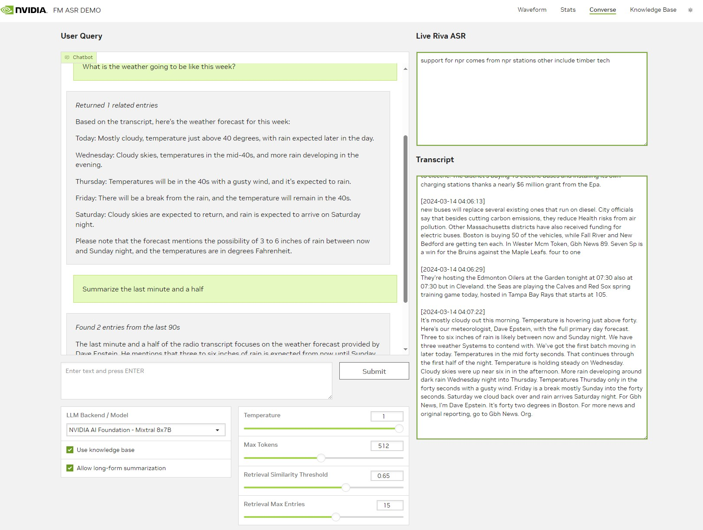
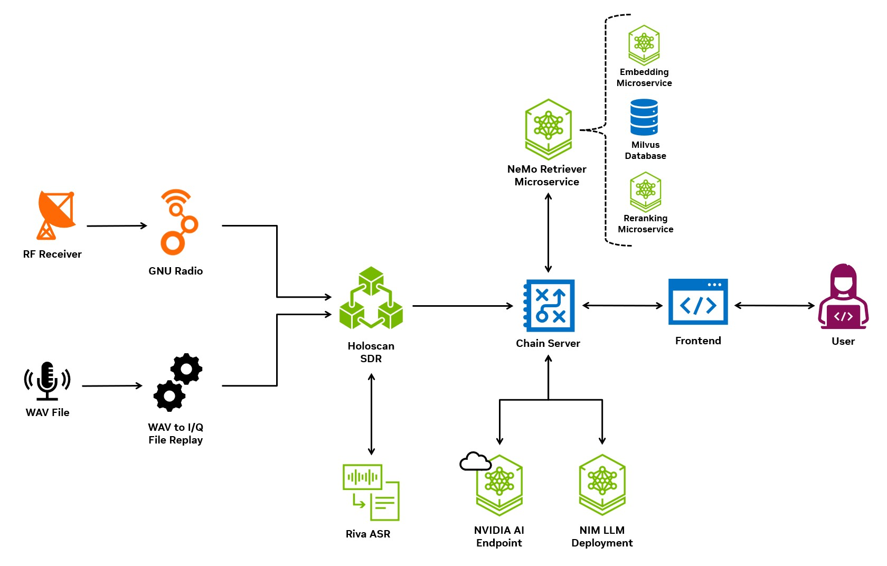
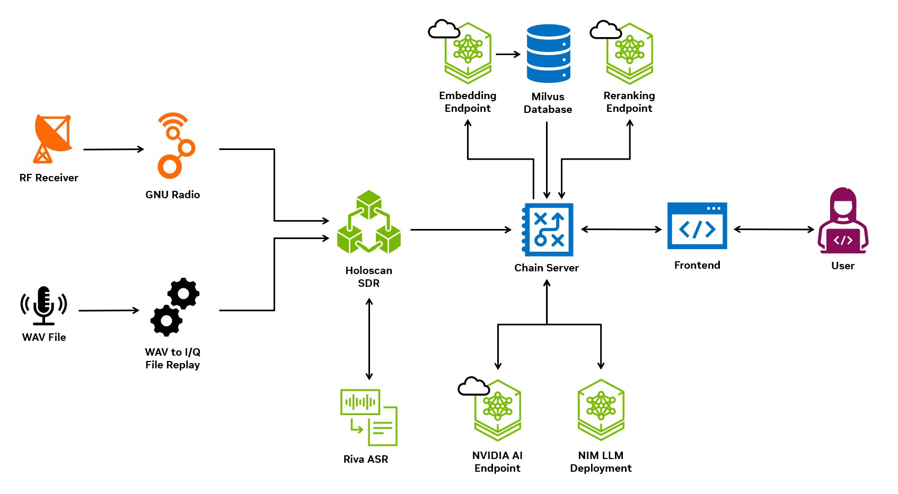
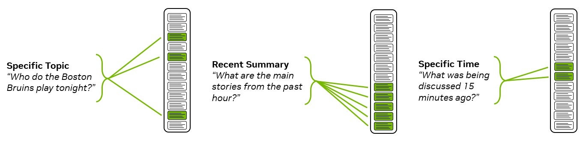
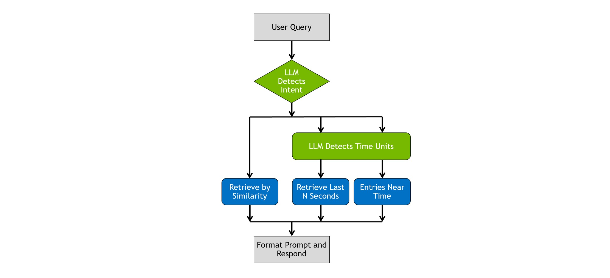

# Streaming FM Radio RAG
This repository enables live processing of FM baseband I/Q samples, automatic speech recognition (ASR) of the resulting audio, and LLM interaction with the transcribed audio.

The FM-ASR pipeline is setup to receive I/Q samples over UDP. The Holoscan-based SDR pipeline expects to receive UDP packets containing baseband I/Q data. Signal processing is done to turn that data into PCM audio, which is sent to a Riva server over gRPC for ASR. The detected transcripts are received back by the Holoscan application and are sent to the chain server via REST API. The chain server then uses the embedding service to store embeddings of the transcript in a Milvus database. That data is then retrieved and used to respond to user queries.

If you don't have an SDR capable of recieving FM, that's ok. Code in the `file-replay` container will read in `.wav` audio files, do signal processing to FM-modulate them, and send the data as UDP packets. From the perspective of the pipeline, this file replay data looks equivalent to data streamed in from an FM source.

## Components
### Folder organization
*Note: `[optional]` denotes optional components that are disabled by default. If enabled services will be deployed locally, otherwise, endpoints from NVIDIA's API catalog at https://build.nvidia.com/explore/discover will be used.*

- `chain-server`: Implementation of LangChain connectors to LLM inference, text embedding to database, retrieval and re-ranking of database documents, and interaction with user queries / intent detection.

- `deploy`: Docker compose files, parameterization, and scripts to deploy application. `compose.env` holds all the environment variables used for deployment.

- `file-replay`: Enables mimicking RF data with audio file. Reads in a WAV audio file, converts the audio data to baseband I/Q data, and sends the I/Q samples over UDP to the Holoscan SDR pipeline.

- `frontend`: Gradio-based UI that displays chat interface, LLM parameters, and a live transcription of FM audio data.

- `nemo-retriever [optional]`: Holds the models and volumes used for the optional [NeMo Retriever Microservice](https://developer.nvidia.com/nemo-microservices) used for deploying embedding service, storage, retrieval, and reranking services. Enabled when `USE_NEMO_RETRIEVER="true"`.

- `nim [optional]`: Holds configuration and Dockerfile for deploying a NIM LLM locally. Currently configured to run Mistral 7B Instruct v0.2 on an RTX A6000.

- `sdr-holoscan`: Using the Holoscan SDK, implements data ingest, GPU-accelerated RF signal processing, communication with the Riva server, and export of transcripts to the chain server.

### Architecture with NeMo Retriever Microservice

### Architecture with Standalone Milvus Database and API Endpoints for Embedding / Reranking

### Data Source
The SDR application expects to receive UDP packets containing baseband I/Q data that match the address / packet size outlined in `sdr-holoscan/params.yml`. Any data source sending UDP to the specified address / port will be processed by the application.

This setup has been tested with a [RTL-SDR Blog V.3](https://www.rtl-sdr.com.rtl-sdr-blog-v-3-dongles-user-guide/) SDR in conjunction with a [GNU Radio](https://www.gnuradio.org/) application. A sample companion file is included in [docs/samples/sample_fm_radio.grc](docs/samples/sample_fm_radio.grc).

Alternatively, WAV audio files can be used to spoof FM data. The `file-replay` container reads the file specified by `REPLAY_FILE`, does FM modulation of the audio data, and transmits the data via UDP.

### FM-ASR Streaming
The [NVIDIA Holoscan SDK](https://developer.nvidia.com/holoscan-sdk) is used for data ingest and GPU-accelerated signal processing, while [NVIDIA Riva](https://www.nvidia.com/en-us/ai-data-science/products/riva/) is used for automatic speech recognition (ASR).

### Embedding & Retrieval
Two options are provided for embedding & retrieval which are determined at deploy-time - using the locally deployed NeMo Retriever Microservice, or using a standalone Milvus DB with NVIDIA's Embedding & Reranking API.

To use the NeMo Retriever Microservice, you must be in the EA program and have access to the container, at which point it can be enabled by setting `USE_NEMO_RETRIEVER="true"`.

Alternatively, a standalone Milvus DB is stood up. Embeddings are provided by [embed-qa-4](https://build.nvidia.com/nvidia/embed-qa-4), retrieval is done with semantic similarity, and reranking is done on the retrieved documents with [reank-qa-mistral-4b](https://build.nvidia.com/nvidia/rerank-qa-mistral-4b).

### LLM Inference
Similarly, there are two options for LLM inference - a locally deployed NIM or using the NVIDIA API endpoints. These can both be used while the workflow is running, there is a dropdown in the UI that allows the user to specify which model is being used and can reference either models hosted by NVIDIA or a NIM model hosted locally.

## Hardware and Access Requirements
- NVIDIA GPU (or GPUs) capable of running at minimum a Riva ASR server and Holoscan signal processing. This setup has been tested with an [RTX A6000](https://www.nvidia.com/en-us/design-visualization/rtx-a6000/), which handles that workload easily. Pushes the A6000's capability when running LLM inference on the same GPU; a dedicated GPU for inference is recommended when deploying locally.
- A [NVIDIA API Catalog](https://build.nvidia.com/explore/discover?signin=true) key and credits for service usage. Uses [LangChain implementation](https://python.langchain.com/docs/integrations/chat/nvidia_ai_endpoints) for LLM inference. Put your key in `NVIDIA_API_KEY` in `deploy/compose.env`.
- NVIDIA's NeMo Retriever & NIM access are in early access and containers are not available for developers not in EA program.
- Access to the [NGC catalog](https://catalog.ngc.nvidia.com/).

## Requirements for running live FM
- An SDR and antenna for downconversion and A2D conversion. Tested with [RTL-SDR Blog V.3](https://www.rtl-sdr.com/rtl-sdr-blog-v-3-dongles-user-guide/).
- [GNU Radio](https://www.gnuradio.org/) or similar software that can deliver baseband I/Q samples over UDP. See a sample companion file [sample_fm_radio.grc](docs/samples/sample_fm_radio.grc).
- The SDR should be sending UDP packets that match the address / packet size outlined in `sdr-holoscan/params.yml`.

## Setup
### Riva ASR
NVIDIA Riva is required to perform the automated transcriptions. You will need to install and configure the [NGC-CLI](https://ngc.nvidia.com/setup/installers/cli) tool, if you have not done so already, to obtain the Riva container and API. The Riva installation steps may be found at this link: [Riva-Install](https://docs.nvidia.com/deeplearning/riva/user-guide/docs/quick-start-guide.html).

Note that Riva performs a TensorRT build during setup and requires access to the targeted GPU. Container-based development and deployment is supported. See our sample [sample_riva_config.sh](docs/samples/sample_riva_config.sh) file for an example of how to configure Riva.

### Containers
The project uses Docker Compose to easily build and deploy containers. You must have a supported set of drivers (tested at `545.23.08`) which can be obtained by installing the [CUDA Toolkit](https://developer.nvidia.com/cuda-downloads). Additionally, the [NVIDIA Container Toolkit](https://docs.nvidia.com/datacenter/cloud-native/container-toolkit/latest/install-guide.html) is required to enable GPU usage in Docker containers. Environment variables needed to run are in `deploy/compose.env`.

### API Access
Create an account at [NVIDIA API Catalog](https://build.nvidia.com/explore/discover?signin=true) for access to the APIs to call LLM inference, embedding, and reranking models.

### File Replay
Move a `.wav` file into `file-replay/files`, set the `REPLAY_FILE` to the file name, relative to the `file-replay/files` directory. So, `/path/to/project/file-replay/files/my-audio.wav` should just be `my-audio.wav`.

### Building NVIDIA NIM model from Hugging Face checkpoint
This repository also provides the tools and frameworks for using NVIDIA NIM to build and deploy [TensorRT-LLM](https://github.com/NVIDIA/TensorRT-LLM) models on-prem. [Documentation for NVIDIA NIM](https://developer.nvidia.com/docs/nemo-microservices/inference/overview.html).

NVIDIA NIM uses the `model_repo_generator` command to build a TRT-LLM engine from a Hugging Face checkpoint. Use the helper script `deploy/scripts/nim-model-build.sh` to build the engine. This engine will be deployed with the inference microservice command called in the main compose file (`nemollm_inference_ms`).

A sample configuration file for Mistral 7B v0.2 is included in `nim/configs`. Simply drop your own config in the folder, set appropriate environment variables and build using the playbook above.

## Running
Start the Riva server. Once initialized, start project with helper script `./deploy/scripts/run.sh`. This script sources `./deploy/compose.env` to read environment variables, then deploys containers based on configuration. Use helper script `./deploy/scripts/stop.sh` to bring down all containers.

## LLM Features & Description
### Intent Detection and Planning
By default, the Q&A pipeline is designed to infer some basic intent types from the user query, which affects how information is retrieved. [Pydantic](https://docs.pydantic.dev/latest/) is used under the hood to handle all agent-style planning and action decisions. The 3 types of intent are:
1. Question or comment about a specific topic – “Who do the Boston Bruins play tonight?”
2. Summarization of recent entries – “What are the main stories from the past hour?”
3. Ask about topic at specific time – “What was being discussed 15 minutes ago?”

The intent of the user query changes what information needs to be retrieved from the database:

If the user query is classified as either `RecentSummary` or `TimeWindow`, the LLM selected for inferencing is used to detect the time units being referenced, i.e. "Summarize the past quarter hour" is classified as (`RecentSummary`, `900 seconds`).

Decision tree for detection and retrieval is shown below:

### Recusive summarization
As a feature to test capability with edge deployments using smaller models with reduced KV-cache and smaller context windows, recursive summarization is used to reduce the number of tokens used in the prompt. When enabled, if the number of retrieved vector database entries exceeds the max entries parameter, the total retreived tokens are reduced to a managable amount by reducing them via summarization. For each block of `max_entries` entries, the LLM summarizes the entries, returns the summarized result to the context pool, and re-chunks the summarized result. This continues until the number of tokens used for context fits in the number of entries corresponding to `max_entries`.