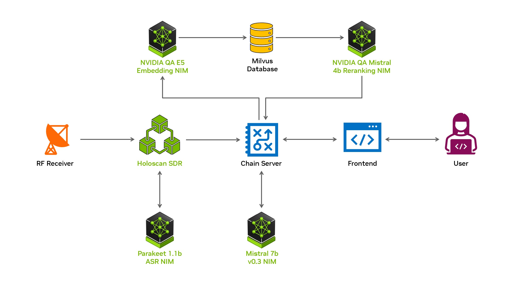

# Streaming FM Radio RAG
## Introduction
This repository enables the live transcription of FM radio broadcasts for usage in a RAG workflow. A GPU-accelerated SDR built on the NVIDIA Holoscan SDK performs live processing of FM radio data and the Parakeet 1.1b speech recognition NIM is used to transcribe the resulting audio signal. Those transcripts are stored in a vector database and used in a RAG workflow powered by [NVIDIA NIM](https://ai.nvidia.com) and [NeMo Retriever](https://developer.nvidia.com/blog/develop-production-grade-text-retrieval-pipelines-for-rag-with-nvidia-nemo-retriever) microservices.


### Brief workflow description
The SDR pipeline is set up to receive a UDP stream containing baseband I/Q data. GPU-accelerated signal processing converts that data into PCM audio, which is sent to a Riva server over gRPC for ASR. The resulting text transcripts are then stored in a Milvus vector database using the NVIDIA QA E5 Embedding NIM for embedding. Once stored, the embeddings are retrieved to be used as context for Q&A with an LLM.



If you don't have an SDR capable of recieving FM, that's ok. Code in the `file-replay` container will read in `.wav` audio files, do signal processing to FM-modulate them, and send the data as UDP packets. From the perspective of the pipeline, this file replay data looks equivalent to data streamed in from an FM source.

## Requirements
### Docker Containers
Docker compose is used to deploy the containers and the workflow has been tested on Docker version >=26.1.3. The NIM endpoints and Holoscan-based SDR both require an NVIDIA Developer account (freely available at https://developer.nvidia.com) to pull images from the [NGC Catalog](https://catalog.ngc.nvidia.com), as well as the [NVIDIA Container Toolkit](https://docs.nvidia.com/datacenter/cloud-native/container-toolkit/latest/install-guide.html) to enable GPU usage inside the containers.

### NIM Endpoints
LLM, embedding, and reranking NIMs may either use locally deployed endpoints or APIs accessible through https://build.nvidia.com. If using the API endpoints, you must have tokens available through your NVIDIA developer account.

The ASR endpoint has only been tested with locally deployed NIMs; for more information, see the [Parakeet modelcard](https://build.nvidia.com/nvidia/parakeet-ctc-1_1b-asr/modelcard) or the [Riva Quick Start Guide](https://docs.nvidia.com/deeplearning/riva/user-guide/docs/quick-start-guide.html).

The full workflow has been tested on a workstation with 2x RTX 6000 Ada GPUs. It is recommended to reserve GPU 0 for a smaller LLM (tested with Mistral 7b v0.3) and GPU 1 for the SDR, embedding NIM, reranking NIM, and ASR NIM.

For more information on deploying NIM microservices, see the support matrices:
- LLM: https://docs.nvidia.com/nim/large-language-models/latest/support-matrix.html
- Embedding: https://docs.nvidia.com/nim/nemo-retriever/text-embedding/latest/support-matrix.html
- Reranking: https://docs.nvidia.com/nim/nemo-retriever/text-reranking/latest/support-matrix.html

### SDR Workflow
This setup has been tested with a [RTL-SDR Blog V.3 SDR](https://www.rtl-sdr.com.rtl-sdr-blog-v-3-dongles-user-guide/) in conjunction with the [GNU Radio](https://www.gnuradio.org/) application deployed in the `gnuradio` directory. As built, the Holoscan SDR application uses comparatively minimal GPU resources and has a data ingest bandwidth of 8 MB/s for the default baseband sample rate of 1 MHz. It has been run without issue on an RTX A3000 laptop GPU.

## Setup
### Environment variables
Use `deploy/compose.env` for general parameterization, including:
- Which GPUs each service should run on
- The model used for each NIM
- The IP address of the machines deploying each NIM and the standalone Milvus services
- Parameters for vector database chunk size
- File locations used when running GNU Radio or File Replay applications

### API keys
To prevent key leakage, keys should be kept in the untracked file `deploy/.keys`, which is automatically sourced with sourcing `deploy/compose.env`.

### RF Receiver
This setup has been tested with a [RTL-SDR Blog V.3 SDR](https://www.rtl-sdr.com.rtl-sdr-blog-v-3-dongles-user-guide/) in conjunction with the [GNU Radio](https://www.gnuradio.org/) application deployed in the `gnuradio` directory. The GNU Radio container uses the file specified by `gnuradio/$GNU_GRC_FILE` as the input file for the application. By default the entrypoint is `grcc -f <file>`, but if `GNU_USE_GUI=1`, a GNU Radio Companion editor will open.

However, any application that streams baseband I/Q data over UDP can be used as the input RF device. Make sure to verify that the networking configuration for your setup matches the expected SDR configuration, which is parameterized in `sdr-holoscan/params.yml -> network_rx`.

Alternatively, WAV audio files can be used to spoof FM data. The `file-replay` container reads the file specified by `REPLAY_FILE`, does FM modulation of the audio data, and transmits the data via UDP. Move a `.wav` file into `file-replay/files`, set the `REPLAY_FILE` to the file name, relative to the `file-replay/files` directory. So, `/path/to/project/file-replay/files/my-audio.wav` should just be `my-audio.wav`.

#### If using RTL-SDR and Windows Subsystem for Linux (WSL)
To connect a USB input device to containers running in WSL, follow standard USB connection procedures. Open Windows PowerShell with admin privileges and use the following the identify the bus ID of the SDR:
```bash
PS C:\Windows\system32> usbipd list
BUSID  VID:PID    DEVICE                                                        STATE
--------------------------------------------------------------------------------------
1-1    046d:c534  Logitech USB Receiver                                         Not shared
1-2    058f:6387  Alcor Micro Corp. Flash Drive                                 Not shared
2-1    0bda:0129  Realtek Semiconductor Corp. RTS5129 Card Reader Controller    Not shared
2-2    04f2:b3f3  Chicony Electronics Co., Ltd USB 2.0 Webcam                   Not shared
3-1    0bda:2838  Bulk-In, Interface   <-- ** This is the RTL-SDR **            Not shared

Persisted:
GUID                                  DEVICE
```
For this example, the bus ID is `3-1`. Bind and attach the device (this procedure is typically repeated each time WSL is restarted).
```bash
PS C:\Windows\system32> usbipd bind --busid 3-1
PS C:\Windows\system32> usbipd list
BUSID  VID:PID    DEVICE                                                        STATE
--------------------------------------------------------------------------------------
1-1    046d:c534  Logitech USB Receiver                                         Not shared
1-2    058f:6387  Alcor Micro Corp. Flash Drive                                 Not shared
2-1    0bda:0129  Realtek Semiconductor Corp. RTS5129 Card Reader Controller    Not shared
2-2    04f2:b3f3  Chicony Electronics Co., Ltd USB 2.0 Webcam                   Not shared
3-1    0bda:2838  Bulk-In, Interface                                            Shared

Persisted:
GUID                                  DEVICE

PS C:\Windows\system32> usbipd attach --wsl --busid 3-1
```

## Running
The deployment folder is intended to be used with Docker Compose. All compose files use environment variables defined in `deploy/compose.env`, with the set of services grouped into 4 different files:
1. `docker-compose.yaml`: Deploys `sdr-holoscan`, `gnuradio`, `frontend`, `chain-server`
2. `docker-compose-nims.yaml`: Deploys the LLM, embedding, reranking, and ASR NIMs
3. `docker-compose-milvus.yaml`: Deploys services for the [Milvus standalone instance](https://milvus.io/docs/install_standalone-docker.md)
4. `docker-compose-file-replay.yaml`: Runs the file replay service

There are helper scripts for starting and stopping the containers in `deploy/scripts`. For containers being deployed non-locally, the scripts will handle deployment on the remote machines via SSH for the `nims` and `milvus` compose files. The containers in `docker-compose.yaml` and `file-replay` are expected to be deployed on the local host and remote deployment would require altering the scripts or manual deployment.

Open `localhost:8090/converse` in a browser to view the frontend.

## Folder organization
- `chain-server`: Implementation of LangChain connectors to LLM inference, embeddings, retrieval and reranking of database documents, and interaction with user queries / intent detection.

- `deploy`: Docker compose files, parameterization, and scripts to deploy application. `compose.env` holds all the environment variables used for deployment.

- `file-replay`: Enables mimicking RF data with audio file. Reads in a WAV audio file, converts the audio data to baseband I/Q data, and sends the I/Q samples over UDP to the Holoscan SDR pipeline.

- `frontend`: Gradio-based UI that displays chat interface, LLM parameters, and a live transcription of FM audio data.

- `gnuradio`: Container with prerequisites for running a GNU Radio application, including a pre-built GRC file in `gnuradio/grc_files/fm_radio.grc`.

- `milvus`: Location for volume mount of Milvus standalone services.

- `sdr-holoscan`: Using the Holoscan SDK, implements data ingest, GPU-accelerated RF signal processing, communication with the Riva server, and export of transcripts to the chain server.