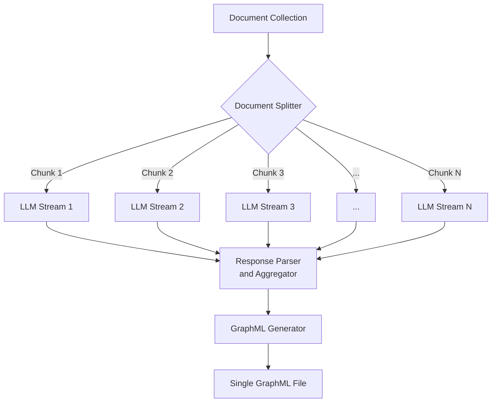
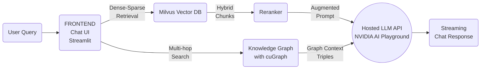
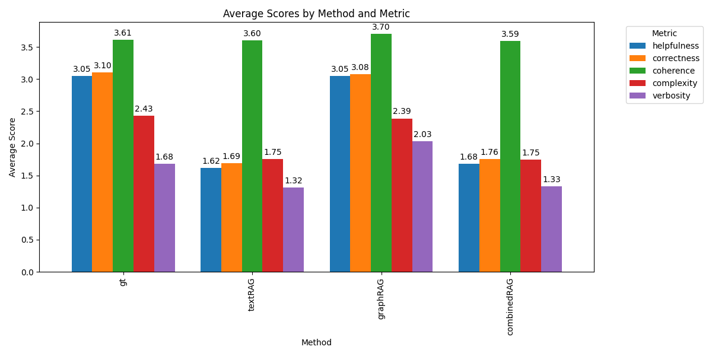

# Knowledge Graphs for RAG with NVIDIA AI Foundation Models and Endpoints

This repository implements a GPU-accelerated pipeline for creating and querying knowledge graphs using Retrieval-Augmented Generation (RAG). Our approach leverages NVIDIA's AI technologies and RAPIDS ecosystem to process large-scale datasets efficiently.

## Overview

This project demonstrates:
- Creation of knowledge graphs from various document sources
- Provides a simple script to download research papers from Arxiv for a given topic
- GPU-accelerated graph processing and analysis using NVIDIA's RAPIDS Graph Analytics library (cuGraph): https://github.com/rapidsai/cugraph
- Hybrid semantic search combining keyword and dense vector approaches
- Integration of knowledge graphs into RAG workflows
- Visualization of the knowledge graph through [Gephi-Lite](https://github.com/gephi/gephi-lite), an open-source web app for visualization of large graphs
- Comprehensive evaluation metrics using NVIDIA's Nemotron-4 340B model for synthetic data generation and reward scoring

## Technologies Used

- **Frontend**: Streamlit
- **Graph Representation and Optimization**: cuGraph (RAPIDS), NetworkX
- **Vector Database**: Milvus
- **LLM Models**:
  - NVIDIA AI Playground hosted models for graph creation and querying, providing numerous instruct-fine-tuned options
  - NVIDIA AI Playground hosted Nemotron-4 340B model for synthetic data generation and evaluation reward scoring

## Architecture Diagram

Here is how the ingestion system is designed, by leveraging a high throughput hosted LLM deployment which can process multiple document chunks in parallel. The LLM can optionally be fine-tuned for triple extraction, thereby requiring a shorter prompt and enabling greater accuracy and optimized inference.



Here's how the inference system is designed, incorporating both hybrid dense-vector search and sparse keyword-based search, reranking, and Knowledge Graph for multi-hop search:



This architecture shows how the user query is processed through both the Milvus Vector DB for traditional retrieval and the Knowledge Graph with cuGraph for multi-hop search. The results from both are then used to augment the prompt sent to the NVIDIA AI Playground backend.

## Setup Steps

Follow these steps to get the chatbot up and running in less than 5 minutes:

### 1. Clone this repository to a Linux machine

```bash
git clone https://github.com/NVIDIA/GenerativeAIExamples/ && cd GenerativeAIExamples/community/knowledge_graph_rag
```

### 2. Get an NVIDIA AI Playground API Key

```bash
export NVIDIA_API_KEY="nvapi-*******************"
```

If you don't have an API key, follow [these instructions](https://github.com/NVIDIA/GenerativeAIExamples/blob/main/docs/api-catalog.md#get-an-api-key-for-the-accessing-models-on-the-api-catalog) to sign up for an NVIDIA AI Foundation developer account and obtain access.

### 3. Create a Python virtual environment and activate it

Refer to the .env.example include the data directory to point to data folder you create inside the backend folder: backend/data. Also set the backend URL.

### 4. Create a Python virtual environment and activate it

```bash
cd knowledge_graph_rag
pip install virtualenv
python3 -m virtualenv venv
source venv/bin/activate
```

### 5. Install the required packages

```bash
pip install -r requirements.txt
```

### 6. Setup a hosted Milvus vector database

Follow the instructions [here](https://milvus.io/docs/install_standalone-docker.md) to deploy a hosted Milvus instance for the vector database backend. Note that it must be Milvus 2.4 or better to support [hybrid search](https://milvus.io/docs/multi-vector-search.md). We do not support disabling this feature for previous versions of Milvus as of now.

### 7. Launch the Streamlit frontend and FAST API backend

```bash
cd knowledge_graph_rag
cd backend
python server.py

```
In another terminal,
```bash
cd knowledge_graph_rag
cd frontend
streamlit run ui.py

```

Open the URL in your browser to access the UI and chatbot!

### 8. Upload Docs and Train Model

Upload your own documents to a folder, or use an existing folder for the knowledge graph creation. Note that the implementation currently focuses on text from PDFs only. It can be extended to other text file formats using the Unstructured.io data loader in LangChain.

## Pipeline Components

1. **Data Ingestion**:
   - ArXiv paper downloader
   - Arbitrary document folder ingestion
2. **Knowledge Graph Creation**:
   - Uses the API Catalog models through the LangChain NVIDIA AI Endpoints interface
3. **Graph Representation**: cuGraph + RAPIDS + NetworkX
4. **Semantic Search**: Milvus 2.4.x for hybrid (keyword + dense vector) search
5. **RAG Integration**: Custom workflow incorporating knowledge graph retrieval
6. **Evaluation**: Comparison of different RAG approaches using Nemotron-4 340B model

## Evaluation Metrics

We've implemented comprehensive evaluation metrics using NVIDIA's Nemotron-4 340B model, which is designed for synthetic data generation and reward scoring. Our evaluation compares different RAG approaches across five key attributes:

1. **Helpfulness**: Overall helpfulness of the response to the prompt.
2. **Correctness**: Inclusion of all pertinent facts without errors.
3. **Coherence**: Consistency and clarity of expression.
4. **Complexity**: Intellectual depth required to write the response.
5. **Verbosity**: Amount of detail included in the response, relative to what is asked for in the prompt.

## Evaluation Results

We compared four RAG approaches on a small representative dataset using the NeMoTron-340B reward model:



Key takeaways:
- Graph RAG significantly outperforms traditional Text RAG.
- Combined Text and Graph RAG shows promise but doesn't consistently beat the ground truth yet. This may be due to the way we structure the augmented prompt for the LLM and needs more experimentation.
- Our approach improves on verbosity and coherence compared to ground truth.

While we're not beating long-context ground truth across the board, these results show the potential of integrating knowledge graphs into RAG systems. We're particularly excited about the improvements in verbosity and coherence. Next steps include refining how we combine text and graph retrieval to get the best of both worlds.

## Component Swapping

All components are designed to be swappable. Here are some options:

- **Frontend**: The current Streamlit implementation can be replaced with other web frameworks.
- **Retrieval**: The embedding model and reranker model being used for semantic search can be swapped to use other models for higher performance. The number of entities retrieved prior to reranking can also be changed. The chunk size for documents can be changed.
- **Vector DB**: While we use Milvus, it can be replaced with options like ChromaDB, Pinecone, FAISS, etc. Milvus is designed to be highly performant and scale on GPU infrastructure.
- **Backend**:
  - Cloud Hosted: Currently uses NVIDIA AI Playground APIs, but can be deployed in a private DGX Cloud or AWS/Azure/GCP with NVIDIA GPUs and LLMs.
  - On-Prem/Locally Hosted: Smaller models like Llama2-7B or Mistral-7B can be run locally with appropriate hardware. Fine-tuning can also be done for the purpose of a specific model designed for triple extraction for a given use-case.

## Future Work

- Dynamic information incorporation into knowledge graphs (continuous update of knowledge graphs)
- Further refinement of evaluation metrics and combined semantic-graphRAG pipeline
- Investigating the impact of different graph structures and queries on RAG performance (single/multi-hop retrieval, BFS/DFS, etc)
- Expanding support for various document types and formats (multimodal RAG with knowledge graphs)
- Fine-tuning the Nemotron-4 340B model for domain-specific evaluations

## Contributing

Please create a merge request to this repository, our team appreciates any and all contributions that add features! We will review and get back as soon as possible.

## Acknowledgements

This project utilizes NVIDIA's AI technologies, including the Nemotron-4 340B model, and the RAPIDS ecosystem. We thank the open-source community for their invaluable contributions to the tools and libraries used in this project.