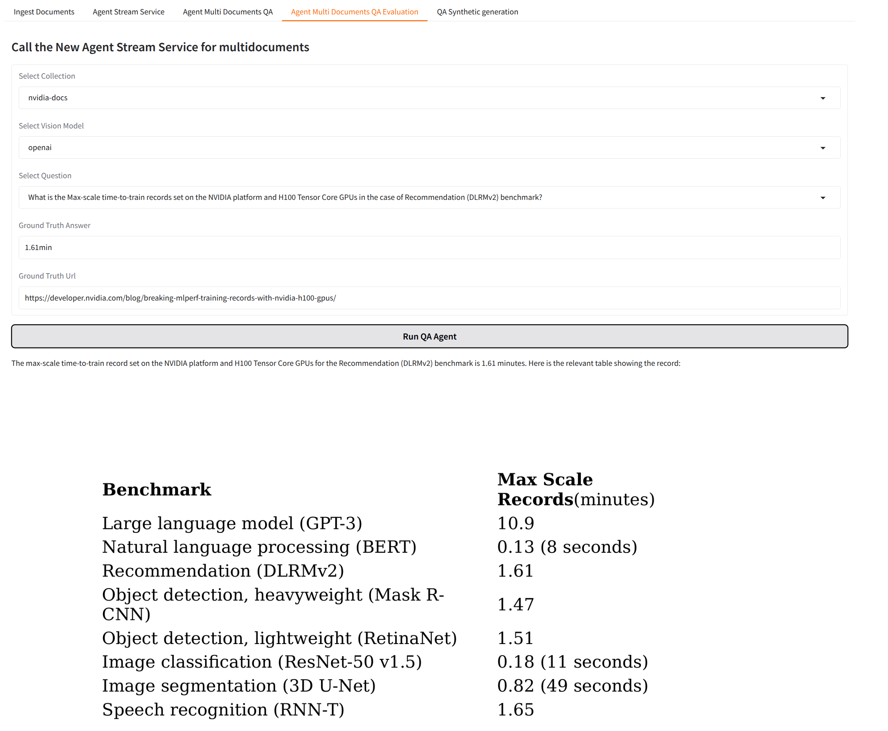
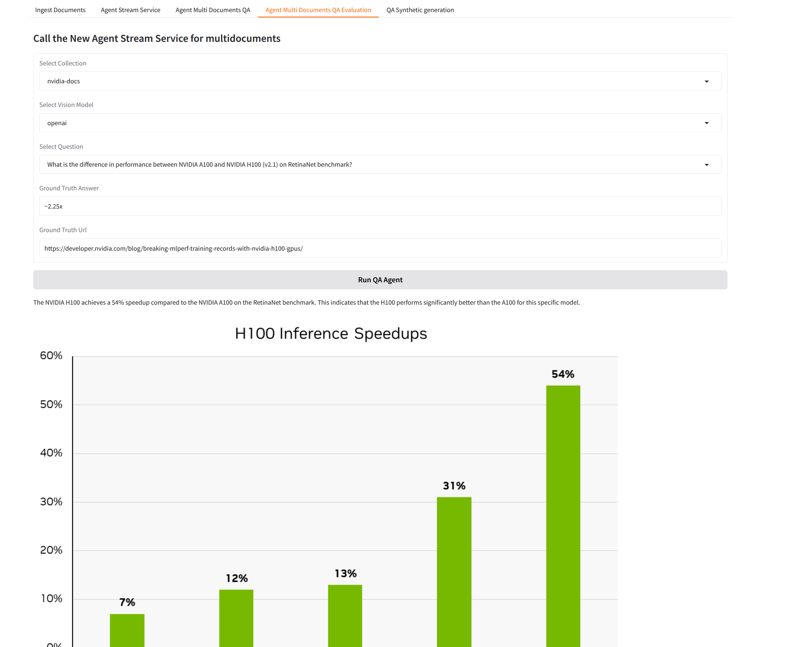
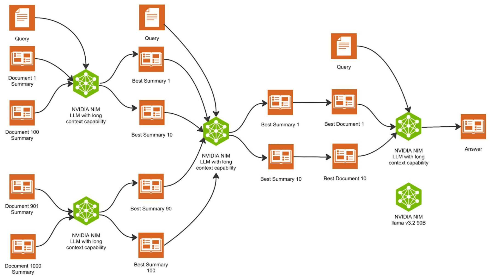

# Introduction

This is a multimodal retrieval using long context. You will be able to ingest HTML documents and ask questions about the document. The tool will allow you to find answers inside the images and the tables.

Here is an example:




The tool uses an openai vision model or an nvidia vision model (llama v3.2 90B)


### Setup details

There are two setups that need to be spun up:

- Langgraph that runs the agent
- Mongodb and langserve that run the database and some services that can be tested along with the Gradio UI to test

The idea is that you have a gradio UI that allows you to ingest html documents and then you can query the agent that is provided by langgraph.


# QuickStart

In this setup we will launch the langgraph agent in dev mode on the host machine and the rest of the setup will be hosted in docker containers, configured through docker compose.
You can also launch langgraph with the containers with `langgraph up`, in that case you don't need an extra .env.lg file (see below)

## Langgraph setup in the host machine

Run this command from the root of the repository (the one with the  `langgraph.json` and `docker-compose.yml` files)


Install a venv (python >= 3.11 is required):


```shell
python3 -m venv lg-venv
source ./lg-venv/bin/activate
pip install -r requirements.txt
```


## Create the env files


You need to create two .env files (one for the docker compose and one for the langgraph agent).

In the below we give the opportunity to use an NVIDIA text model for the pure text based tasks.

For the Langgraph agent we leave the LLM model to be openai as at the moment it is providing better results with tools binding.


### .env

Create a .env file in the root directory of this repository (the one with the `langgraph.json` and `docker-compose.yml` files)

```shell
# .env
MONGO_INITDB_ROOT_USERNAME=admin
MONGO_INITDB_ROOT_PASSWORD=secret
MONGO_HOST=localhost
MONGO_PORT=27017
AGENTS_PORT=2024
OPENAI_API_KEY=
LANGCHAIN_API_KEY=
LANGSMITH_API_KEY=
LANGGRAPH_CLOUD_LICENSE_KEY=
NVIDIA_API_KEY=
IMAGES_HOST=localhost
NVIDIA_VISION_MODEL=meta/llama-3.2-90b-vision-instruct
NVIDIA_TEXT_MODEL=meta/llama-3.3-70b-instruct
TEXT_MODEL_PROVIDER=nvidia
```

Normally LANGCHAIN_API_KEY and LANGSMITH_API_KEY have the same value.


### .env.lg

We need this because we want to launch langgraph in dev mode, so to be able to reach mongodb from inside the langgraph agent we need to set its hostname to the localhost. 

It should be located in the root of the repository (the one with the `langgraph.json` and `docker-compose.yml` files)

```shell
MONGO_INITDB_ROOT_USERNAME=admin
MONGO_INITDB_ROOT_PASSWORD=secret
MONGO_HOST=localhost
MONGO_PORT=27017

AGENTS_PORT=2024

OPENAI_API_KEY=
LANGCHAIN_API_KEY=
LANGSMITH_API_KEY=
LANGGRAPH_CLOUD_LICENSE_KEY=
NVIDIA_API_KEY=
IMAGES_HOST=localhost

NVIDIA_VISION_MODEL=meta/llama-3.2-90b-vision-instruct
NVIDIA_TEXT_MODEL=meta/llama-3.3-70b-instruct
TEXT_MODEL_PROVIDER=nvidia

```

# Launch the mongodb and gradio services

Update the `.env` file adding your API Keys.

Launch the docker compose services

```shell
docker compose up --build
```
then you can connect to `http://localhost:7860` to ingest documents

# Launch langgraph

```bash
langgraph dev --host 0.0.0.0
```

## Test Langgraph

```bash
curl --request POST \
    --url http://localhost:2024/runs/stream \
    --header 'Content-Type: application/json' \
    --data '{
    "assistant_id": "agent",
    "input": {
        "messages": [
            {
                "role": "user",
                "content": "What is the harness?"
            }
        ]
    },
    "metadata": {},
    "config": {
        "configurable": {
            "collection_name": "test",
            "document_id": "8eb8f7396e4fe72595e6577c35a7a587"
        }
    },
    "multitask_strategy": "reject",
    "stream_mode": [
        "values"
    ]
}'

```


## Scaling the services

One can easily scale this solution using a hierarchical approach, with multiple long context LLM calls. 



The picture above illustrates the hierarchical approach using an example of 1000 documents. These documents are divided into 10 groups, with each containing 100 documents. In the first stage, the LLM generates the top 10 summaries for each group, resulting in a total of 100 best summaries. In the second stage, the LLM selects the top 10 summaries from the 100 summaries. These 10 summaries then lead to the 10 most relevant documents, from which the LLM retrieves an answer to the query. If the answer is derived from an image, a VLM is deployed in this stage to process the visual content.


