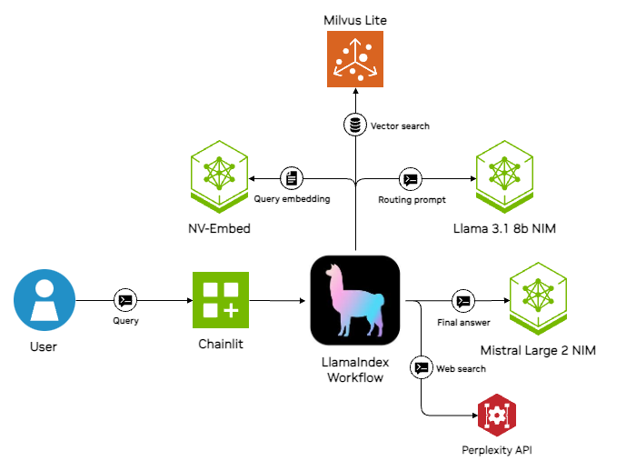
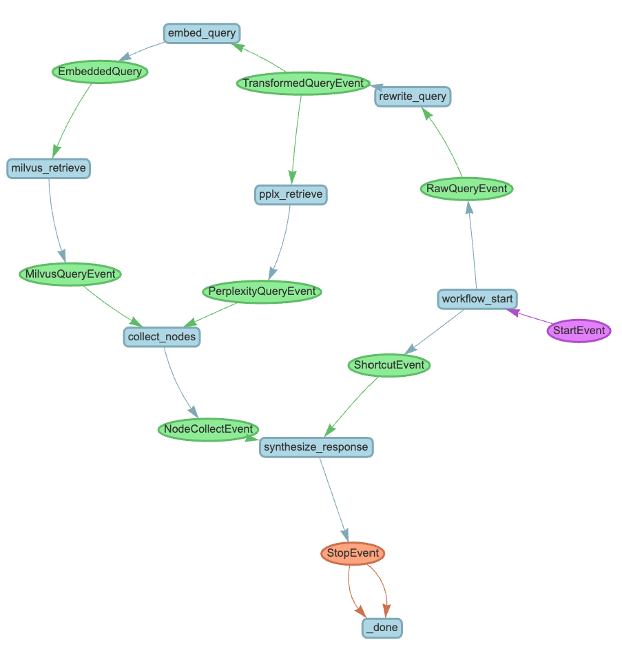

# LlamaIndex + NVIDIA
This project shows how to use NVIDIA's APIs for large language models with LlamaIndex Workflow and ingestion functionality. Chainlit provides the chat UI. 

### Project highlights:
- Interfaces with chat completion and embedding models from [build.nvidia.com](https://build.nvidia.com)
- Routs queries based on whether they require access to a document database
- Answers queries using the [Perplexity API for web search](https://docs.perplexity.ai/home)
- Performs vector lookup [using Milvus Lite](https://milvus.io/docs/milvus_lite.md) (WIP)
- Stores user chat history with a local SQLite database (WIP)

### Technologies used:
- **Frontend**: Chainlit
- **Web search**: Perplexity API
- **LLM**: Llama 3.1 8b and Mistral Large 2
- **Database**: Milvus Lite
- **Chat application**: LlamaIndex Workflows

### Getting started
To run this code, make sure you have environment variables set for the following:
- `NVIDIA_API_KEY` for access to NVIDIA LLM APIs (required). You can set this by running `export NVIDIA_API_KEY="nvapi-*******************"`. If you don't have an API key, follow [these instructions](https://github.com/NVIDIA/GenerativeAIExamples/blob/main/docs/api-catalog.md#get-an-api-key-for-the-accessing-models-on-the-api-catalog) to sign up for an NVIDIA AI Foundation developer account and obtain access.

- `PERPLEXITY_API_KEY` (optional) if you are interested in using Perplexity to answer queries using the web. 

Then, clone this project and (optionally) create a new virtual environment in Python. Run `pip install -r requirements.txt` for the dependencies and begin the application using `chainlit run app.py` from this directory. The application should then be available at http://localhost:8000.

### Design
This project uses Chainlit to host a combined frontend and backend. The chat logic is implemented a LlamaIndex Workflow class, which runs the user's query through the following steps:
- Decide whether user query warrants usage of LLM with or without RAG (`QueryFlow.route_query`)
- If using RAG, the query is transformed (`QueryFlow.rewrite_query`)into a format better suited for web search and document retrieval and a vector embedding is produced (`QueryFlow.embed_query`)
- Documents are retrieved from the document database (`QueryFlow.milvus_retrieve`)
- An answer is solicited from the Perplexity API (`QueryFlow.pplx_retrieve`)
- The results are combined and used for generating a final response which is streamed to the user (`QueryFlow.synthesize_response`)

