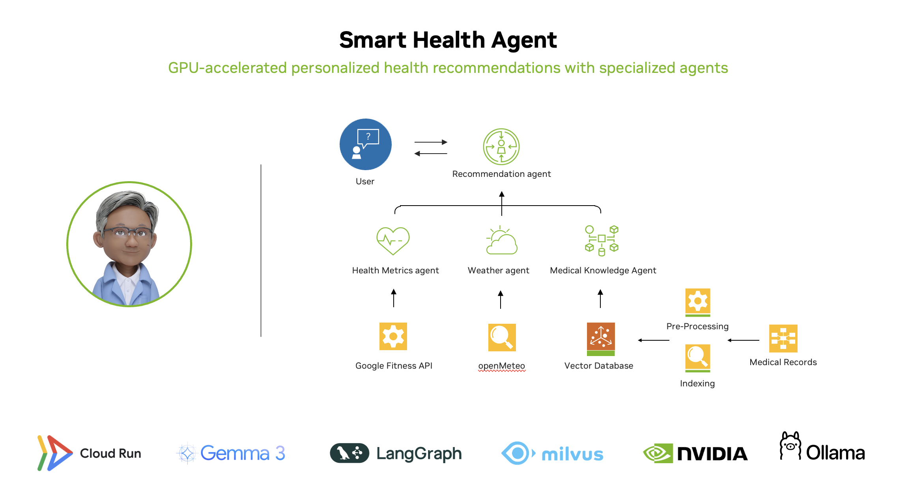

<!--
  SPDX-FileCopyrightText: Copyright (c) 2025 NVIDIA CORPORATION & AFFILIATES. All rights reserved.
  SPDX-License-Identifier: Apache-2.0

  Licensed under the Apache License, Version 2.0 (the "License");
  you may not use this file except in compliance with the License.
  You may obtain a copy of the License at

  http://www.apache.org/licenses/LICENSE-2.0

  Unless required by applicable law or agreed to in writing, software
  distributed under the License is distributed on an "AS IS" BASIS,
  WITHOUT WARRANTIES OR CONDITIONS OF ANY KIND, either express or implied.
  See the License for the specific language governing permissions and
  limitations under the License.
-->

# Smart Health Agent 

A comprehensive application that uses multi agent workflow to get real-time health metrics, weather, and Retrieval Augmented Generation (RAG) that can process multimodal documents to provide personalized health recommendations, powered by Gemma 3 on Ollama and LangGraph.




## Overview

This repository demonstrates a complete workflow for health data analysis and personalized recommendations:

1. **Health data integration**: Analyze health metrics from synthetic data  or Google Fit API.
2. **Document processing**: Extract information from health-related documents (PDFs)
3. **Weather integration**: Incorporate local weather data for context-aware recommendations
4. **Personalized guidance**: Generate health recommendations based on all available data

The implementation leverages Ollama for powerful RAG-enhanced conversational AI capabilities and LangGraph for agent orchestration.

## Features

- **Multimodal Processing**: Extract and analyze text, tables, images, and charts from health documents
- **Intelligent Document Analysis**: Automatically detects and processes charts/graphs with specialized description
- **Personalized Recommendations**: Combines health metrics with document knowledge
- **Interactive Chat Interface**: Ask follow-up questions about your health data and received recommendations
- **Weather Integration**: Incorporates local weather data for context-aware health recommendations
- **Agent-Based Architecture**: Uses LangGraph for orchestrated agent workflows

## System Architecture

The Smart Health Agent operates through a team of specialized AI agents working together:

1. **Health Metrics Analyst Agent**: Examines fitness data, vitals, and activity levels
2. **Environmental Context Agent**: Evaluates local weather to customize recommendations
3. **Medical Knowledge Agent**: Processes medical records to find relevant health insights
4. **Personalized Recommendation Agent**: Combines all insights to create a tailored health plan

All agents communicate through a LangGraph orchestration system running on Cloud Run.

## Requirements

- Python 3.10+
- Ollama installed and running (see [Ollama Setup](#ollama-setup) section)
- Google Fit API access (optional, see [Google Fitness API Setup](#google-fitness-api-setup))
- Required Python packages (see requirements.txt)

## Repository Contents

- `smart_health_ollama.py`: Main application with Gradio UI and agent workflows
- `document_processor.py`: Helper module for multimodal document processing
- `google_fit_utils.py`: Integration with Google Fit API for health data retrieval

## Installation

1. Clone the NVIDIA GenerativeAIExamples repository:
   ```bash
   git clone https://github.com/NVIDIA/GenerativeAIExamples.git
   cd GenerativeAIExamples/community/smart-health-agent
   ```

2. Install dependencies:
   ```bash
   pip install -r requirements.txt
   ```

3. Set up Ollama (see [Google Cloud Run Deployment](#google-cloud-run-deployment) or [Local Ollama Setup](#local-ollama-setup-(alternative)))

4. Run the application:
   ```bash
   python smart_health_ollama.py
   ```

## Google Cloud Run Deployment

To deploy the Gemma 3 models on Google Cloud Run with Ollama and GPU support:

1. Follow the [Google Cloud Run GPU with Ollama tutorial](https://cloud.google.com/run/docs/tutorials/gpu-gemma-with-ollama)
2. Set up the necessary Cloud Run service with GPU acceleration
3. Configure the Ollama container with the required Gemma 3 models
4. Once deployed, copy the Cloud Run service URL
5. Set this URL as the `OLLAMA_HOST` environment variable in your application
6. Update the `smart_health_ollama.py` file with your Ollama host:
   ```python
   OLLAMA_HOST = "https://your-ollama-service-url.run.app"  # Replace with your actual Cloud Run service URL
   ```

Note: Ensure your Cloud Run service has sufficient GPU resources allocated for optimal performance with the Gemma 3 models.

## Local Ollama Setup (Alternative)

If you prefer to run Ollama locally for development:

1. Install Ollama:
   - Visit [Ollama's official website](https://ollama.ai) and follow the installation instructions for your platform

2. Pull the required model:
   ```bash
   ollama pull gemma3:4b-it-q4_K_M
   ```

3. Configure the application:
   - Set the `OLLAMA_HOST` environment variable to `http://localhost:11434`

## Using the Application

1. In the UI:
   - Select data source (Synthetic Data or Google Fit (Deprecated))
   - Enter your city name for weather data
   - Provide a folder path containing medical PDF documents
   - Click "Activate Agent System" 
   - Interact with the Smart Health Agent Chat to ask health-related questions

2. The application will:
   - Process your health data
   - Analyze weather conditions
   - Index your health documents for RAG
   - Generate personalized health recommendations
   - Allow follow-up questions via chat

## Document Processing Capabilities

The document processor (`document_processor.py`) handles health-related PDF documents:
   - Extracts text content with intelligent block grouping
   - Identifies and processes tables with structure analysis
   - Extracts and analyzes embedded images
   - Detects charts/graphs and provides detailed descriptions

## Google Fitness API Setup

### Important Notice: API Deprecation
The Google Fit APIs, including the Google Fit REST API, will be deprecated in 2026. As of May 1, 2024, developers cannot sign up to use these APIs. For more information, visit the [official Google Fit REST API documentation](https://developers.google.com/fit/rest).

### Access Conditions
- If you already have access to the Google Fit API (created before May 1, 2024), you can continue using it by following the setup guide below.
- If you don't have existing access, please use the "Synthetic Data" option in the application instead.

### A. Project & API Setup (For Existing API Users Only)
1. Visit [console.cloud.google.com](https://console.cloud.google.com)
2. Create a new project or select an existing one
3. Enable the Fitness API:
   - Search for "Fitness API" in the search bar at the top
   - Click on the Fitness API result
   - Click "Enable"

### B. Configure OAuth Consent Screen
1. In the left sidebar, navigate to "APIs & Services" > "OAuth consent screen"
2. Click the "Get Started" button
3. For User Type, select "External" (for personal Gmail accounts)
4. Fill in the required App Information:
   - App name (e.g., "Health Companion")
   - User support email
   - Developer contact information
5. Click "Save and Continue"
6. You'll be taken to the "Scopes" page, but we'll add these later through the Data Access tab
7. Click "Save and Continue" to proceed to the next step

### C. Add Test Users (CRITICAL STEP)
1. After the Scopes page, you'll reach the "Test users" section
2. Click "ADD USERS" 
3. Enter your own Google account email (the one you'll use to test the application)
4. Click "ADD"
5. Click "Save and Continue" to complete the OAuth consent screen setup
6. **IMPORTANT:** Without completing this step, you'll get an "Access blocked" or "has not completed the Google verification process" error!

### D. Configure Data Access Scopes
1. After completing the consent screen setup, go to "Google Auth Platform" in the left sidebar
2. Select "Data Access"
3. Click "Add or remove scopes"
4. In the dialog that appears, filter by "Fitness API"
5. Select the read permissions you need:
   - `.../auth/fitness.activity.read`
   - `.../auth/fitness.heart_rate.read`
   - `.../auth/fitness.sleep.read`
6. Click "Save" to confirm your scope selections

### E. Verify Test User in Audience Section
1. In the left sidebar of Google Auth Platform, click on "Audience"
2. Confirm your app is in "Testing" status
3. Scroll down to "Test users" section
4. Verify your email appears in the list
5. If not, click "Add users" and add your email

### F. Create OAuth Client ID
1. In the left sidebar, go to "Google Auth Platform" > "Clients" (or "APIs & Services" > "Credentials")
2. Click "Create Credentials" and select "OAuth Client ID"
3. Application type: Choose "Desktop Application"
4. Name: Give your client a descriptive name
5. Click "Create"
6. Download the JSON file containing your client credentials
7. Save the file to a secure location on your system
8. Set an environment variable to tell the application where to find your credentials:
   ```bash
   export GOOGLE_FIT_CLIENT_SECRETS=/path/to/your/client_secrets.json
   ```

### G. Use in Your Application
1. Ensure the environment variable is set before running the application
2. The first time your app runs with Google Fit as the data source, it will prompt you to authorize via a browser
3. Make sure to log in with the same account you added as a test user
4. You will see a warning that "This app isn't verified" - this is normal for apps in testing mode
5. Since you added yourself as a test user, you can proceed by clicking on your email address

### H. Required Google Fit Data (IMPORTANT)
1. **The Health Companion app expects certain fitness data to be available in your Google Fit account.**
2. If you choose "Google Fit" as your data source, your Google account should have:
   - Step count data (derived:com.google.step_count.delta)
   - Heart rate data (derived:com.google.heart_rate.bpm)
   - Sleep data (derived:com.google.sleep.segment)
3. To ensure you have data before using the app:
   - Install the Google Fit app on your mobile device
   - Log some activity data (take walks with your phone)
   - Record heart rate data (if you have a compatible device)
   - Record sleep data (if you have a compatible device)
4. **Alternative:** Use the "Synthetic Data" option in the app if you don't have real Google Fit data.

### Troubleshooting Google Fit Integration
- If you see "Access blocked: [app name] has not completed the Google verification process":
  - Make sure you added your email as a test user in the Audience section
  - Make sure you're signing in with the exact same email you added as a test user
  - Try deleting any existing token.json file from your project and reauthorizing
  - After adding yourself as a test user, wait a few minutes for changes to propagate
- If you encounter an "invalid_grant" error, it usually means:
  - Your refresh token has expired
  - Access has been revoked
  - You're not using an authorized test user email
  - Solution: Delete the token.json file (if it exists) and re-authorize the application
- If you get `HttpError 403` about missing data sources:
  - Switch to "Synthetic Data" rather than "Google Fit" in the app
  - Ensure your Google Fit account has recorded activity/fitness data
  - Use a Google account that actively uses fitness tracking devices

## Model Details

The application uses:
- **Ollama**: For LLM capabilities and text generation
- **LangGraph**: For agent orchestration and workflow management
- **Sentence Transformers**: For document embeddings
- **Milvus**: For vector database storage

## Required APIs and Dependencies

- Ollama (for LLM capabilities)
- Open-Meteo (for weather data)
- Google Fit API (optional, for health data)
- PyMuPDF (for PDF processing)
- Milvus (for vector database)
- LangGraph (for agent orchestration)

## Technical Notes

- The application creates a local Milvus database for vector storage
- Image and table references are stored in the `vectorstore` directory
- For optimal performance, ensure you have at least 8GB of RAM available
- The application uses a multi-agent architecture with LangGraph for orchestration
- For Cloud Run deployment, ensure proper GPU configuration and concurrency settings

## Acknowledgments

- Ollama team for providing the LLM capabilities
- Open-Meteo for weather data API
- Google for Fitness API integration
- LangGraph team for the agent orchestration framework

## Contact

For questions, feedback, or collaboration opportunities, please open an issue in the [NVIDIA GenerativeAIExamples repository](https://github.com/NVIDIA/GenerativeAIExamples).

## Contributing

This example is part of the NVIDIA GenerativeAIExamples community contributions. To contribute to this project or other community examples, please refer to the [main repository](https://github.com/NVIDIA/GenerativeAIExamples) for contribution guidelines. 