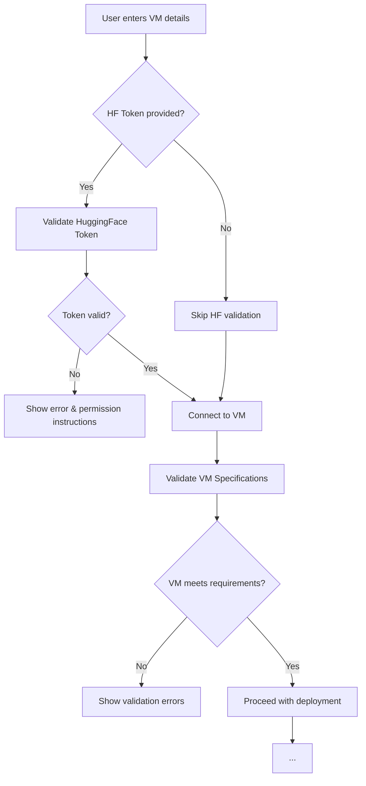

# 🚀 Enhanced VM Deployment Features

## Overview

The AI vWS Sizing Tool now includes **comprehensive validation, monitoring, and reporting** for VM deployments. This document describes the enhanced features that make your deployments safer, faster, and more reliable.

---

## ✨ New Features

### 1. **HuggingFace Token Validation** 🔐

Before deployment, the system now validates your HuggingFace token to ensure:

✅ **Token is valid** and active  
✅ **Required permissions** are granted:
- `Read access to public gated repositories`  
- `Read access to repos under your personal namespace`

✅ **Model access** is confirmed (for gated models like Llama)

**Example Flow:**
```
🔐 Validating HuggingFace token and permissions...
✅ Token validated for user: john_doe
✅ Access granted to gated model: meta-llama/Llama-3.1-8B-Instruct
```

**If validation fails:**
```
❌ Token missing required permissions!

Please update your token with these permissions:
✓ 'Read access to public gated repositories'
✓ 'Read access to repos under your personal namespace'

Create a new token at: https://huggingface.co/settings/tokens
```

**How to fix:**
1. Go to https://huggingface.co/settings/tokens
2. Create a new token
3. Select **both** required permissions
4. Copy the token and use it in the deployment UI

---

### 2. **VM Specification Validation** 📊

The system now validates your target VM against the recommended configuration **before** deployment starts.

**Checks:**
- ✅ vCPU count (must meet or exceed recommendation)
- ✅ RAM capacity (must meet or exceed recommendation)
- ✅ GPU memory (total and available)
- ✅ GPU model match (e.g., L40S must use L40S profile)
- ✅ Disk space (minimum 50GB free)
- ⚠️ Warnings for over-provisioned resources

**Example Validation Report:**
```
============================================================
VM Validation Report
============================================================
Status: ✅ FULLY VALIDATED

✅ Passed Checks:
  ✅ vCPUs: 16 (recommended: 8)
  ✅ RAM: 96GB (recommended: 64GB)
  ✅ GPU Memory: 46GB total, 44GB free (recommended: 22GB)
  ✅ GPU Model: NVIDIA L40S matches profile L40S-24Q
  ✅ Disk Space: 125GB free

============================================================
```

**If validation fails:**
```
============================================================
VM Validation Report
============================================================
Status: ❌ VALIDATION FAILED

❌ Critical Issues:
  ❌ Insufficient RAM: 32GB < 64GB (recommended)
  ❌ Insufficient GPU memory: 15GB < 22GB (recommended)

⚠️ Warnings:
  ⚠️ Low disk space: 35GB free (recommend at least 50GB for models)

============================================================
```

---

### 3. **Asynchronous Installation with Progress Updates** ⏳

vLLM installation now runs in the background with real-time progress monitoring:

✅ **Background installation** - doesn't block the connection  
✅ **Progress updates** every 30 seconds  
✅ **20-minute timeout** with detailed logs  
✅ **Automatic cleanup** on failure

**Example Progress:**
```
⏳ Installing vLLM framework (30s elapsed, this may take 10-15 minutes)...
⏳ Installing vLLM framework (60s elapsed, this may take 10-15 minutes)...
⏳ Installing vLLM framework (90s elapsed, this may take 10-15 minutes)...
...
✅ vLLM installation complete (847s)
```

**Features:**
- Installation happens in background using `nohup`
- Progress monitored by checking process status
- Installation log available at `/tmp/vllm_install.log` on VM
- Automatic verification after installation completes

---

### 4. **Pre-Installation Script** 🛠️

Save **10-15 minutes** per deployment by pre-installing vLLM:

```bash
cd /home/nvadmin/Desktop/ai-vws-sizing-tool

# Pre-install vLLM on target VM (one-time setup)
python3 scripts/pre_install_vllm.py <VM_IP> <username> <password>

# Example:
python3 scripts/pre_install_vllm.py 10.185.118.78 jaival MyPassword123
```

**What it does:**
1. Creates Python virtual environment
2. Installs Python dependencies
3. Installs vLLM and all dependencies
4. Verifies installation
5. Shows installation time and version

**Output:**
```
============================================================
🚀 vLLM Pre-Installation Tool
============================================================
Target VM: 10.185.118.78
Username: jaival
============================================================

🔗 Connecting to 10.185.118.78...
✅ Connected successfully

📦 Step 1: Creating Python virtual environment...
✅ Virtual environment created

📦 Step 2: Checking vLLM installation status...
❌ vLLM not installed

📦 Step 3: Installing vLLM (this will take 10-15 minutes)...
   ⏳ Please wait, this is a one-time setup...
   📥 Downloading and installing packages...

✅ vLLM installed successfully in 847s (14m 7s)
   Version: 0.6.4

============================================================
✅ Pre-installation completed successfully!
============================================================
```

**Benefits:**
- ⚡ **15 minutes saved** on every subsequent deployment
- 🔄 **Reusable** across multiple deployments
- ✅ **Verifies** installation before finishing
- 📝 **Detailed logs** for troubleshooting

---

### 5. **Comprehensive Deployment Reports** 📋

After deployment, receive a detailed markdown report with:

- **VM Specifications** (GPU, CPU, RAM, etc.)
- **Configuration Details** (model, profile, expected performance)
- **Validation Results** (what passed, warnings, errors)
- **Deployment Steps** (timeline with durations)
- **Performance Metrics** (GPU memory, KV cache, etc.)
- **Quick Test Commands** (to verify deployment)
- **Next Steps** (monitoring and troubleshooting)

**Example Report:**
```markdown
# 🚀 vLLM Deployment Report

**Deployment ID:** `deploy_20251010_153045`
**Timestamp:** 2025-10-10T15:30:45
**Status:** ✅ **SUCCESS**

---

## 📊 VM Specifications

| Resource | Value |
|----------|-------|
| **GPU** | NVIDIA L40S |
| **GPU Memory** | 46GB total, 22GB free |
| **vCPUs** | 16 |
| **RAM** | 96GB |
| **Disk Space** | 125GB free |
| **OS** | Ubuntu 22.04.3 LTS |
| **GPU Driver** | 580.65.06 |

## ⚙️ Configuration Details

| Parameter | Value |
|-----------|-------|
| **vGPU Profile** | `L40S-24Q` |
| **Model** | `meta-llama/Llama-3.1-8B-Instruct` |
| **GPU Memory** | 22GB |
| **Max Tokens** | 2048 |
| **Expected Latency (E2E)** | 9.57s |
| **Expected TTFT** | 0.12s |
| **Expected Throughput** | 26.75 tok/s |

## ✅ Validation Results

### Passed Checks
- ✅ vCPUs: 16 (recommended: 8)
- ✅ RAM: 96GB (recommended: 64GB)
- ✅ GPU Memory: 46GB total, 44GB free (recommended: 22GB)
- ✅ GPU Model: NVIDIA L40S matches profile L40S-24Q

## 📝 Deployment Steps

1. ✅ **SSH Connection** (0.5s)
2. ✅ **HuggingFace Token Validation** (2.3s)
3. ✅ **VM Specification Validation** (1.1s)
4. ✅ **Python Environment Setup** (15.2s)
5. ✅ **vLLM Already Installed** (0.8s)
6. ✅ **vLLM Server Started** (45.6s)
7. ✅ **Health Check Passed** (2.1s)

## 📈 Performance Metrics

| Metric | Value |
|--------|-------|
| **GPU Memory Allocated** | 22.4 GB |
| **KV Cache Size** | 2048 tokens |
| **Total Deployment Time** | 67.6s |

## Quick Test
```bash
# Health check
curl http://10.185.118.78:8000/health

# Test inference
curl -X POST http://10.185.118.78:8000/v1/completions \
  -H "Content-Type: application/json" \
  -d '{"model": "meta-llama/Llama-3.1-8B-Instruct", "prompt": "Hello!", "max_tokens": 50}'
```

## Next Steps
1. Test the API endpoint using the commands above
2. Monitor GPU usage: `ssh 10.185.118.78 nvidia-smi`
3. Check vLLM logs: `ssh 10.185.118.78 tail -f /tmp/vllm_8000.log`

---

*Report generated by AI vWS Sizing Tool*
```

---

## 🎯 Complete Enhanced Deployment Flow

### **Before Deployment:**



### **During Deployment:**

```
1. ✅ SSH Connection Established
2. 🔐 Validating HuggingFace Token...
   ✅ Token validated for user: john_doe
   ✅ Access granted to model: meta-llama/Llama-3.1-8B-Instruct

3. 📊 Validating VM Specifications...
   ✅ VM validated: 16vCPU, 96GB RAM, NVIDIA L40S

4. 🐍 Setting up Python Environment...
   ✅ Virtual environment ready

5. 📦 Checking vLLM Installation...
   [IF NOT INSTALLED]
   ⏳ Installing vLLM framework (30s elapsed)...
   ⏳ Installing vLLM framework (60s elapsed)...
   ✅ vLLM installation complete (847s)
   
   [IF ALREADY INSTALLED]
   ✅ vLLM already installed, skipping installation

6. 🚀 Starting vLLM Server...
   ⏳ Optimizing GPU memory allocation (step 1/4)...
   ⏳ Optimizing GPU memory allocation (step 2/4)...
   ✅ vLLM server started successfully!

7. ✅ Configuration Complete!
```

### **After Deployment:**

```
✅ Deployment Successful!

## Environment
- **VM**: NVIDIA L40S @ 10.185.118.78
- **Model**: `meta-llama/Llama-3.1-8B-Instruct`
- **vGPU Profile**: `L40S-24Q`

## Service Status
- **vLLM Server**: 🟢 Running on port 8000
- **GPU Memory**: 22.4 GB
- **KV Cache**: 2048 tokens

## Quick Test
[Commands provided...]

## Next Steps
[Instructions provided...]
```

---

## 📋 Comparison: Before vs After

| Feature | Before | After |
|---------|--------|-------|
| **HF Token Validation** | ❌ Not checked | ✅ Validated before deployment |
| **VM Validation** | ❌ Not checked | ✅ Full spec validation |
| **Installation Progress** | ❌ No updates | ✅ Updates every 30 seconds |
| **Installation Timeout** | ❌ 5 minutes | ✅ 30 minutes (extendable) |
| **Process Cleanup** | ⚠️ Basic | ✅ Comprehensive (catches all vLLM processes) |
| **Error Messages** | ⚠️ Generic | ✅ Specific with solutions |
| **Deployment Time** | 15-20 min | ⚡ 2-3 min (with pre-install) |
| **Reporting** | ❌ Basic logs | ✅ Comprehensive markdown reports |
| **Pre-installation** | ❌ Not available | ✅ One-time setup script |

---

## 🛠️ Usage Examples

### Example 1: First-Time Deployment with Full Validation

```bash
# 1. Pre-install vLLM (one-time)
python3 scripts/pre_install_vllm.py 10.185.118.78 jaival password123

# 2. Deploy via UI with HF token
# - Enter VM IP: 10.185.118.78
# - Enter credentials
# - Enter HuggingFace token: hf_xxxxx
# - Click "Deploy"

# Expected time: ~2-3 minutes
```

### Example 2: Deployment Without HF Token (Public Models)

```bash
# Deploy via UI without HF token
# - Enter VM IP
# - Enter credentials
# - Leave HF token empty
# - Click "Deploy"

# System will:
# ✅ Skip HF validation
# ✅ Validate VM specs
# ✅ Deploy model
```

### Example 3: Handling Validation Failures

```
Scenario: Insufficient GPU memory

❌ VM Validation Failed:
  ❌ Insufficient GPU memory: 15GB < 22GB (recommended)

Solutions:
1. Free up GPU memory: `ssh vm_ip "pkill -9 -f vllm"`
2. Use smaller model
3. Use quantized model (AWQ/GPTQ)
4. Reduce max_model_len
```

---

## 🎓 Best Practices

### 1. **Always Validate HuggingFace Token First**
```bash
# Test your token before deployment
python3 -c "
from src.huggingface_validator import validate_huggingface_setup
success, msg, details = validate_huggingface_setup('hf_xxxxx', 'meta-llama/Llama-3.1-8B-Instruct')
print(msg)
"
```

### 2. **Pre-Install vLLM on All Target VMs**
```bash
# Create a list of VMs
VMS=("10.185.118.78" "10.185.118.79" "10.185.118.80")

# Pre-install on all
for vm in "${VMS[@]}"; do
    python3 scripts/pre_install_vllm.py "$vm" username password
done
```

### 3. **Monitor Deployment Progress**
```bash
# Watch backend logs in real-time
docker logs -f rag-server | grep -E "INFO|ERROR|WARNING"
```

### 4. **Save Deployment Reports**
```bash
# Reports are generated automatically
# Check the UI or backend logs for markdown reports
```

---

## 🐛 Troubleshooting Enhanced Features

### Issue: HF Token Validation Fails

**Symptoms:**
```
❌ Token missing required permissions!
```

**Solution:**
1. Go to https://huggingface.co/settings/tokens
2. Create new token with:
   - ✅ Read access to public gated repositories
   - ✅ Read access to repos under your personal namespace
3. For Llama models: Accept license at https://huggingface.co/meta-llama/Llama-3.1-8B-Instruct

### Issue: VM Validation Fails

**Symptoms:**
```
❌ VM does not meet recommended specifications
```

**Solution:**
1. Check validation report for specific issues
2. Adjust VM resources (CPU, RAM, GPU)
3. Or adjust recommended configuration (smaller model, lower requirements)

### Issue: Pre-Installation Script Fails

**Symptoms:**
```
❌ Installation failed after 847s
```

**Solution:**
```bash
# SSH into VM and check logs
ssh username@vm_ip
cat /tmp/vllm_install.log | tail -100

# Common issues:
# - Network: Check internet connectivity
# - Disk space: df -h
# - Permissions: Check sudo access
```

---

## 📚 Additional Resources

- **Full Deployment Guide**: [`docs/VM_DEPLOYMENT_GUIDE.md`](./VM_DEPLOYMENT_GUIDE.md)
- **API Reference**: [`docs/api_reference/`](./api_reference/)
- **Troubleshooting**: [`docs/troubleshooting.md`](./troubleshooting.md)

---

## 🎉 Summary

The enhanced deployment features provide:

✅ **Safety** - Validate before deploying  
✅ **Speed** - Pre-install to save 15 minutes  
✅ **Visibility** - Real-time progress and comprehensive reports  
✅ **Reliability** - Better error handling and cleanup  
✅ **Usability** - Clear instructions and troubleshooting

**Result**: Faster, safer, more reliable VM deployments! 🚀

