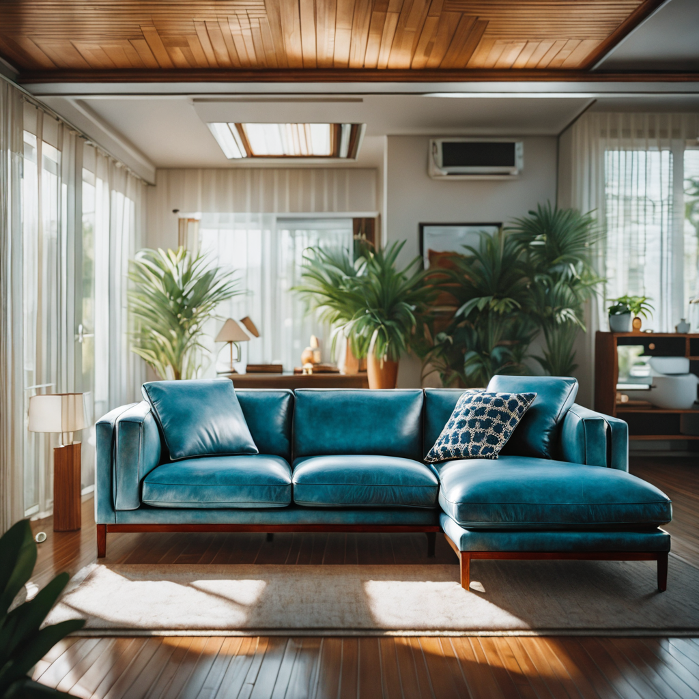

# **Environment Design**

## **Demo Overview**

This workflow is using Generative AI to allow users to retexturize, relight any place objects into a new environment or the same one. Powered by NVIDIA Blackwell, this workflow accelerates design iterations with unparalleled speed and efficiency.

## **Key Points**

* Generate a specific material over a preselected object from an image - using CosXL for retexturing and SAM2 for accurate selections
* Reinforce texture/material onto object if necessary with IPAdapters using strong style transfer
* Relight the object in the same scene or a new designed space. Selected light colors and direction - Using IC- Relight and Stable Diffusion 1.5
* Upscale your final design to add extra detail - Using SAM ( Segment anything Models), In Context Lora, And Clip VIsion with Flux Redux, Flux Turbo and Flux Dev Fill. 
