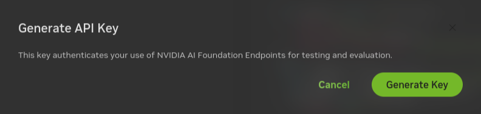

<!--
  SPDX-FileCopyrightText: Copyright (c) 2023 NVIDIA CORPORATION & AFFILIATES. All rights reserved.
  SPDX-License-Identifier: Apache-2.0

  Licensed under the Apache License, Version 2.0 (the "License");
  you may not use this file except in compliance with the License.
  You may obtain a copy of the License at

  http://www.apache.org/licenses/LICENSE-2.0

  Unless required by applicable law or agreed to in writing, software
  distributed under the License is distributed on an "AS IS" BASIS,
  WITHOUT WARRANTIES OR CONDITIONS OF ANY KIND, either express or implied.
  See the License for the specific language governing permissions and
  limitations under the License.
-->

# Using the NVIDIA API Catalog

```{contents}
---
depth: 2
local: true
backlinks: none
---
```

## Example Features

This example deploys a developer RAG pipeline for chat Q&A and serves inferencing from an NVIDIA API Catalog endpoint
instead of a local inference server, a local model, or local GPUs.

Developers get free credits for 10K requests to any of the available models.

```{list-table}
:header-rows: 1

* - Model
  - Embedding
  - Framework
  - Description
  - Multi-GPU
  - TRT-LLM
  - Model Location
  - NIM for LLMs
  - Vector Database

* - ai-llama3-70b
  - snowflake/arctic-embed-l
  - LangChain
  - QA chatbot
  - NO
  - NO
  - API Catalog
  - NO
  - Milvus

* - ai-llama3-8b
  - snowflake/arctic-embed-l
  - LlamaIndex
  - QA chatbot
  - NO
  - NO
  - API Catalog
  - NO
  - Milvus
```

The following figure shows the sample topology:

- The sample chat bot web application communicates with the chain server.
  The chain server sends inference requests to an NVIDIA API Catalog endpoint.
- Optionally, you can deploy NVIDIA Riva. Riva can use automatic speech recognition to transcribe
  your questions and use text-to-speech to speak the answers aloud.


## Prerequisites

% start-prerequisites

- Clone the Generative AI examples Git repository using Git LFS:

  ```console
  $ sudo apt -y install git-lfs
  $ git clone git@github.com:NVIDIA/GenerativeAIExamples.git
  $ cd GenerativeAIExamples/
  $ git lfs pull
  ```

- Install Docker Engine and Docker Compose.
  Refer to the instructions for [Ubuntu](https://docs.docker.com/engine/install/ubuntu/).

- Login to Nvidia's docker registry. Please refer to [instructions](https://docs.nvidia.com/ngc/gpu-cloud/ngc-overview/index.html) to create account and generate NGC API key. This is needed for pulling in the secure base container used by all the examples.

  ```console
  $ docker login nvcr.io
  Username: $oauthtoken
  Password: <ngc-api-key>
  ```

- Optional: Enable NVIDIA Riva automatic speech recognition (ASR) and text to speech (TTS).

  - To launch a Riva server locally, refer to the [Riva Quick Start Guide](https://docs.nvidia.com/deeplearning/riva/user-guide/docs/quick-start-guide.html).

    - In the provided `config.sh` script, set `service_enabled_asr=true` and `service_enabled_tts=true`, and select the desired ASR and TTS languages by adding the appropriate language codes to `asr_language_code` and `tts_language_code`.

    - After the server is running, assign its IP address (or hostname) and port (50051 by default) to `RIVA_API_URI` in `deploy/compose/compose.env`.

  - Alternatively, you can use a hosted Riva API endpoint. You might need to obtain an API key and/or Function ID for access.

    In `deploy/compose/compose.env`, make the following assignments as necessary:

    ```bash
    export RIVA_API_URI="<riva-api-address/hostname>:<port>"
    export RIVA_API_KEY="<riva-api-key>"
    export RIVA_FUNCTION_ID="<riva-function-id>"
    ```

% end-prerequisites

## Get an API Key for the Accessing Models on the API Catalog

% api-key-start

Perform the following steps if you do not already have an API key.
You can use different model API endpoints with the same API key.

1. Navigate to <https://build.nvidia.com/explore/discover>.

2. Find the **Llama 3 70B Instruct** card and click the card.

   

3. Click **Get API Key**.

   

4. Click **Generate Key**.

   

5. Click **Copy Key** and then save the API key.
   The key begins with the letters nvapi-.

   

% api-key-end


## Build and Start the Containers

1. In the Generative AI examples repository, export this variable in terminal.

   Add the API key for the model endpoint:

   ```text
   export NVIDIA_API_KEY="nvapi-<...>"
   ```

2. From the root of the repository, build the containers:

   ```console
   $ docker compose \
       --env-file deploy/compose/compose.env \
       -f deploy/compose/rag-app-api-catalog-text-chatbot.yaml \
       build
   ```

3. Start the containers:

   ```console
   $ docker compose \
       --env-file deploy/compose/compose.env \
       -f deploy/compose/rag-app-api-catalog-text-chatbot.yaml \
       up -d
   ```

   *Example Output*

   ```output
    ✔ Network nvidia-rag         Created
    ✔ Container chain-server     Started
    ✔ Container rag-playground   Started
   ```

4. Start the Milvus vector database:

   ```console
   $ docker compose \
       --env-file deploy/compose/compose.env \
       -f deploy/compose/docker-compose-vectordb.yaml \
       --profile llm-embedding \
       up -d milvus
   ```

   *Example Output*

   ```output
   ✔ Container milvus-minio       Started
   ✔ Container milvus-etcd        Started
   ✔ Container milvus-standalone  Started
   ```

5. Confirm the containers are running:

   ```console
   $ docker ps --format "table {{.ID}}\t{{.Names}}\t{{.Status}}"
   ```

   *Example Output*

   ```output
   CONTAINER ID   NAMES               STATUS
   39a8524829da   rag-playground      Up 2 minutes
   bfbd0193dbd2   chain-server        Up 2 minutes
   ec02ff3cc58b   milvus-standalone   Up 3 minutes
   6969cf5b4342   milvus-minio        Up 3 minutes (healthy)
   57a068d62fbb   milvus-etcd         Up 3 minutes (healthy)
   ```

## Using an Alternative Inference Model

You can specify the model to use in the `APP_LLM_MODELNAME` environment variable when you start the Chain Server.
The following sample command uses the Mistral AI Mixtral 8x7B Instruct model.

```console
$ APP_LLM_MODELNAME='mistralai/mixtral-8x7b-instruct-v0.1' docker compose \
     --env-file deploy/compose/compose.env \
     -f deploy/compose/rag-app-api-catalog-text-chatbot.yaml \
     up -d
```

You can determine the available model names using one of the following methods:

- Browse the models at <https://build.ngc.nvidia.com/explore/discover>.
  View the sample Python code and get the model name from the `model` argument to the `client.chat.completions.create` method.
- Install the [langchain-nvidia-ai-endpoints](https://pypi.org/project/langchain-nvidia-ai-endpoints/) Python package from PyPi.
  Use the `get_available_models()` method to list the models.
  Refer to the preceding web page for sample code to list the models.

## Using the LlamaIndex Data Framework

As an alternative to the LangChain based Chain Server, you can build and run a LlamaIndex based Chain Server.

This example also starts a JupyterLab server on port 8888.

1. After meeting the [](#prerequisites), build the containers:

   ```console
   $ docker compose \
       --env-file deploy/compose/compose.env \
       -f deploy/compose/rag-app-text-chatbot.yaml \
       build
   ```

1. Start the containers:

   ```console
   $ docker compose \
       --env-file deploy/compose/compose.env \
       -f deploy/compose/rag-app-text-chatbot.yaml \
       up -d
   ```

1. Start the Milvus vector database:

   ```console
   $ docker compose \
       --env-file deploy/compose/compose.env \
       -f deploy/compose/docker-compose-vectordb.yaml \
       --profile llm-embedding \
       up -d milvus
   ```

## Next Steps

- Access the web interface for the chat server.
  Refer to [](./using-sample-web-application.md) for information about using the web interface.
- [](./vector-database.md)
- Stop the containers by running `docker compose -f deploy/compose/rag-app-api-catalog-text-chatbot.yaml down` and
  `docker compose -f deploy/compose/docker-compose-vectordb.yaml --profile llm-embedding down`.
