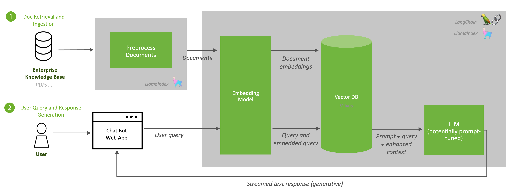

<!--
  SPDX-FileCopyrightText: Copyright (c) 2023 NVIDIA CORPORATION & AFFILIATES. All rights reserved.
  SPDX-License-Identifier: Apache-2.0

  Licensed under the Apache License, Version 2.0 (the "License");
  you may not use this file except in compliance with the License.
  You may obtain a copy of the License at

  http://www.apache.org/licenses/LICENSE-2.0

  Unless required by applicable law or agreed to in writing, software
  distributed under the License is distributed on an "AS IS" BASIS,
  WITHOUT WARRANTIES OR CONDITIONS OF ANY KIND, either express or implied.
  See the License for the specific language governing permissions and
  limitations under the License.
-->

# Architecture

```{contents}
---
depth: 2
local: true
backlinks: none
---
```

## Overview of Software Components

The default sample deployment contains:

- [NVIDIA NeMo Framework Inference Server](https://docs.nvidia.com/nemo-framework/user-guide/latest/index.html) - part of NVIDIA AI Enterprise solution
- [NVIDIA TensorRT-LLM](https://developer.nvidia.com/tensorrt) - for low latency and high throughput inference for LLMs
- [LangChain](https://github.com/langchain-ai/langchain/) and [LlamaIndex](https://www.llamaindex.ai/) for combining language model components and easily constructing question-answering from a company's database
- [Sample Jupyter Notebooks](jupyter-server.md) and [chat bot web application/API calls](./frontend.md) so that you can test the chat system in an interactive manner
- [Milvus](https://milvus.io/docs/install_standalone-docker.md) - Generated embeddings are stored in a vector database. The vector DB used in this workflow is Milvus. Milvus is an open-source vector database capable of NVIDIA GPU-accelerated vector searches.
- [e5-large-v2 model](https://huggingface.co/embaas/sentence-transformers-e5-large-v2) from Hugging Face to generate the embeddings.
- [Llama2](https://github.com/facebookresearch/llama/), an open source model from Meta, to formulate natural responses.

This sample deployment is a reference for you to build your own enterprise AI solution with minimal effort.
The software components are used to deploy models and inference pipeline, integrated together with the additional components as indicated in the following diagram:


## NVIDIA AI Components

The sample deployment uses a variety of NVIDIA AI components to customize and deploy the RAG-based chat bot example.

- [NVIDIA TensorRT-LLM](https://github.com/NVIDIA/TensorRT-LLM)
- [NVIDIA NeMo Inference Container](https://developer.nvidia.com/nemo)

### NVIDIA TensorRT-LLM Optimization

An LLM can be optimized using TensorRT-LLM. NVIDIA NeMo uses TensorRT for LLMs (TensorRT-LLM), for deployment which accelerates and maximizes inference performance on the latest LLMs.
The sample deployment leverages a Llama 2 (13B parameters) chat model.
The foundational model is converted to TensorRT format using TensorRT-LLM for optimized inference.

### NVIDIA NeMo Framework Inference Container

With NeMo Framework Inference Container, the optimized LLM can be deployed for high-performance, cost-effective, and low-latency inference. NeMo Framework Inference Container contains modules and scripts to help exporting LLM models to [TensorRT-LLM](https://github.com/NVIDIA/TensorRT-LLM) and deploying them to [Triton Inference Server](https://docs.nvidia.com/deeplearning/triton-inference-server/user-guide/docs/index.html) with easy-to-use APIs.

## Inference Pipeline

To get started with the inferencing pipeline, we connect the customized LLM to a sample proprietary data source.
This knowledge can come in many forms: product specifications, HR documents, or finance spreadsheets.
Enhancing the model’s capabilities with this knowledge can be done with RAG.

Because foundational LLMs are not trained on your proprietary enterprise data and are only trained up to a fixed point in time, they need to be augmented with additional data.
RAG consists of two processes.
First, *retrieval* of data from document repositories, databases, or APIs that are all outside of the foundational model’s knowledge.
Second, *generation* of responses via inference.
The following graphic describes an overview of this inference pipeline:


## Document Ingestion and Retrieval

RAG begins with a knowledge base of relevant up-to-date information.
Because data within an enterprise is frequently updated, the ingestion of documents into a knowledge base is a recurring process and could be scheduled as a job.
Next, content from the knowledge base is passed to an embedding model such as e5-large-v2 that the sample deployment uses.
The embedding model converts the content to vectors, referred to as *embeddings*.
Generating embeddings is a critical step in RAG.
The embeddings provide dense numerical representations of textual information.
These embeddings are stored in a vector database, in this case Milvus, which is [RAFT accelerated](https://developer.nvidia.com/blog/accelerating-vector-search-using-gpu-powered-indexes-with-rapids-raft).

## User Query and Response Generation

When a user query is sent to the inference server, it is converted to an embedding using the embedding model.
This is the same embedding model that is used to convert the documents in the knowledge base, e5-large-v2, in the case of this sample deployment.
The database performs a similarity/semantic search to find the vectors that most closely resemble the user’s intent and provides them to the LLM as enhanced context.
Because Milvus is RAFT accelerated, the similarity serach is optimized on the GPU.
Lastly, the LLM generates a full answer that is streamed to the user.
This is all done with ease using [LangChain](https://github.com/langchain-ai/langchain/) and [LlamaIndex](https://www.llamaindex.ai).

The following diagram illustrates the ingestion of documents and generation of responses.



LangChain enables you to write LLM wrappers for your own custom LLMs.
NVIDIA provides a sample wrapper for streaming responses from a TensorRT-LLM Llama 2 model running on Triton Inference Server.
This wrapper enables us to leverage LangChain’s standard interface for interacting with LLMs while still achieving vast performance speedup from TensorRT-LLM and scalable and flexible inference from Triton Inference Server.

A sample chat bot web application is provided in the sample deployment so that you can test the chat system in an interactive manner.
Requests to the chat system are wrapped in API calls, so these can be abstracted to other applications.

An additional method of customization in the inference pipeline is possible with a prompt template.
A prompt template is a pre-defined recipe for generating prompts for language models.
The prompts can contain instructions, few-shot examples, and context that is appropriate for a given task.
In our sample deployment, we prompt our model to generate safe and polite responses.


## LLM Inference Server

The LLM Inference Server uses models that are stored in a model repository.
This repository is available locally to serve inference requests.
After they are available in Triton Inference Server, inference requests are sent from a client application.
Python and C++ libraries provide APIs to simplify communication.
Clients send HTTP/REST requests directly to Triton Inference Server using HTTP/REST or gRPC protocols.

Within the sample deployment, the Llama2 LLM was optimized using NVIDIA TensorRT for LLMs (TRT-LLM).
This software accelerates and maximizes inference performance on the latest LLMs.

## Vector DB

Milvus is an open-source vector database built to power embedding similarity search and AI applications.
The database makes unstructured data from API calls, PDFs, and other documents more accessible by storing them as embeddings.

When content from the knowledge base is passed to an embedding model, e5-large-v2, the model converts the content to vectors--referred to as *embeddings*.
These embeddings are stored in the vector database.
The sample deployment uses Milvus as the vector database.
Milvus is an open-source vector database capable of NVIDIA GPU-accelerated vector searches.

If needed, see Milvus's [documentation](https://milvus.io/docs/install_standalone-docker.md/) for how to configure a Docker Compose file for Milvus.
