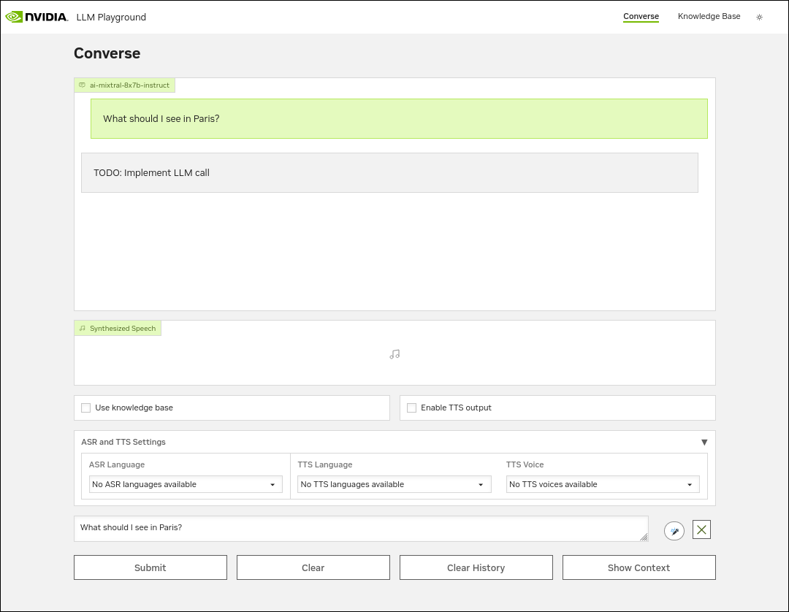
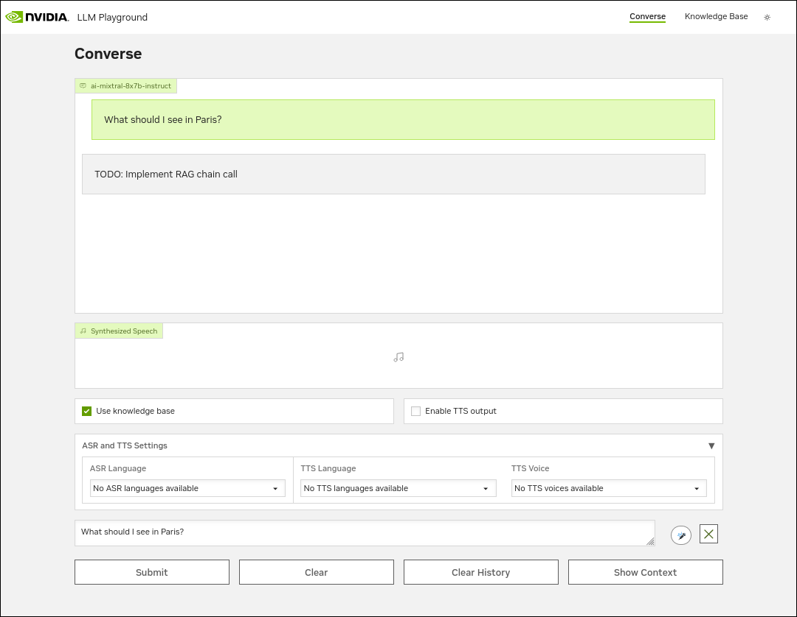

<!--
  SPDX-FileCopyrightText: Copyright (c) 2023 NVIDIA CORPORATION & AFFILIATES. All rights reserved.
  SPDX-License-Identifier: Apache-2.0

  Licensed under the Apache License, Version 2.0 (the "License");
  you may not use this file except in compliance with the License.
  You may obtain a copy of the License at

  http://www.apache.org/licenses/LICENSE-2.0

  Unless required by applicable law or agreed to in writing, software
  distributed under the License is distributed on an "AS IS" BASIS,
  WITHOUT WARRANTIES OR CONDITIONS OF ANY KIND, either express or implied.
  See the License for the specific language governing permissions and
  limitations under the License.
-->

# Setting up the Simple Example

```{contents}
---
depth: 2
local: true
backlinks: none
---
```

## Creating Directories and Boilerplate Code

1. Make a directory for the example:

   ```console
   $ mkdir RetrievalAugmentedGeneration/examples/simple_rag_api_catalog
   ```

1. Create an empty `__init__.py` file to indicate it is a Python module:

   ```console
   $ touch RetrievalAugmentedGeneration/examples/simple_rag_api_catalog/__init__.py
   ```

1. Create a `RetrievalAugmentedGeneration/examples/simple_rag_api_catalog/chains.py` file with the following boilerplate code:

   ```{literalinclude} ./simple-example/code/api-catalog/boilerplate/chains.py
   :language: python
   ```

## Building and Running with Docker Compose

<!--
  cp docs/simple-example/code/api-catalog/boilerplate/simple-rag-api-catalog.yaml deploy/compose
  cp docs/simple-example/code/api-catalog/boilerplate/chains.py RetrievalAugmentedGeneration/examples/simple_rag_api_catalog/
-->

Like the examples provided by NVIDIA, the simple example uses Docker Compose to build and run the example.

1. Create a `deploy/compose/simple-rag-api-catalog.yaml` file with the following content.

   The `EXAMPLE_NAME` field identifies the directory, relative to `RetrievalAugmentedGeneration/examples` to build for the chain server.

   ```{literalinclude} ./simple-example/code/api-catalog/boilerplate/simple-rag-api-catalog.yaml
   :language: yaml
   :emphasize-lines: 9
   ```

1. Build the containers for the simple example:

   ```console
   $ docker compose --env-file deploy/compose/compose.env -f deploy/compose/simple-rag-api-catalog.yaml build
   ```

   Building the containers requires several minutes.

1. Run the containers:

   ```console
   $ docker compose --env-file deploy/compose/compose.env -f deploy/compose/simple-rag-api-catalog.yaml up -d
   ```

## Verify the Chain Server Methods Using Curl

You can access the Chain Server with a URL like <http://localhost:8081>.

- Confirm the `llm_chain` method runs and returns the TODO response by running a command like the following:

  ```console
  $ curl -H "Content-Type: application/json" http://localhost:8081/generate \
      -d '{"messages":[{"role":"user", "content":"What should I see in Paris?"}], "use_knowledge_base": false}'
  ```

  The response shows the TODO message:

  ```{literalinclude} ./simple-example/output/api-catalog/boilerplate/llm-chain.json
  :emphasize-lines: 1
  ```

- Confirm the `rag_chain` method runs by setting `use_knowledge_base` to `true`:

  ```console
  $ curl -H "Content-Type: application/json" http://localhost:8081/generate \
      -d '{"messages":[{"role":"user", "content":"What should I see in Paris?"}], "use_knowledge_base": true}'
  ```

  The response also shows the TODO message:

  ```{literalinclude} ./simple-example/output/api-catalog/boilerplate/rag-chain.json
  :emphasize-lines: 1
  ```

- Confirm the `ingest_docs` method runs by uploading a sample document, such as the README from the repository:

  ```console
  $ curl http://localhost:8081/documents -F "file=@README.md"
  ```

  *Example Output*

  ```{literalinclude} ./simple-example/output/api-catalog/boilerplate/ingest-docs.json
  :language: json
  ```

  View the logs for the Chain Server to see the logged message from the method:

  ```console
  $ docker logs chain-server
  ```

  The logs show the message from the code, but no ingest process:

  ```output
  INFO:example:Ingesting the documents
  ```

- Confirm the `get_documents` and `delete_documents` methods run:

  ```console
  $ curl -X GET http://localhost:8081/documents 
  ```

  ```console
  $ curl -X DELETE http://localhost:8081/documents\?filename\=README.md 
  ```

  View the logs for the Chain Server to see the logged messages from the methods:

  ```console
  $ docker logs chain-server
  ```

  The logs show the message from the code:

  ```output
  INFO:example:Getting document file names from the vector store
  INFO:example:Deleting documents from the vector index
  ```

- Confirm the `document_search` method runs:

  ```console
  $ curl -H "Content-Type: application/json" http://localhost:8081/search \
      -d '{"query":"What should I see in Paris?", "top_k":4}'
  ```

  The response is empty because the `ingest_docs` and `document_search` methods are not implemented:

  ```{literalinclude} ./simple-example/output/api-catalog/boilerplate/document-search.json
  :language: json
  ```

  View the logs for the Chain Server to see the logged message from the method:

  ```console
  $ docker logs chain-server
  ```

  *Example Output*

  ```output
  INFO:example:Searching for documents based on the query
  ```


## Verify the Chain Server Methods Using the RAG Playground

You can access the RAG Playground web interface with a URL like <http://localhost:8090>.

- Confirm the `llm_chain` method runs by accessing <http://localhost:8090/converse> and entering a query such as `What should I see in Paris?`.

  

- Confirm the `rag_chain` method runs by enabling the **Use knowledge base** checkbox and entering a query.

  

- Confirm the `ingest_docs` method runs by accessing <http://localhost:8090/kb>, clicking **Add File**, and uploading a file.

  After the upload, view the Chain Server logs by running `docker logs chain-server`.

  *Example Output*

  ```output
  INFO:example:Ingesting the documents
  ```

## Next Steps

- [](./ingest-api-catalog.md)
