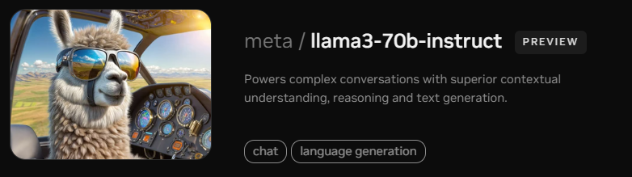
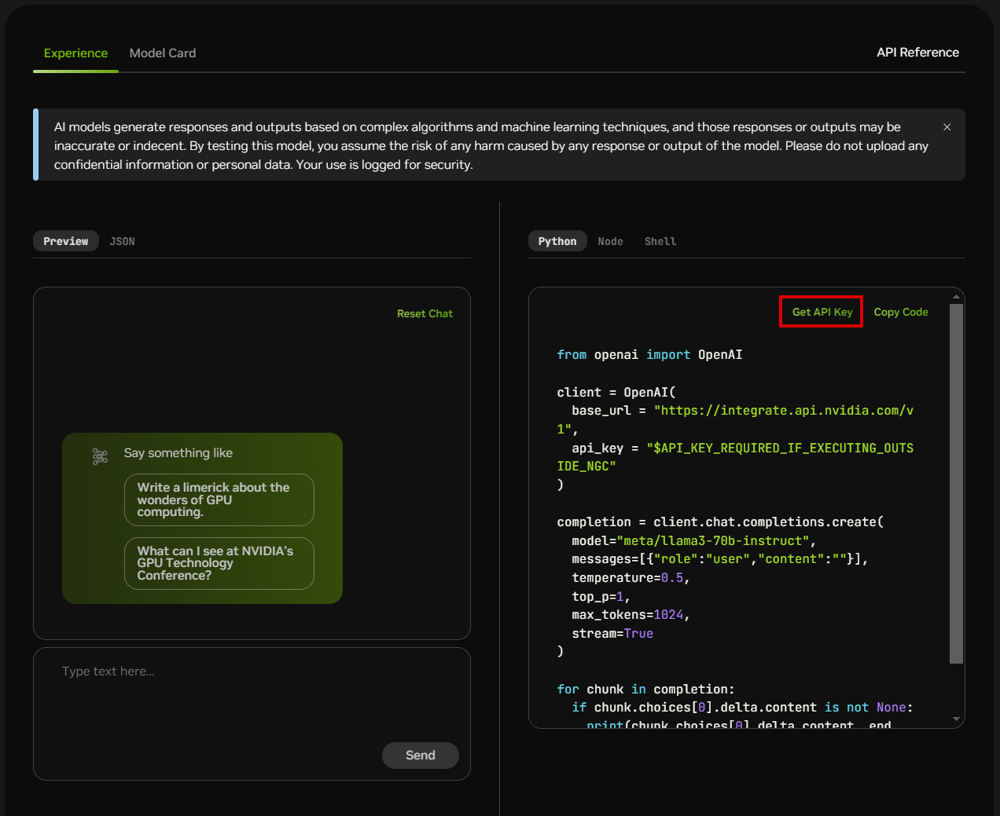
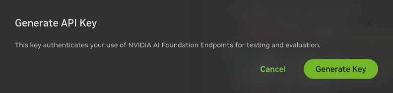
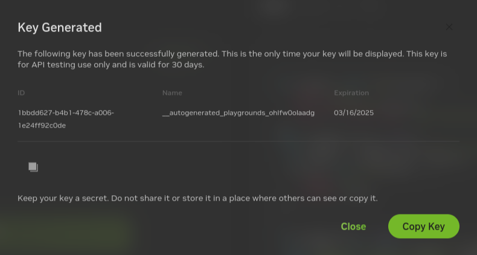

<!--
  SPDX-FileCopyrightText: Copyright (c) 2023 NVIDIA CORPORATION & AFFILIATES. All rights reserved.
  SPDX-License-Identifier: Apache-2.0
-->

# Prerequisites

1. Clone the Generative AI examples Git repository using Git LFS:

    ```console
    sudo apt -y install git-lfs
    git clone git@github.com:NVIDIA/GenerativeAIExamples.git
    cd GenerativeAIExamples/
    git lfs pull
    ```

2. Install Docker Engine. Refer to these instructions for [Ubuntu](https://docs.docker.com/engine/install/ubuntu/).

3. Install Docker Compose. Refer to these instructions to [install the Compose plugin](https://docs.docker.com/compose/install/linux/).

    a. Ensure the Docker Compose plugin version is 2.20 or higher.

    b. After you get the Docker Compose plugin installed, run `docker compose version` to confirm.
  
4. Optional: You can run some containers with GPU acceleration, such as Milvus and NVIDIA NIM for LLMs. To configure Docker for GPU-accelerated containers, [install](https://docs.nvidia.com/datacenter/cloud-native/container-toolkit/latest/install-guide.html) the NVIDIA Container Toolkit.

5. Get an API key to access models in the API Catalog. You can use different model API endpoints with the same API key.

    a. Navigate to [https://build.nvidia.com/explore/discover](https://build.nvidia.com/explore/discover).

    b. Find the **Llama 3.1 70B Instruct** card and click the card.

    

    c. Click **Get API Key**.

    

    d. Click **Generate Key**.

    

    e. Click **Copy Key** and then save the API key. The key begins with the letters ``nvapi-``.

    

6. Get an NGC license. Choose one of the following methods.

    a. Try before you buy and [request a 90-day trial](https://enterpriseproductregistration.nvidia.com/?LicType=EVAL&ProductFamily=NVAIEnterprise). For more information, refer to the [NVIDIA AI Enterprise Overview](https://www.nvidia.com/en-us/data-center/products/ai-enterprise/).

    b. Create an account with the [NVIDIA Developer Program](https://developer.nvidia.com/login). For more information, refer to the [NVIDIA Developer Program Overview](https://developer.nvidia.com/developer-program).

7. Get an NVIDIA NGC API key. The NVIDIA NGC API key is required to log in to the NVIDIA container registry, nvcr.io, and to pull secure base container images used in the examples. Refer to these instructions to [generate an NGC API key](https://docs.nvidia.com/ngc/gpu-cloud/ngc-user-guide/index.html#generating-api-key).

    a. After you get your NGC API key, you can run `docker login nvcr.io` to confirm the key is valid.
