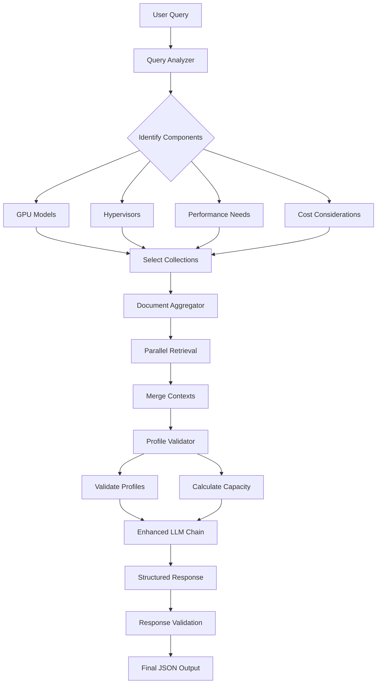

# Enhanced RAG Architecture Implementation Guide

## Overview

This guide describes the enhanced RAG architecture for vGPU configuration recommendations that addresses the following issues:
1. **Document Chaining**: Retrieves from multiple PDF collections based on query analysis
2. **vGPU Profile Validation**: Prevents non-existent profiles and validates configurations
3. **Multiple GPU Support**: Handles heterogeneous/homogeneous GPU configurations
4. **GPU Passthrough**: Supports both vGPU and passthrough deployment modes
5. **Capacity Calculation**: Accurately calculates VM capacity based on profiles and inventory

## Architecture Components

### 1. Query Analyzer (`src/query_analyzer.py`)
- Analyzes user queries to identify relevant document categories
- Extracts GPU models, hypervisors, workload types, and requirements
- Maps query components to document collections

### 2. Document Aggregator (`src/document_aggregator.py`)
- Performs parallel retrieval across multiple collections
- Merges contexts with proper organization
- Extracts vGPU profiles and sizing data from documents
- Provides chained document retrieval

### 3. vGPU Profile Validator (`src/vgpu_profile_validator.py`)
- Maintains official NVIDIA vGPU profile definitions
- Validates profile names and suggests corrections
- Calculates VM capacity based on GPU inventory
- Recommends deployment strategies (vGPU vs passthrough)

### 4. Enhanced RAG Chain (`src/chains_enhanced.py`)
- Integrates all components for end-to-end processing
- Validates LLM responses against known profiles
- Ensures feasible configurations based on hardware

## Document Organization

### Collection Structure
```
vgpu_baseline/          # Core vGPU concepts and configurations
vgpu_hypervisor/        # ESXi, VMware, Citrix, etc.
vgpu_cost_efficiency/   # Cost optimization strategies
vgpu_performance/       # Performance benchmarks and sizing
vgpu_sizing/           # Sizing matrices and guidelines
vgpu_deployment/       # Deployment modes (vGPU, passthrough, MIG)
vgpu_a100/            # A100-specific documentation
vgpu_a40/             # A40-specific documentation
vgpu_l40s/            # L40S-specific documentation
vgpu_l4/              # L4-specific documentation
```

### Creating Collections
```python
# Create collections for each document category
collection_names = [
    "vgpu_baseline",
    "vgpu_hypervisor", 
    "vgpu_cost_efficiency",
    "vgpu_performance",
    "vgpu_sizing",
    "vgpu_deployment",
    "vgpu_a100",
    "vgpu_a40",
    "vgpu_l40s",
    "vgpu_l4"
]

# Use the collections API to create them
await create_collections(collection_names=collection_names)
```

## Query Processing Flow



## Implementation Steps

### Step 1: Install New Components
```bash
# Copy the new modules to your src directory
cp query_analyzer.py src/
cp document_aggregator.py src/
cp vgpu_profile_validator.py src/
cp chains_enhanced.py src/
```

### Step 2: Update Configuration
```python
# In configuration.py, add:
@configclass
class DocumentRoutingConfig(ConfigWizard):
    """Configuration for document routing."""
    enable_multi_collection: bool = configfield(
        "enable_multi_collection",
        default=True,
        help_txt="Enable multi-collection document retrieval"
    )
    collections_per_query: int = configfield(
        "collections_per_query",
        default=5,
        help_txt="Maximum collections to search per query"
    )
```

### Step 3: Modify Server Endpoints
```python
# In server.py, update the generate endpoint to use enhanced chain
if prompt.use_enhanced_rag:
    from src.chains_enhanced import EnhancedUnstructuredRAG
    enhanced_rag = EnhancedUnstructuredRAG()
    generator = enhanced_rag.rag_chain_enhanced(
        query=last_user_message,
        chat_history=processed_chat_history,
        reranker_top_k=prompt.reranker_top_k,
        vdb_top_k=prompt.vdb_top_k,
        collection_name=collection_name,
        **kwargs
    )
```

### Step 4: Update Frontend
```typescript
// In WorkloadConfigWizard.tsx
const generateEnhancedQuery = (): string => {
    const parts = [];
    
    // Include GPU inventory with quantities
    if (config.gpuInventory) {
        const inventory = Object.entries(config.gpuInventory)
            .filter(([_, qty]) => qty > 0)
            .map(([gpu, qty]) => `${qty}x ${gpu}`)
            .join(', ');
        parts.push(`GPU inventory: ${inventory}`);
    }
    
    // Add deployment preference
    if (config.deploymentMode) {
        parts.push(`Deployment mode: ${config.deploymentMode}`);
    }
    
    return parts.join('. ');
};
```

## Usage Examples

### Example 1: Multi-GPU vGPU Configuration
```
Query: "We have 4 A40 GPUs on an ESXi host. I need to deploy a RAG workload using 
large language models (30B+). The goal is to support 10–50 concurrent users with 
good performance but also stay cost-efficient. Should I use vGPU or passthrough?"

Result:
- Searches: vgpu_baseline, vgpu_hypervisor, vgpu_a40, vgpu_cost_efficiency, vgpu_performance
- Recommended: A40-8Q profile (6 VMs per GPU = 24 total VMs)
- Validates profile exists in context
- Calculates actual capacity
```

### Example 2: Heterogeneous GPU Configuration
```
Query: "I have 2x NVIDIA L40S and 4x NVIDIA L4 GPUs. Need to run multiple AI 
inference workloads with different model sizes. How should I configure these?"

Result:
- Searches: vgpu_baseline, vgpu_l40s, vgpu_l4, vgpu_sizing
- Recommends different profiles for each GPU type
- L40S-16Q for larger models (3 VMs per GPU = 6 VMs)
- L4-4Q for smaller models (6 VMs per GPU = 24 VMs)
```

### Example 3: GPU Passthrough Request
```
Query: "Need maximum performance for Llama 3 70B model training. Have 2x A100 80GB 
GPUs. Should use passthrough mode for best performance."

Result:
- Detects passthrough request
- Validates model fits in 80GB memory
- Recommends passthrough configuration
- 1 VM per GPU with full 80GB access
```

## Troubleshooting

### Issue: Non-existent vGPU profiles
**Solution**: The validator now checks all profiles against the official list and suggests corrections.

### Issue: Empty JSON responses
**Solution**: Enhanced response always provides default values based on recommendations.

### Issue: Incorrect VM capacity calculations
**Solution**: Profile validator uses documented max instances per GPU for accurate calculations.

### Issue: Single collection retrieval
**Solution**: Document aggregator performs parallel retrieval from all relevant collections.

## Best Practices

1. **Document Organization**
   - Keep baseline documentation comprehensive
   - Organize GPU-specific docs by model
   - Include sizing tables and performance data

2. **Query Construction**
   - Include GPU inventory with quantities
   - Specify workload requirements clearly
   - Mention deployment preferences explicitly

3. **Profile Validation**
   - Always validate profiles before using
   - Use profile validator for capacity planning
   - Check compatibility with GPU models

4. **Performance Optimization**
   - Use parallel retrieval for faster responses
   - Enable reranking for better relevance
   - Cache frequently accessed collections

## Future Enhancements

1. **Dynamic Collection Management**
   - Auto-create collections based on new GPU models
   - Version control for documentation updates

2. **Advanced Validation**
   - Driver compatibility checking
   - Hypervisor version validation
   - License requirement validation

3. **Capacity Planning**
   - Multi-host configurations
   - Resource pooling strategies
   - Failover planning

4. **Cost Optimization**
   - TCO calculations
   - License optimization
   - Power consumption estimates 