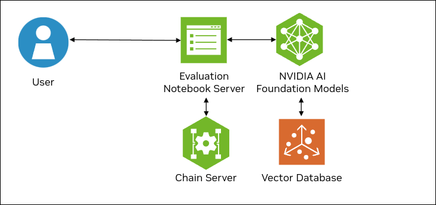
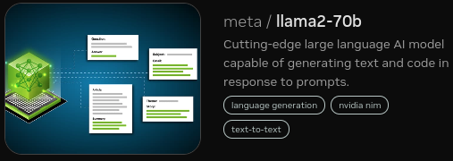
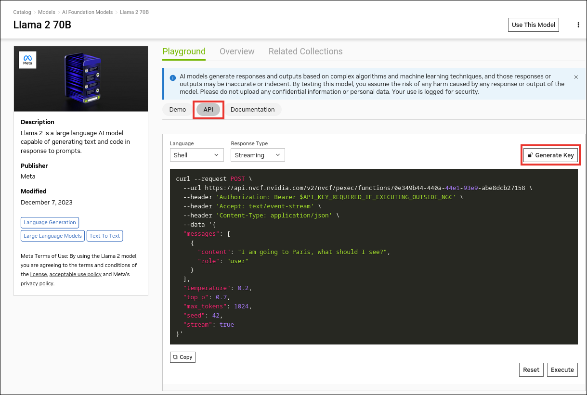

<!--
  SPDX-FileCopyrightText: Copyright (c) 2023 NVIDIA CORPORATION & AFFILIATES. All rights reserved.
  SPDX-License-Identifier: Apache-2.0

  Licensed under the Apache License, Version 2.0 (the "License");
  you may not use this file except in compliance with the License.
  You may obtain a copy of the License at

  http://www.apache.org/licenses/LICENSE-2.0

  Unless required by applicable law or agreed to in writing, software
  distributed under the License is distributed on an "AS IS" BASIS,
  WITHOUT WARRANTIES OR CONDITIONS OF ANY KIND, either express or implied.
  See the License for the specific language governing permissions and
  limitations under the License.
-->

# Evaluation Tool

```{contents}
---
depth: 2
local: true
backlinks: none
---
```

## Introduction

Evaluation is crucial for retrieval augmented generation (RAG) pipelines because it ensures the accuracy and relevance of the information that is retrieved as well as the generated content.

There are three components needed for evaluating the performance of a RAG pipeline:

- Data for testing.
- Automated metrics to measure performance of both the context retrieval and response generation.
- Human-like evaluation of the generated response from the end-to-end pipeline.

This tool provides a set of notebooks that demonstrate how to address these requirements in an automated fashion for the default developer RAG example.

The following figure shows the sample topology:

- The Jupyter notebooks for evaluation are served by a notebook server.
- The notebook server communicates with the chain server to ingest documents and build a knowledge base.
- The notebook server communicates NVIDIA AI Foundation Models and Endpoints for inference.




### Synthetic Data Generation

Using an existing knowledge base, we can generate synthetic question|answer|context triplets using an LLM.
This tool uses the Llama 2 70B model from the NVIDIA AI Foundation Models and Endpoints for data generation.

### Automated Metrics

[RAGAS](https://github.com/explodinggradients/ragas) is an automated metrics tool for measuring performance of both the retriever and generator.
This tool uses a LangChain wrapper to connect to NVIDIA AI Foundation Models and Endpoints to run RAGAS evaluation on our example RAG pipeline.

### LLM-as-a-Judge

This tool uses LLMs to provide human-like feedback and Likert evaluation scores for full end-to-end RAG pipelines.
The Llama 2 70B model is used as a judge LLM.

## Prerequisites

% prerequisites-start

- Clone the Generative AI examples Git repository using Git LFS:

  ```console
  $ sudo apt -y install git-lfs
  $ git clone git@github.com:NVIDIA/GenerativeAIExamples.git
  $ cd GenerativeAIExamples/
  $ git lfs pull
  ```

- A host with an NVIDIA A100, H100, or L40S GPU.

- Verify NVIDIA GPU driver version 535 or later is installed and that the GPU is in compute mode:

  ```console
  $ nvidia-smi -q -d compute
  ```

  *Example Output*

  ```{code-block} output
  ---
  emphasize-lines: 4,9
  ---
  ==============NVSMI LOG==============

  Timestamp                                 : Sun Nov 26 21:17:25 2023
  Driver Version                            : 535.129.03
  CUDA Version                              : 12.2

  Attached GPUs                             : 1
  GPU 00000000:CA:00.0
      Compute Mode                          : Default
  ```

  If the driver is not installed or below version 535, refer to the [*NVIDIA Driver Installation Quickstart Guide*](https://docs.nvidia.com/datacenter/tesla/tesla-installation-notes/index.html).

- Install Docker Engine and Docker Compose.
  Refer to the instructions for [Ubuntu](https://docs.docker.com/engine/install/ubuntu/).

- Install the NVIDIA Container Toolkit.

  1. Refer to the [installation documentation](https://docs.nvidia.com/datacenter/cloud-native/container-toolkit/latest/install-guide.html).

  1. When you configure the runtime, set the NVIDIA runtime as the default:

     ```console
     $ sudo nvidia-ctk runtime configure --runtime=docker --set-as-default
     ```

     If you did not set the runtime as the default, you can reconfigure the runtime by running the preceding command.

  1. Verify the NVIDIA container toolkit is installed and configured as the default container runtime:

     ```console
     $ cat /etc/docker/daemon.json
     ```

     *Example Output*

     ```json
     {
         "default-runtime": "nvidia",
         "runtimes": {
             "nvidia": {
                 "args": [],
                 "path": "nvidia-container-runtime"
             }
         }
     }
     ```

   1. Run the `nvidia-smi` command in a container to verify the configuration:

      ```console
      $ sudo docker run --rm --runtime=nvidia --gpus all ubuntu nvidia-smi -L
      ```

      *Example Output*

      ```output
      GPU 0: NVIDIA A100 80GB PCIe (UUID: GPU-d8ce95c1-12f7-3174-6395-e573163a2ace)
      ```

% prerequisites-end


## Get an API Key for the Llama 2 70B API Endpoint

Perform the following steps if you do not already have an API key.
You can use different model API endpoints with the same API key.

1. Navigate to <https://catalog.ngc.nvidia.com/ai-foundation-models>.

1. Find the **Llama 2 70B** card and click **Learn More**.

   

1. Click the **API** button and then click **Generate Key**.

   

1. Save the generated API key.


## Build and Start the Containers

1. In the Generative AI Examples repository, edit the `deploy/compose/compose.env` file.

   Specify the absolute path to the model location, model architecture, and model name.

   ```text
   # full path to the local copy of the model weights
   # NOTE: This should be an absolute path and not relative path
   export MODEL_DIRECTORY="/path/to/llama/llama-2-13b_chat/"

   # the architecture of the model. eg: llama
   export MODEL_ARCHITECTURE="llama"

   # the name of the model being used - only for displaying on frontend
   export MODEL_NAME="Llama-2-13b-chat"
   ...
   ```

2. Export the `NVIDIA_API_KEY` variable in terminal.

   Add the API for the model endpoint:

   ```text
   export NVIDIA_API_KEY="nvapi-<...>"
   ```


3. From the root of the repository, build the containers:

   ```console
   $ docker compose --env-file deploy/compose/compose.env -f deploy/compose/rag-app-text-chatbot.yaml build
   ```

4. Start the milvus container:

   ```console
   $ docker compose -f deploy/compose/docker-compose-vectordb.yaml up -d milvus
   ```

5. Start the containers:

   ```console
   $ docker compose --env-file deploy/compose/compose.env -f deploy/compose/rag-app-text-chatbot.yaml up -d
   ```
   NVIDIA Triton Inference Server can require 5 minutes to start. The `-d` flag starts the services in the background.

   *Example Output*

   ```output
   ✔ Network nvidia-rag              Created
   ✔ Container llm-inference-server  Started
   ✔ Container notebook-server       Started
   ✔ Container chain-server          Started
   ✔ Container rag-playground        Started
   ```

6. Build and deploy the evaluation service:

   ```console
   $ docker compose -f deploy/compose/docker-compose-evaluation.yaml build
   $ docker compose -f deploy/compose/docker-compose-evaluation.yaml up -d
   ```

## Next Steps

- Access the evaluation notebook server at `http://host-ip:8889` from your web browser and run the notebooks sequentially starting from `01_synthetic_data_generation.ipynb`.

- Stop the containers by running the following commands:

  - `docker compose -f deploy/compose/rag-app-text-chatbot.yaml down`
  - `docker compose -f deploy/compose/docker-compose-vectordb.yaml down`
  - `docker compose -f deploy/compose/docker-compose-evaluation.yaml down`
