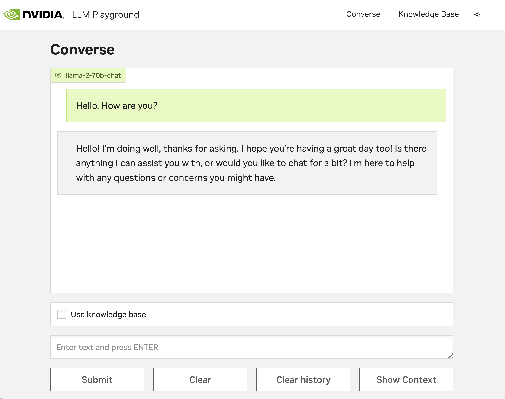

<!--
  SPDX-FileCopyrightText: Copyright (c) 2023 NVIDIA CORPORATION & AFFILIATES. All rights reserved.
  SPDX-License-Identifier: Apache-2.0

  Licensed under the Apache License, Version 2.0 (the "License");
  you may not use this file except in compliance with the License.
  You may obtain a copy of the License at

  http://www.apache.org/licenses/LICENSE-2.0

  Unless required by applicable law or agreed to in writing, software
  distributed under the License is distributed on an "AS IS" BASIS,
  WITHOUT WARRANTIES OR CONDITIONS OF ANY KIND, either express or implied.
  See the License for the specific language governing permissions and
  limitations under the License.
-->

# RAG Playground Web Application

```{contents}
---
depth: 2
local: true
backlinks: none
---
```

## About the Web Application

The web application provides a user interface to the RAG [chain server](./chain-server.md) APIs.

- You can chat with the LLM and see responses streamed back for different examples.
- By selecting **Use knowledge base**, the chat bot returns responses that are augmented with data from documents that you uploaded and were stored in the vector database.
- To store content in the vector database, click **Knowledge Base** in the upper right corner and upload documents.



## Web Application Design

At its core, the application is a FastAPI server written in Python. This FastAPI server hosts two [Gradio](https://www.gradio.app/) applications, one for conversing with the model and another for uploading documents. These Gradio pages are wrapped in a static frame created with the NVIDIA Kaizen UI React+Next.js framework and compiled down to static pages. Iframes are used to mount the Gradio applications into the outer frame.

## Running the Web Application Individually

To run the web application for development purposes, run the following commands:

- Build the container from source:

  ```console
  $ source deploy/compose/compose.env
  $ docker compose -f deploy/compose/rag-app-text-chatbot.yaml build frontend
  ```

- Start the container, which starts the server:

  ```console
  $ source deploy/compose/compose.env
  $ docker compose -f deploy/compose/rag-app-text-chatbot.yaml up frontend
  ```

- Open the web application at ``http://host-ip:8090``.

If you upload multiple PDF files, the expected time of completion that is shown in the web application might not be correct.
