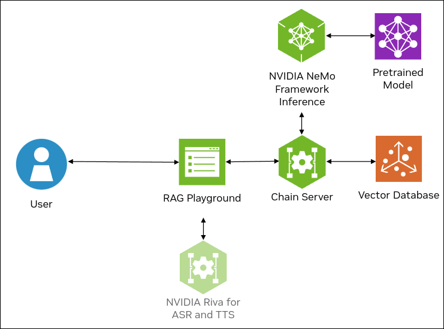

<!--
  SPDX-FileCopyrightText: Copyright (c) 2023 NVIDIA CORPORATION & AFFILIATES. All rights reserved.
  SPDX-License-Identifier: Apache-2.0

  Licensed under the Apache License, Version 2.0 (the "License");
  you may not use this file except in compliance with the License.
  You may obtain a copy of the License at

  http://www.apache.org/licenses/LICENSE-2.0

  Unless required by applicable law or agreed to in writing, software
  distributed under the License is distributed on an "AS IS" BASIS,
  WITHOUT WARRANTIES OR CONDITIONS OF ANY KIND, either express or implied.
  See the License for the specific language governing permissions and
  limitations under the License.
-->

# Multi-GPU for Inference

```{contents}
---
depth: 2
local: true
backlinks: none
---
```

## Comparison with the Local GPUs Example

This example is very similar to the example that uses local GPUs.
The key difference is that the `deploy/compose/rag-app-text-chatbot.yaml` file
is modified to identify the device IDs of the GPUs for the services.

If you performed all the steps in [](local-gpu.md), consider skipping to
step 1 of [](#build-and-start-the-containers) on this page.

## Example Features

This example deploys a developer RAG pipeline for chat Q&A and serves inferencing with the NeMo Framework Inference container across multiple local GPUs.

This example uses a local host with an NVIDIA A100, H100, or L40S GPU.

```{list-table}
:header-rows: 1

* - Model
  - Embedding
  - Framework
  - Description
  - Multi-GPU
  - TRT-LLM
  - Model Location
  - Triton
  - Vector Database

* - llama-2
  - e5-large-v2
  - LlamaIndex
  - QA chatbot
  - YES
  - YES
  - Local Model
  - YES
  - Milvus

* - llama-2
  - e5-large-v2
  - LlamaIndex
  - QA chatbot
  - YES
  - YES
  - Local Model
  - YES
  - pgvector
```

The following figure shows the sample topology:

- The sample chat bot web application communicates with the local chain server.

- The chain server sends inference requests to NVIDIA Triton Inference Server (TIS).
  TIS uses TensorRT-LLM and NVIDIA GPUs with the LLama 2 model for generative AI.

- The sample chat bot supports uploading documents to create a knowledge base.
  The uploaded documents are parsed by the chain server and embeddings are stored
  in the vector database, Milvus or pgvector.
  When you submit a question and request to use the knowledge base, the chain server
  retrieves the most relevant documents and submits them with the question to
  TIS to perform retrieval-augumented generation.

- Optionally, you can deploy NVIDIA Riva. Riva can use automatic speech recognition to
  transcribe your questions and use text-to-speech to speak the answers aloud.




## Prerequisites

- Clone the Generative AI examples Git repository using Git LFS:

  ```console
  $ sudo apt -y install git-lfs
  $ git clone git@github.com:NVIDIA/GenerativeAIExamples.git
  $ cd GenerativeAIExamples/
  $ git lfs pull
  ```

- A host with one or more NVIDIA A100, H100, or L40S GPU.

- Verify NVIDIA GPU driver version 535 or later is installed and that the GPU is in compute mode:

  ```console
  $ nvidia-smi -q -d compute
  ```

  *Example Output*

  ```{code-block} output
  ---
  emphasize-lines: 4,9
  ---
  ==============NVSMI LOG==============

  Timestamp                                 : Sun Nov 26 21:17:25 2023
  Driver Version                            : 535.129.03
  CUDA Version                              : 12.2

  Attached GPUs                             : 2
  GPU 00000000:CA:00.0
      Compute Mode                          : Default

  GPU 00000000:FA:00.0
      Compute Mode                          : Default
  ```

  If the driver is not installed or below version 535, refer to the [*NVIDIA Driver Installation Quickstart Guide*](https://docs.nvidia.com/datacenter/tesla/tesla-installation-notes/index.html).

- Install Docker Engine and Docker Compose.
  Refer to the instructions for [Ubuntu](https://docs.docker.com/engine/install/ubuntu/).

- Install the NVIDIA Container Toolkit.

  1. Refer to the [installation documentation](https://docs.nvidia.com/datacenter/cloud-native/container-toolkit/latest/install-guide.html).

  1. When you configure the runtime, set the NVIDIA runtime as the default:

     ```console
     $ sudo nvidia-ctk runtime configure --runtime=docker --set-as-default
     ```

     If you did not set the runtime as the default, you can reconfigure the runtime by running the preceding command.

  1. Verify the NVIDIA container toolkit is installed and configured as the default container runtime:

     ```console
     $ cat /etc/docker/daemon.json
     ```

     *Example Output*

     ```json
     {
         "default-runtime": "nvidia",
         "runtimes": {
             "nvidia": {
                 "args": [],
                 "path": "nvidia-container-runtime"
             }
         }
     }
     ```

  1. Run the `nvidia-smi` command in a container to verify the configuration:

     ```console
     $ sudo docker run --rm --runtime=nvidia --gpus all ubuntu nvidia-smi -L
     ```

     *Example Output*

     ```output
     GPU 0: NVIDIA A100 80GB PCIe (UUID: GPU-d8ce95c1-12f7-3174-6395-e573163a2ace)
     GPU 1: NVIDIA A100 80GB PCIe (UUID: GPU-1d37ef30-0861-de64-a06d-73257e247a0d)
     ```

- Optional: Enable NVIDIA Riva automatic speech recognition (ASR) and text to speech (TTS).

  - To launch a Riva server locally, refer to the [Riva Quick Start Guide](https://docs.nvidia.com/deeplearning/riva/user-guide/docs/quick-start-guide.html).

    - In the provided `config.sh` script, set `service_enabled_asr=true` and `service_enabled_tts=true`, and select the desired ASR and TTS languages by adding the appropriate language codes to `asr_language_code` and `tts_language_code`.

    - After the server is running, assign its IP address (or hostname) and port (50051 by default) to `RIVA_API_URI` in `deploy/compose/compose.env`.

  - Alternatively, you can use a hosted Riva API endpoint. You might need to obtain an API key and/or Function ID for access.

    In `deploy/compose/compose.env`, make the following assignments as necessary:

    ```bash
    export RIVA_API_URI="<riva-api-address/hostname>:<port>"
    export RIVA_API_KEY="<riva-api-key>"
    export RIVA_FUNCTION_ID="<riva-function-id>"
    ```

## Download the Llama 2 Model and Weights

1. Fill out Meta's [Llama request access form](https://ai.meta.com/resources/models-and-libraries/llama-downloads/).

   - Select the **Llama 2 & Llama Chat** checkbox.
   - After verifying your email, Meta will email you a download link.

1. Clone the Llama repository:

   ```console
   $ git clone https://github.com/facebookresearch/llama.git
   $ cd llama/
   ```

1. Run the `download.sh` script.  When prompted, specify `13B-chat` to download the llama-2-13b-chat model:

   ```console
   $ ./download.sh
   Enter the URL from email: < https://download.llamameta.net/...>

   Enter the list of models to download without spaces (7B,13B,70B,7B-chat,13B-chat,70B-chat), or press Enter for all: 13B-chat
   ```

1. Copy the tokenizer to the model directory.

   ```console
   $ mv tokenizer* llama-2-13b-chat/
   $ ls llama-2-13b-chat/
   ```

   *Example Output*

   ```output
   checklist.chk  consolidated.00.pth  consolidated.01.pth  params.json  tokenizer.model  tokenizer_checklist.chk
   ```

## Build and Start the Containers

1. In the Generative AI Examples repository, edit the `deploy/compose/rag-app-text-chatbot.yaml` file.

   Specify the GPU device IDs to assign to the services:

   ```yaml
   services:
     llm:
       // ...
       deploy:
         resources:
           reservations:
             devices:
               - driver: nvidia
                 # count: ${INFERENCE_GPU_COUNT:-all} # Comment this out
                 device_ids: ["0", "1"]
                 capabilities: [gpu]

     jupyter-server:
       // ...
       deploy:
         resources:
           reservations:
             devices:
               - driver: nvidia
                 # count: 1 # Comment this out
                 device_ids: ["2"]
                 capabilities: [gpu]
   ```

1. Edit the `deploy/compose/docker-compose-vectordb.yaml` file.

   Specify the GPU device IDs to assign to the services:

   ```yaml
   services:
     milvus:
       // ...
       deploy:
         resources:
           reservations:
             devices:
               - driver: nvidia
                 # count: 1 # Comment this out
                 device_ids: ["3"]
                 capabilities: [gpu]
   ```

1. Edit the `deploy/compose/compose.env` file.

   Specify the absolute path to the model location, model architecture, and model name.

   ```bash
   # full path to the local copy of the model weights
   # NOTE: This should be an absolute path and not relative path
   export MODEL_DIRECTORY="/path/to/llama/llama-2-13b_chat/"

   # the architecture of the model. eg: llama
   export MODEL_ARCHITECTURE="llama"

   # the name of the model being used - only for displaying on frontend
   export MODEL_NAME="Llama-2-13b-chat"
   ...
   ```

1. From the root of the repository, build the containers:

   ```console
   $ docker compose --env-file deploy/compose/compose.env -f deploy/compose/rag-app-text-chatbot.yaml build
   ```

1. Start the containers:

   ```console
   $ docker compose --env-file deploy/compose/compose.env -f deploy/compose/rag-app-text-chatbot.yaml up -d
   ```

   NVIDIA Triton Inference Server can require 5 minutes to start. The `-d` flag starts the services in the background.

   *Example Output*

   ```output
   ✔ Network nvidia-rag              Created
   ✔ Container llm-inference-server  Started
   ✔ Container notebook-server       Started
   ✔ Container chain-server          Started
   ✔ Container rag-playground        Started
   ```

1. Start the Milvus vector database:

   ```console
   $ docker compose --env-file deploy/compose/compose.env -f deploy/compose/docker-compose-vectordb.yaml up -d milvus
   ```

   *Example Output*

   ```output
   ✔ Container milvus-minio       Started
   ✔ Container milvus-etcd        Started
   ✔ Container milvus-standalone  Started
   ```

1. Confirm the containers are running:

   ```console
   $ docker ps --format "table {{.ID}}\t{{.Names}}\t{{.Status}}"
   ```

   *Example Output*

   ```output
   CONTAINER ID   NAMES                  STATUS
   256da0ecdb7b   rag-playground         Up 48 minutes
   2974aa4fb2ce   chain-server           Up 48 minutes
   4a8c4aebe4ad   notebook-server        Up 48 minutes
   5be2b57bb5c1   milvus-standalone      Up 48 minutes (healthy)
   ecf674c8139c   llm-inference-server   Up 48 minutes (healthy)
   a6609c22c171   milvus-minio           Up 48 minutes (healthy)
   b23c0858c4d4   milvus-etcd            Up 48 minutes (healthy)
   ```

### Related Information

- [Meta Llama README](https://github.com/facebookresearch/llama/blob/main/README.md)
- [Meta Llama request access form](https://ai.meta.com/resources/models-and-libraries/llama-downloads/)


## Stopping the Containers

- To uninstall, stop and remove the running containers from the root of the Generative AI Examples repository:

  ```console
  $ docker compose -f deploy/compose/rag-app-text-chatbot.yaml down
  ```

## Next Steps

- Use the [](./using-sample-web-application.md).
- [](./vector-database.md)
- Run the sample Jupyter notebooks to learn about optional features.
