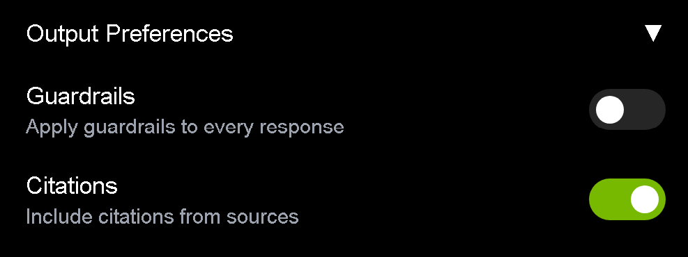

<!--
  SPDX-FileCopyrightText: Copyright (c) 2025 NVIDIA CORPORATION & AFFILIATES. All rights reserved.
  SPDX-License-Identifier: Apache-2.0
-->

# NeMo Guardrails Setup for RAG Blueprint

This guide provides step-by-step instructions to enable **NeMo Guardrails** for the RAG Blueprint, allowing you to control and safeguard LLM interactions.

## Overview

NeMo Guardrails is a framework that provides safety and security measures for LLM applications. When enabled, it provides:
- Content safety filtering
- Topic control to prevent off-topic conversations
- Jailbreak detection to prevent prompt attacks

## Hardware Requirements

The NeMo Guardrails models have specific hardware requirements:

- **Llama 3.1 NemoGuard 8B Content Safety Model**: Requires 48 GB of GPU memory
- **Llama 3.1 NemoGuard 8B Topic Control Model**: Requires 48 GB of GPU memory

**Note:** You need two separate GPUs (2 x H100 or 2 x A100) for deployment, as each model must be deployed on its own dedicated GPU - one for the Content Safety model and another for the Topic Control model.

NVIDIA developed and tested these microservices using H100 and A100 GPUs.

For detailed hardware compatibility and support information:
- [Llama 3.1 NemoGuard 8B Content Safety Support Matrix](https://docs.nvidia.com/nim/llama-3-1-nemoguard-8b-contentsafety/latest/support-matrix.html)
- [Llama 3.1 NemoGuard 8B Topic Control Support Matrix](https://docs.nvidia.com/nim/llama-3-1-nemoguard-8b-topiccontrol/latest/support-matrix.html)

---

## Setting Up NeMo Guardrails

### Prerequisites
- Docker and Docker Compose installed
- NVIDIA API Key configured
- Docker configured for GPU access
- RAG Server must be running before starting NeMo Guardrails services

---

### Deployment Options

You can deploy NeMo Guardrails using one of the following methods:

1. **Self-hosted Deployment (Docker Compose)** – Default method running all guardrails services locally on your hardware
2. **Cloud Deployment** – Uses NVIDIA-hosted models instead of running the models locally
3. **Helm Deployment** – Deploys NeMo Guardrails as a Helm chart on a Kubernetes cluster (local deployment only)

---

## Option 1: Self-hosted Deployment (Default)

### Step 1: Enable Guardrails

Set the environment variable to enable guardrails:

```bash
export ENABLE_GUARDRAILS=true
export DEFAULT_CONFIG=nemoguard
```

After setting these environment variables, you must restart the RAG server for `ENABLE_GUARDRAILS` to take effect:

```bash
docker compose -f deploy/compose/docker-compose-rag-server.yaml up -d
```

**Note:** For on-premises deployment, the default NIM service must be up and running. If you're unable to run the NIM service locally, you can use NVIDIA's cloud-hosted LLM by exporting the NIM endpoint URL:

```bash
# Use NVIDIA's cloud-hosted LLM
export NIM_ENDPOINT_URL=https://integrate.api.nvidia.com/v1
# Or provide your own custom NIM endpoint URL
# export NIM_ENDPOINT_URL=<your-custom-nim-endpoint-url>
```

---

### Step 2: Create Model Cache Directory

Create a directory for caching models (if not already created):

```bash
mkdir -p ~/.cache/model-cache
```

---

### Step 3: Set Model Directory Path

Set the model directory path:

```bash
export MODEL_DIRECTORY=~/.cache/model-cache
```

---

### Step 3a: Check Available GPUs and Set GPU IDs

Check your available GPUs and their IDs:

```bash
nvidia-smi
```

This will display all available GPUs with their IDs, memory usage, and utilization. Based on this information, you can export specific GPU IDs for the guardrails services:

```bash
# By default, the services use GPU IDs 7 and 6
# Set these to appropriate values based on your system configuration
export CONTENT_SAFETY_GPU_ID=0  # Choose GPU ID for content safety model
export TOPIC_CONTROL_GPU_ID=1   # Choose GPU ID for topic control model
```

**Note:** Each model requires a dedicated GPU with at least 48GB of memory. Make sure to select GPUs with sufficient available memory.

---

### Step 4: Start NeMo Guardrails Service

Start the NeMo Guardrails service using Docker Compose:

```bash
USERID=$(id -u) docker compose -f deploy/compose/docker-compose-nemo-guardrails.yaml up -d
```

This command starts the following services:
- NeMo Guardrails microservice
- Content safety model
- Topic control model

**Note:** The NemoGuard services may take several minutes to fully initialize. You can monitor their status with:

```bash
watch -n 2 'docker ps --format "table {{.Names}}\t{{.Status}}" | grep -E "nemoguard|guardrails"'
```

Wait until you see all services showing as "healthy" before proceeding:

```
llama-3.1-nemoguard-8b-topic-control    Up 5 minutes (healthy)
llama-3.1-nemoguard-8b-content-safety   Up 5 minutes (healthy)
nemo-guardrails-microservice            Up 4 minutes (healthy)
```

---

### Step 5: Enable Guardrails from the UI

Once the services are running, you can enable guardrails from the RAG Playground UI:

1. Open the RAG Playground UI
2. Go to Settings by clicking on the top right corner of the UI
3. In the "Output Preferences" section, toggle "Guardrails" to ON (as shown in the screenshot below)



---

#### Option 2: Cloud Deployment

For cloud deployment using NVIDIA-hosted models instead of the default self-hosted deployment:

```bash
# Set configuration for cloud deployment
export DEFAULT_CONFIG=nemoguard_cloud
export NIM_ENDPOINT_URL=https://integrate.api.nvidia.com/v1

# Start only the guardrails microservice
docker compose -f deploy/compose/docker-compose-nemo-guardrails.yaml up -d --no-deps nemo-guardrails-microservice
```

**Note:** Before starting the cloud deployment, verify that the model names in the configuration file are correct:

```bash
cat deploy/compose/nemoguardrails/config-store/nemoguard_cloud/config.yml
```

Ensure that the model names in this file match the models available in your NVIDIA API account. You may need to update these names based on the specific models you have access to.

---

## Option 3: Helm Deployment (Local Deployment Only)

Alternatively, you can deploy NeMo Guardrails using Helm for Kubernetes environments.

### Step 1: Install NeMo Guardrails Helm Chart

Follow the instructions to install the chart in inference mode:

👉 [https://catalog.ngc.nvidia.com/orgs/nvidia/teams/nemo-microservices/helm-charts/nemo-guardrails](https://catalog.ngc.nvidia.com/orgs/nvidia/teams/nemo-microservices/helm-charts/nemo-guardrails)

### Step 2: Retrieve NeMo Guardrails Service URL

After deploying the chart, obtain the URL of the NeMo Guardrails service (external IP or internal cluster service name).

You can retrieve it using:

```bash
kubectl get svc -n <namespace>
```

Locate the `nemo-guardrails` service and copy its URL.

### Step 3: Update RAG Blueprint Deployment with NeMo Guardrails

Use the Helm upgrade command below to enable NeMo Guardrails in RAG Blueprint by setting `ENABLE_GUARDRAILS` and the `NEMO_GUARDRAILS_URL`:

```bash
helm upgrade rag -n rag https://helm.ngc.nvidia.com/nvidia/blueprint/charts/nvidia-blueprint-rag-v2.1.0.tgz \
  --username '$oauthtoken' \
  --password "${NGC_API_KEY}" \
  --set imagePullSecret.password=${NGC_API_KEY} \
  --set ngcApiSecret.password=${NGC_API_KEY} \
  --set envVars.ENABLE_GUARDRAILS="True" \
  --set envVars.NEMO_GUARDRAILS_URL="<URL OF THE NEMO GUARDRAILS SERVICE>"
```

Replace `<URL OF THE NEMO GUARDRAILS SERVICE>` with the URL you obtained.

This will configure the RAG server to route guardrails functionality to the deployed NeMo Guardrails service.

---

## Current Limitations

- The Jailbreak detection model is currently not available. This feature will be added in future updates.
- User queries which attempt to jailbreak the system (asking the bot to behave in a certain way) may not work as expected in the current version. These jailbreak attempts could be better addressed with the [NemoGuard-Jailbreak-Detect](https://build.nvidia.com/nvidia/nemoguard-jailbreak-detect) NIM Micro-service, which currently does not offer out-of-the-box support.
- Both the content-safety and topic-control models are trained on single-turn datasets, meaning they don't handle multi-turn conversations as effectively. When the bot combines multiple queries and previous context, it may inconsistently flag certain phrases as safe or unsafe.
- The current version of Guardrails is tuned to provide simple safe responses, such as "I'm sorry. I can't respond to that." More meaningful responses with enhanced caution notes will be available in future releases.

---

## Troubleshooting

### GPU Device ID Issues

If you encounter GPU device errors, you can customize the GPU device IDs used by the guardrails services. By default, the services use GPUs 6 and 7, but you can set specific GPUs by setting these environment variables before starting the service:

```bash
# Specify which GPUs to use for guardrail services
export CONTENT_SAFETY_GPU_ID=0  # Default is GPU 0
export TOPIC_CONTROL_GPU_ID=1   # Default is GPU 1
```

This allows you to control which specific GPUs are assigned to each model in multi-GPU systems.

### Service Health Check

To verify if the guardrails services are running properly:

```bash
docker ps --format "table {{.Names}}\t{{.Status}}" | grep -E "guardrails|safety|topic"
```

```bash
nemo-guardrails-microservice            Up 19 minutes
llama-3.1-nemoguard-8b-topic-control    Up 19 minutes
llama-3.1-nemoguard-8b-content-safety   Up 19 minutes
```

---

## Additional Information

For more information about NeMo Guardrails, visit the [NeMo Guardrails documentation](https://docs.nvidia.com/nemo-guardrails/).

## References

- [NeMo Guardrails Microservice Overview](https://developer.nvidia.com/docs/nemo-microservices/guardrails/source/overview.html) - Detailed information about the NeMo Guardrails microservice architecture and capabilities
- [Integrating with NemoGuard NIM Microservices](https://developer.nvidia.com/docs/nemo-microservices/guardrails/source/guides/integrate-nim.html) - Guide for integrating NemoGuard NIM microservices into your application

---