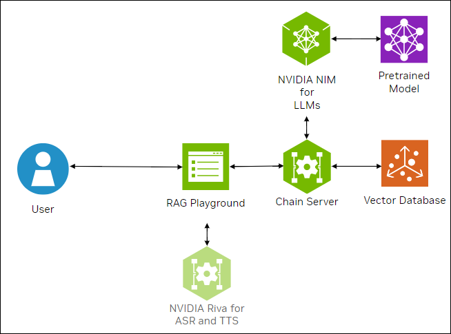

<!--
  SPDX-FileCopyrightText: Copyright (c) 2023 NVIDIA CORPORATION & AFFILIATES. All rights reserved.
  SPDX-License-Identifier: Apache-2.0

  Licensed under the Apache License, Version 2.0 (the "License");
  you may not use this file except in compliance with the License.
  You may obtain a copy of the License at

  http://www.apache.org/licenses/LICENSE-2.0

  Unless required by applicable law or agreed to in writing, software
  distributed under the License is distributed on an "AS IS" BASIS,
  WITHOUT WARRANTIES OR CONDITIONS OF ANY KIND, either express or implied.
  See the License for the specific language governing permissions and
  limitations under the License.
-->

# Using NVIDIA NIM for LLMs

```{contents}
---
depth: 2
local: true
backlinks: none
---
```

## Running Examples on NIM for LLMs

NVIDIA NIM for LLMs provides the enterprise-ready approach for deploying large language models (LLMs).

If you are approved for [early access to NVIDIA NeMo Microservices](https://developer.nvidia.com/nemo-microservices), you can run the examples with NIM for LLMs.

The following figure shows the sample topology:

- The sample chat bot web application communicates with the chain server.
  The chain server sends inference requests to a local NVIDIA NIM for LLMs microservice.
- Optionally, you can deploy NVIDIA Riva. Riva can use automatic speech recognition to transcribe
  your questions and use text-to-speech to speak the answers aloud.




## Prerequisites

- You have early access to NVIDIA NeMo Microservices.
- Clone the Generative AI examples Git repository using Git LFS:

  ```console
  $ sudo apt -y install git-lfs
  $ git clone git@github.com:NVIDIA/GenerativeAIExamples.git
  $ cd GenerativeAIExamples/
  $ git lfs pull
  ```

- A host with an NVIDIA A100, H100, or L40S GPU.

- Verify NVIDIA GPU driver version 535 or later is installed and that the GPU is in compute mode:

  ```console
  $ nvidia-smi -q -d compute
  ```

  *Example Output*

  ```{code-block} output
  ---
  emphasize-lines: 4,9
  ---
  ==============NVSMI LOG==============

  Timestamp                                 : Sun Nov 26 21:17:25 2023
  Driver Version                            : 535.129.03
  CUDA Version                              : 12.2

  Attached GPUs                             : 1
  GPU 00000000:CA:00.0
      Compute Mode                          : Default
  ```

  If the driver is not installed or below version 535, refer to the [*NVIDIA Driver Installation Quickstart Guide*](https://docs.nvidia.com/datacenter/tesla/tesla-installation-notes/index.html).

- Install Docker Engine and Docker Compose.
  Refer to the instructions for [Ubuntu](https://docs.docker.com/engine/install/ubuntu/).

- Install the NVIDIA Container Toolkit.

  1. Refer to the [installation documentation](https://docs.nvidia.com/datacenter/cloud-native/container-toolkit/latest/install-guide.html).

  1. When you configure the runtime, set the NVIDIA runtime as the default:

     ```console
     $ sudo nvidia-ctk runtime configure --runtime=docker --set-as-default
     ```

     If you did not set the runtime as the default, you can reconfigure the runtime by running the preceding command.

  1. Verify the NVIDIA container toolkit is installed and configured as the default container runtime:

     ```console
     $ cat /etc/docker/daemon.json
     ```

     *Example Output*

     ```json
     {
         "default-runtime": "nvidia",
         "runtimes": {
             "nvidia": {
                 "args": [],
                 "path": "nvidia-container-runtime"
             }
         }
     }
     ```

   1. Run the `nvidia-smi` command in a container to verify the configuration:

      ```console
      $ sudo docker run --rm --runtime=nvidia --gpus all ubuntu nvidia-smi -L
      ```

      *Example Output*

      ```output
      GPU 0: NVIDIA A100 80GB PCIe (UUID: GPU-d8ce95c1-12f7-3174-6395-e573163a2ace)
      ```

- Optional: Enable NVIDIA Riva automatic speech recognition (ASR) and text to speech (TTS).

  - To launch a Riva server locally, refer to the [Riva Quick Start Guide](https://docs.nvidia.com/deeplearning/riva/user-guide/docs/quick-start-guide.html).

    - In the provided `config.sh` script, set `service_enabled_asr=true` and `service_enabled_tts=true`, and select the desired ASR and TTS languages by adding the appropriate language codes to `asr_language_code` and `tts_language_code`.

    - After the server is running, assign its IP address (or hostname) and port (50051 by default) to `RIVA_API_URI` in `deploy/compose/compose.env`.

  - Alternatively, you can use a hosted Riva API endpoint. You might need to obtain an API key and/or Function ID for access.

    In `deploy/compose/compose.env`, make the following assignments as necessary:

    ```bash
    export RIVA_API_URI="<riva-api-address/hostname>:<port>"
    export RIVA_API_KEY="<riva-api-key>"
    export RIVA_FUNCTION_ID="<riva-function-id>"
    ```


## Build and Start the Containers

1. Create a `model-cache` directory to download and store the models
    ```bash
    mkdir -p model-cache
    ```

1. In the Generative AI Examples repository, edit the `deploy/compose/compose.env` file.

   Add or update the following environment variables.

   ```bash
   # full path to the `model-cache` directory
   # NOTE: This should be an absolute path and not relative path
   export MODEL_DIRECTORY="/path/to/model/cache/directory/"

   # IP of system where llm is deployed.
   export APP_LLM_SERVERURL="nemollm-inference:8000"

   # Name of the deployed embedding model (NV-Embed-QA)
   export APP_EMBEDDINGS_MODELNAME="NV-Embed-QA"

   export APP_EMBEDDINGS_MODELENGINE=nvidia-ai-endpoints

   # IP of system where embedding model is deployed.
   export APP_EMBEDDINGS_SERVERURL="nemollm-embedding:9080"    # Or ranking-ms:8080 for the reranking example.

   # GPU for use by Milvus
   export VECTORSTORE_GPU_DEVICE_ID=<free-gpu-id>
   ...
   ```

1. Build the Chain Server and RAG Playground containers:

   ```console
   $ docker compose \
       --env-file deploy/compose/compose.env \
       -f deploy/compose/rag-app-text-chatbot.yaml \
       build chain-server rag-playground
   ```

   Avoid GPU memory errors by assigning a GPU to the Chain Server.
   Update `device_ids` in the `chain-server` service of `deploy/compose/rag-app-text-chatbot.yaml` manifest to specify a unique GPU ID.
   You can specify a different Docker Compose file, such as `deploy/compose/rag-app-multiturn-chatbot.yaml`.

   ```yaml
        deploy:
          resources:
            reservations:
              devices:
                - driver: nvidia
                  device_ids: ['<free-gpu-id>']
                  capabilities: [gpu]
   ```

1. Start the Chain Server and RAG Playground:

   ```console
   $ docker compose \
       --env-file deploy/compose/compose.env \
       -f deploy/compose/rag-app-text-chatbot.yaml \
       up -d --no-deps chain-server rag-playground
   ```

   The `-d` argument starts the services in the background and the `--no-deps` argument avoids starting the JupyterLab server.

1. Start the NIM for LLMs and NeMo Embedding Microservices containers.

   1. Export the `NGC_API_KEY` environment variable that the containers use to download models from NVIDIA NGC:

      ```console
      export NGC_API_KEY=M2...
      ```

      The NGC API key has a different value than the NVIDIA API key that the API catalog examples use.

   1. Start the containers:

      ```console
      $ DOCKER_USER=$(id -u) docker compose \
          --env-file deploy/compose/compose.env \
          -f deploy/compose/docker-compose-nim-ms.yaml \
          --profile llm-embedding \
          up -d
      ```

1. Start the Milvus vector database:

   ```console
   $ docker compose \
       --env-file deploy/compose/compose.env \
       -f deploy/compose/docker-compose-vectordb.yaml \
       --profile llm-embedding \
       up -d milvus
   ```

1. Confirm the containers are running:

   ```console
   $ docker ps --format "table {{.ID}}\t{{.Names}}\t{{.Status}}"
   ```

   *Example Output*

   ```output
   CONTAINER ID   NAMES                  STATUS
   256da0ecdb7b   rag-playground         Up About an hour
   2974aa4fb2ce   chain-server           Up About an hour
   f96712f57ff8   <nim-llms>             Up About an hour
   5e1cf74192d6   <embedding-ms>         Up About an hour
   5be2b57bb5c1   milvus-standalone      Up About an hour
   a6609c22c171   milvus-minio           Up About an hour
   b23c0858c4d4   milvus-etcd            Up About an hour
   ```


## Stopping the Containers

1. Stop the vector database:

   ```console
   $ docker compose -f deploy/compose/docker-compose-vectordb.yaml --profile llm-embedding down
   ```

1. Stop the NIM for LLMs and NeMo Retriever Embedding Microservices:

   ```console
   $ DOCKER_USER=$(id -u) docker compose \
       --env-file deploy/compose/compose.env \
       -f deploy/compose/docker-compose-nim-ms.yaml \
       --profile llm-embedding \
       down
   ```

1. Stop and remove the application containers:

   ```console
   $ docker compose --env-file deploy/compose/compose.env -f deploy/compose/rag-app-text-chatbot.yaml down
   ```

1. Stop the NIM for LLMs container and NeMo Retriever Embedding container by pressing Ctrl+C in each terminal.


## Related Information

- [_NVIDIA NIM for LLMs_](https://docs.nvidia.com/nim/large-language-models/latest/index.html)

- [_NVIDIA NeMo Retriever Embedding_](https://developer.nvidia.com/docs/nemo-microservices/embedding/source/overview.html)

- [_NVIDIA NeMo Retriever Reranking_](https://developer.nvidia.com/docs/nemo-microservices/reranking/source/overview.html)


## Next Steps

- Use the [](./using-sample-web-application.md).
- [](./vector-database.md)

