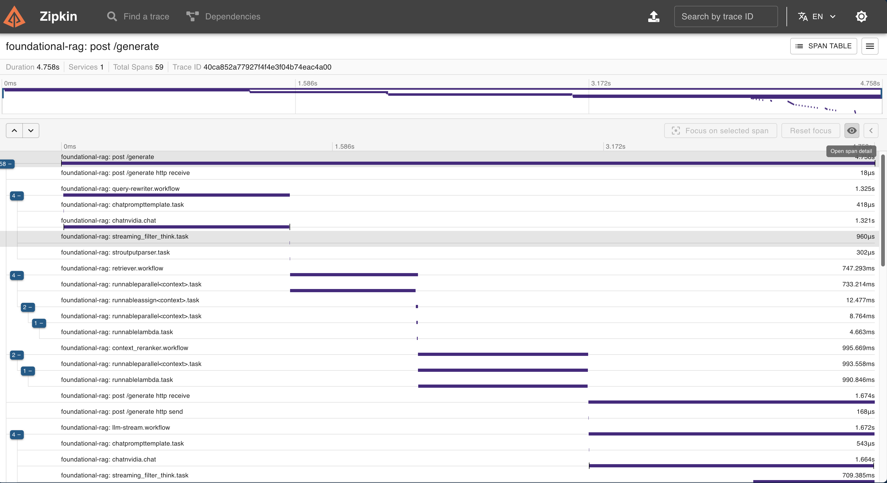

# Observability Setup for RAG Server

This guide provides step-by-step instructions to enable **tracing and observability** for the **RAG Server** using **OpenTelemetry (OTel) Collector** and **Zipkin**.

## Overview
The observability stack consists of:
- **OTel Collector** - Collects, processes, and exports telemetry data.
- **Zipkin** - Used for **visualizing traces**.

---

## Setting Up Observability

### **Step 1: Set Environment Variables**
Before starting the observability services, set the required environment variable for the **OTel Collector Config**:

From the repo root directory

```sh
export OPENTELEMETRY_CONFIG_FILE=$(pwd)/deploy/config/otel-collector-config.yaml
```

---

### **Step 2: Start the Observability Services**
Run the following command to start the **OTel Collector** and **Zipkin**:

```sh
docker-compose -f deploy/compose/observability.yaml up -d
```

---

### **Step 3: Enable Tracing in RAG Server**
The **RAG Server** needs to have tracing enabled. To do this:
- Ensure that the environment variable `APP_TRACING_ENABLED` is set to `"True"` in `docker-compose-rag-server.yaml`:

```yaml
services:
  rag-server:
    environment:
      # Tracing
      APP_TRACING_ENABLED: "True"
```

Then, start the **RAG Server** by following instructions from [Getting Started](quickstart.md)

---

## Viewing Traces in Zipkin
Once tracing is enabled and the system is running, you can **view the traces** in **Zipkin** by opening:

  <p align="center">
  
  </p>

Open the Zipkin UI at: **http://localhost:9411**  


---

## Viewing Metrics on Grafana dashboard

As part of the tracing, the RAG service also exports metrics like API request counts, LLM prompt and completion token count and words per chunk.

These metrics are exposed on the metrics endpoint exposed by Otel collector at **http://localhost:8889/metrics**

You can open Grafana UI and visualize these metrics on a dashboard by selecting data source as Prometheus and putting prometheus URL as **http://prometheus:9090**

Open the Grafana UI at **http://localhost:3000**


