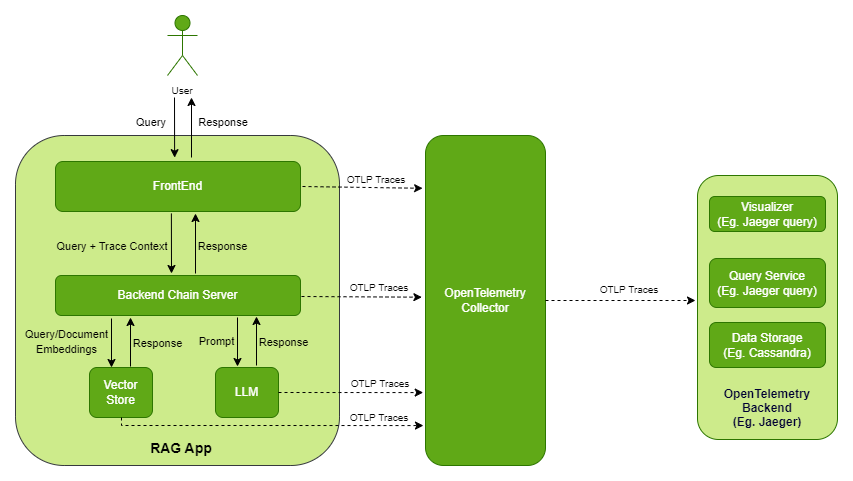

<!--
  SPDX-FileCopyrightText: Copyright (c) 2023 NVIDIA CORPORATION & AFFILIATES. All rights reserved.
  SPDX-License-Identifier: Apache-2.0

  Licensed under the Apache License, Version 2.0 (the "License");
  you may not use this file except in compliance with the License.
  You may obtain a copy of the License at

  http://www.apache.org/licenses/LICENSE-2.0

  Unless required by applicable law or agreed to in writing, software
  distributed under the License is distributed on an "AS IS" BASIS,
  WITHOUT WARRANTIES OR CONDITIONS OF ANY KIND, either express or implied.
  See the License for the specific language governing permissions and
  limitations under the License.
-->

# Observability Tool

```{contents}
---
depth: 2
local: true
backlinks: none
---
```

## Introduction

Observability is a crucial aspect that facilitates the monitoring and comprehension of the internal state and behavior of a system or application.
Applications based on RAG are intricate systems that encompass the interaction of numerous components.
To enhance the performance of these RAG-based applications, observability is an efficient mechanism for both monitoring and debugging.

The following diagram shows high-level overview of how traces are captured.



The observability stack adds following containers on top of the RAG app containers:

- OpenTelemetry Collector: Receives, processes, and exports the traces.
- Jaeger: Acts as an OpenTelemetry backend that provides storage, query service, and visualizer.
  You can configure any other OTLP-compatible backend such as [Zipkin](https://zipkin.io/), [Prometheus](https://prometheus.io/), and so on.
  To configure an alternative backend, refer to [Configuration](https://opentelemetry.io/docs/collector/configuration/) in the OpenTelemetry documentation.
- Cassandra: Provides persistent storage for traces.
  Jaeger supports many other [storage backends](https://www.jaegertracing.io/docs/1.18/deployment/#storage-backends) such as ElasticSearch, Kafka, and Badger.
  For a large scale, production deployment, the Jaeger team recommends ElasticSearch over Cassandra.

## Key terms

Span
: A unit of work within a system, encapsulating information about a specific operation (Eg. LLM call, embedding generation etc).

Traces
: The recording of a request as it goes through a system, tracking every service the request comes in contact with.
  Multiple spans make a trace logically bound by parent-child relationship.

Root Span
: The first span in a trace, denoting the beginning and end of the entire operation.

Span Attributes
: Key-value pairs a Span may consist of to provide additional context or metadata.

Collectors
: Components that process and export telemetry data from instrumented applications.

Context
: Signifies current location within the trace hierarchy.
  The context determines whether a new span initiates a trace or connects to an existing parent span.

Services
: Microservices that generates telemetry data.

The following diagram shows a typical trace for query that uses a knowledge base and identifies the spans and root span.


## Prerequisites

```{include} evaluation.md
:start-after: prerequisites-start
:end-before: prerequisites-end
```

## Build and Start the Containers

1. In the Generative AI Examples repository, edit the `deploy/compose/configs/otel-collector-config.yaml`
   and `deploy/compose/configs/jaeger.yaml` files.

   Refer to [configuration](https://opentelemetry.io/docs/collector/configuration/) in the OpenTelemetry documentation
   and the [Jaeger all-in-one with Cassandra](https://www.jaegertracing.io/docs/1.52/cli/#jaeger-all-in-one-cassandra)
   reference in the Jaeger documentation.

1. Edit the `deploy/compose/rag-app-text-chatbot.yaml` file.
   For the rag-playground and chain-server services, set the following environment variables:

   ```yaml
   environment:
     OTEL_EXPORTER_OTLP_ENDPOINT: http://otel-collector:4317
     OTEL_EXPORTER_OTLP_PROTOCOL: grpc
     ENABLE_TRACING: true
   ```

1. Deploy the developer RAG example:

   ```console
   $ docker compose --env-file deploy/compose/compose.env -f deploy/compose/rag-app-text-chatbot.yaml build
   $ docker compose --env-file deploy/compose/compose.env -f deploy/compose/rag-app-text-chatbot.yaml up -d
   ```

1. Start the Milvus vector database:

   ```console
   $ docker compose --env-file deploy/compose/compose.env -f deploy/compose/docker-compose-vectordb.yaml up -d milvus
   ```

1. Deploy the observability services:

   ```console
   $ docker compose --env-file deploy/compose/compose.env -f deploy/compose/docker-compose-observability.yaml build
   $ docker compose --env-file deploy/compose/compose.env -f deploy/compose/docker-compose-observability.yaml up -d
   ```

   *Example Output*

   ```output
   ✔ Container otel-collector              Started
   ✔ Container cassandra                   Started
   ✔ Container compose-cassandra-schema-1  Started
   ✔ Container jaeger                      Started
   ```

1. Optional: Confirm the services are started:

   ```console
   $ docker ps --format "table {{.ID}}\t{{.Names}}\t{{.Status}}"
   ```

   *Example Output*

   ```output
   CONTAINER ID   NAMES               STATUS
   beb1582320d6   jaeger              Up 5 minutes
   674c7bbb367e   cassandra           Up 6 minutes
   d11e35ee69f4   rag-playground      Up 5 minutes
   68f22b3842cb   chain-server        Up 5 minutes
   751dd4fd80ec   milvus-standalone   Up 5 minutes (healthy)
   b435006c95c1   milvus-minio        Up 6 minutes (healthy)
   9108253d058d   notebook-server     Up 6 minutes
   5315a9dc9eb4   milvus-etcd         Up 6 minutes (healthy)
   d314a43074c8   otel-collector      Up 6 minutes
   ```

1. Access the Jaeger web interface at `http://host-ip:16686` from your web browser.


## Example Traces

The following screenshots show traces from the Jaeger web interface.

- Upload document trace
  
- User query using knowledge base trace
  

## Implementation Details

The user interface web application, named the RAG playground, and the chain server, are instrumented.

### RAG Playground

The [tracing.py](https://github.com/NVIDIA/GenerativeAIExamples/blob/main/RetrievalAugmentedGeneration/frontend/frontend/tracing.py) module in the frontend application code performs the instrumentation.
At high level, the code performs the following:

- Sets up the OpenTelemetry configurations for resource name, frontend, span processor, and context propagator.
- Provides instrumentation decorator functions, `instrumentation_wrapper` and `predict_instrumentation_wrapper`, for managing trace context across different services.
  This decorator function is used with the API functions in [chat_client.py](https://github.com/NVIDIA/GenerativeAIExamples/blob/main/RetrievalAugmentedGeneration/frontend/frontend/chat_client.py) to create new span contexts.
  The span contexts can then be injected in the headers of the request made to the chain server.
  The code also logs span attributes that are extracted from the API request.

### Chain Server

The [tracing.py](https://github.com/NVIDIA/GenerativeAIExamples/blob/main/RetrievalAugmentedGeneration/common/tracing.py) module in the chain server application code is responsible for instrumentation.
At high level, the code performs the following:

- Sets up the OpenTelemetry configurations for resource name, chain-server, span processor, and context propagator.
- Initializes the [LlamaIndex OpenTelemetry callback handler](https://github.com/NVIDIA/GenerativeAIExamples/blob/main/tools/observability/llamaindex/opentelemetry_callback.py).
  The callback handler uses [LlamaIndex callbacks](https://docs.llamaindex.ai/en/stable/module_guides/observability/callbacks/root.html) to track various events such as LLM calls, chunking, embedding, and so on.
- Provides an instrumentation decorator function, `instrumentation_wrapper`, for managing trace context across different services.
  This decorator function is used with the API functions in [server.py](https://github.com/NVIDIA/GenerativeAIExamples/blob/main/RetrievalAugmentedGeneration/common/server.py) to extract the trace context that is present in requests from the frontend service and attach it in the new span created by the chain-server.

The instrumentation decorator function, `instrumentation_wrapper`, can be used to instrument any LlamaIndex application as long as LlamaIndex OpenTelemetry callback handler, `opentelemetry_callback.py`, is set as global handler in the application.
