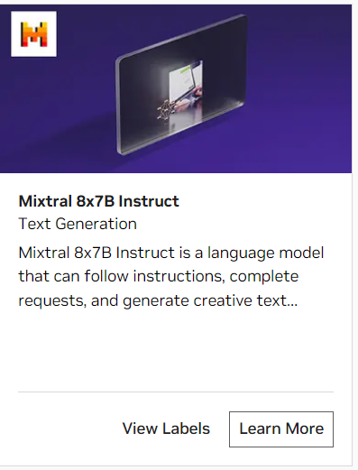
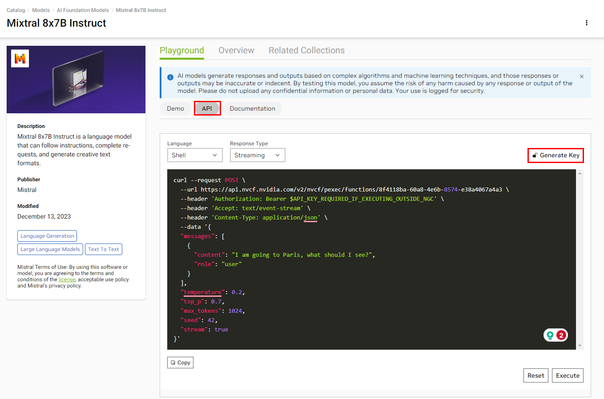

# NVIDIA AI Foundation

**NVIDIA AI Foundation** lets developers to experience state of the art LLMs accelerated by NVIDIA. Developers get **free credits for 10K requests** to any of the available models.

## Prepare the environment

1.  Navigate to https://catalog.ngc.nvidia.com/ai-foundation-models.

2. Find the <i>Mixtral x7B</i> model icon and click ``Learn More``.



3. Select the ```API``` navigation bar and click on the ```Generate key``` option..



4. Save the generated API key.

## Deploy

1.  Clone the Generative AI examples Git repository.

> ⚠️ **NOTE**: This example requires Git Large File Support (LFS)

```
$ sudo apt -y install git-lfs
$ git clone git@github.com:NVIDIA/GenerativeAIExamples.git
Cloning into 'GenerativeAIExamples'...
$ cd GenerativeAIExamples/
$ git lfs pull
```

2. Add your NGC API key to <i>compose.env</i> to use the NVIDIA endpoint.

```
$ cd GenerativeAIExamples

$ grep NVIDIA_API_KEY deploy/compose/compose.env
 export NVIDIA_API_KEY="nvapi-*"
```

3. Set the nv-ai-foundation example in <i>compose.env</i>.
```
 export RAG_EXAMPLE="nvidia_ai_foundation"
```
4. Deploy the developer RAG example via Docker compose.

```
$ source deploy/compose/compose.env ; docker compose -f deploy/compose/docker-compose-nv-ai-foundation.yaml build

$ docker compose -f deploy/compose/docker-compose-nv-ai-foundation.yaml up -d

$ docker ps --format "table {{.ID}}\t{{.Names}}\t{{.Status}}"
CONTAINER ID   NAMES             STATUS
70ef27ae4c91   llm-playground    Up 56 seconds
4aacfbe89464   chain-server      Up 56 seconds
```

## Test

1. Follow steps 1 - 5 in the ["Test" section of example 02](../../RetrievalAugmentedGeneration/README.md#23-test).

