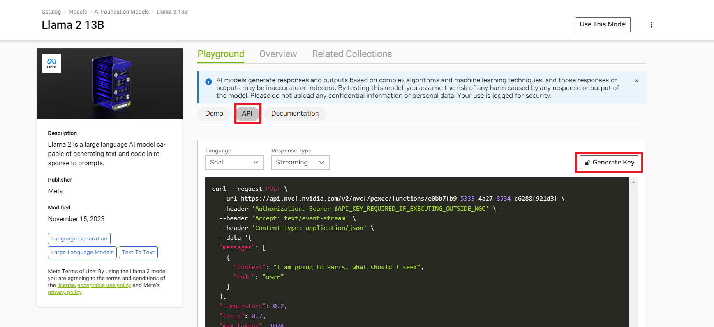

# NVIDIA AI Playground

**NVIDIA AI Playground** on NGC allows developers to experience state of the art LLMs accelerated on NVIDIA DGX Cloud with NVIDIA TensorRT nd Triton Inference Server. Developers get **free credits for 10K requests** to any of the available models. Sign up process is easy.

**Setup**

Please follow the instruction below to get access to AI playground API key

* Navigate to https://catalog.ngc.nvidia.com/ai-foundation-models
* Select any of the available models and click on learn more


* Select the ```API``` navigation bar and click on the ```Generate key``` option as shown below.



* Copy the generated key over to a safe place.


## Using Nvdia Cloud based LLM's

#### Step 1: Sign up to AI playground

- Follow the [above](#nvidia-ai-playground) instructions to get access to an API key.

#### Step 2: Set Environment Variables

- Modify ``compose.env`` in the ``deploy/compose`` directory to set your environment variables. The following variable is required.
```
  export AI_PLAYGROUND_API_KEY="nvapi-*"
```

#### Step 3: Build and Start Containers
- Pull lfs files. This will pull large files from repository.
    ```
        git lfs pull
    ```
- Run the following command to build containers.
    ```
        source deploy/compose/compose.env;  docker compose -f deploy/compose/docker-compose-playground.yaml build
    ```

- Run the following command to start containers.
    ```
        source deploy/compose/compose.env; docker compose -f deploy/compose/docker-compose-playground.yaml up -d
    ```

#### Step 4: Try out queries with the deployed pipeline
- Interact with the pipeline using UI as as mentioned [here.](../../RetrievalAugmentedGeneration/README.md#step-4-run-the-sample-web-application)

- Example [notebook 6](../../notebooks/06_AI_playground.ipynb) showcases the usage of AI Playground based LLM. You can access the notebook server at `http://host-ip:8888` from your web browser.


## Using Nvidia Cloud based Embedding models

#### Step 1: Sign up to AI playground

- Follow the [above](#nvidia-ai-playground) instructions to get access to an API key.

#### Step 2: Set Environment Variables

- Modify ``compose.env`` in the ``deploy/compose`` directory to set your environment variables. The following variables are required. Provide your API key for NV playground and absolute path to [config.yaml](../../deploy/compose/config.yaml) file.
```
    export AI_PLAYGROUND_API_KEY="YOUR_NV_PLAYGROUND_API_KEY"
    export APP_CONFIG_FILE="ABSOLUTE PATH TO config.yaml"
```

If you want to use the on-prem deployed LLM model provide the values of below variables as well:
```
    # full path to the local copy of the model weights
    export MODEL_DIRECTORY="PATH TO MODEL CHECKPOINT DIrECTORY"

    # the architecture of the model. eg: llama
    export MODEL_ARCHITECTURE="llama"

    # the name of the model being used - only for displaying on frontend
    export MODEL_NAME="llama-2-13b-chat"
```

#### Step 3: Update Config file
- Update the embedding model name and model engine in [config.yaml](../../deploy/compose/config.yaml)

    ```
        embeddings:
          model_name: nvolve
          model_engine: ai-playground
    ```

#### Step 4: Build and Start Containers
- Run the following command to build containers and start container if you want to use on-prem LLM model with playground based embedding model.
    ```
        source deploy/compose/compose.env;  docker compose -f deploy/compose/docker-compose.yaml build
        docker compose -f deploy/compose/docker-compose.yaml up -d
    ```

Alternatively, run the following command to build and start the containers if you want to use playground based LLM model with playground based embedding model.
```
    source deploy/compose/compose.env;  docker compose -f deploy/compose/docker-compose-playground.yaml build
    docker compose -f deploy/compose/docker-compose-playground.yaml up -d
```

#### Step 5: Try out queries with the deployed pipeline
- Interact with the pipeline using UI by following the steps mentioned [here.](../../RetrievalAugmentedGeneration/README.md#step-4-run-the-sample-web-application)