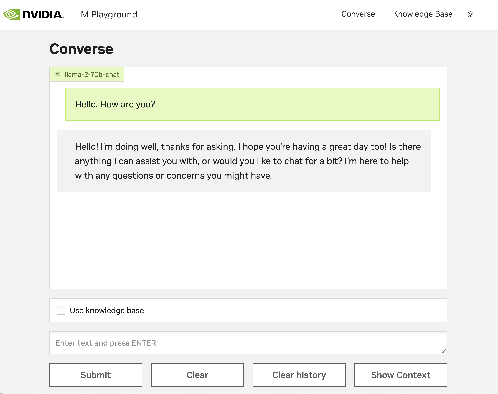

# Web Frontend
------------
The web frontend provides a UI on top of the [RAG chat server APIs](./chat_server.md).
- Users can chat with the LLM and see responses streamed back.
- By selecting “Use knowledge base,” the chatbot returns responses augmented with the data that’s been stored in the vector database.
- To store content in the vector database, change the window to “Knowledge Base” in the upper right corner and upload documents.



# Frontend structure

At its core, llm-playground is a FastAPI server written in Python. This FastAPI server hosts two [Gradio](https://www.gradio.app/) applications, one for conversing with the model and another for uploading documents. These Gradio pages are wrapped in a static frame created with the Kaizen UI React+Next.js framework and compiled down to static pages. Iframes are used to mount the Gradio applications into the outer frame.

# Running the web UI
If the web frontend needs to be stood up manually for development purposes, run the following commands:

- Build the web UI container from source
```
  source deploy/compose/compose.env
  docker compose -f deploy/compose/docker-compose.yaml build frontend
```
- Run the container which will start the server
```
  source deploy/compose/compose.env
  docker compose -f deploy/compose/docker-compose.yaml up frontend
```

- Open the web application at ``http://host-ip:8090``

Note:
- If multiple pdf files are being uploaded the expected time of completion as shown in the UI may not be correct.


