## Downloading Model from huggingface

- Visit the Hugging Face Models Hub at https://huggingface.co/models

- Search for the "llama-2" model in search bar.
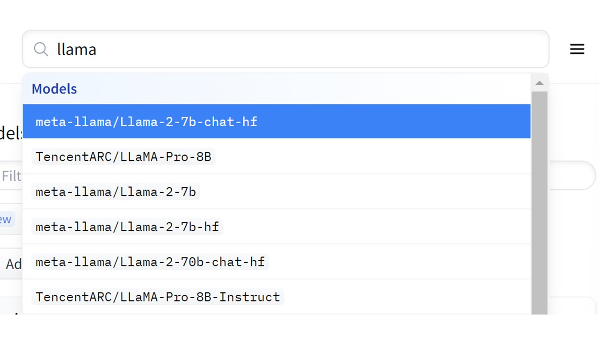

- Choose the specific model you wish to download; for instance, let's select "llama-2-13b-chat-hf."

- If you haven't already, sign up or log in to your Hugging Face account.
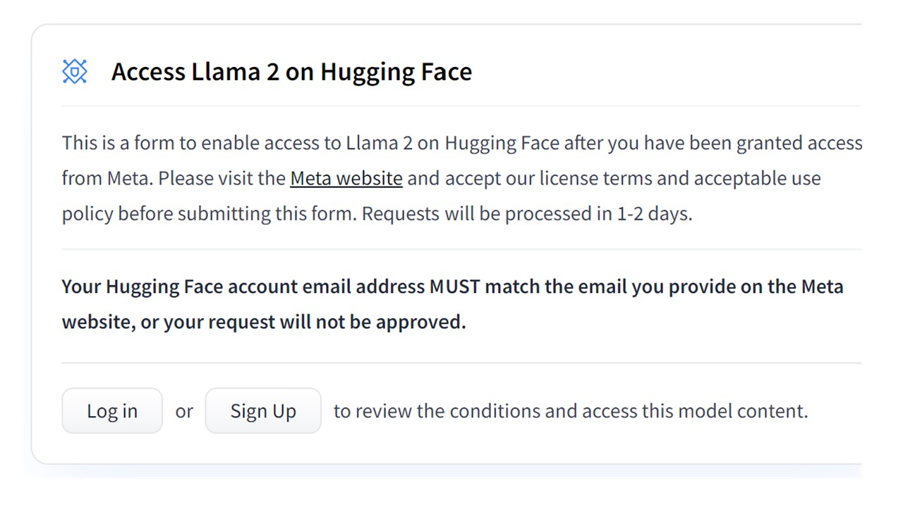

- Agree to the terms and conditions provided.
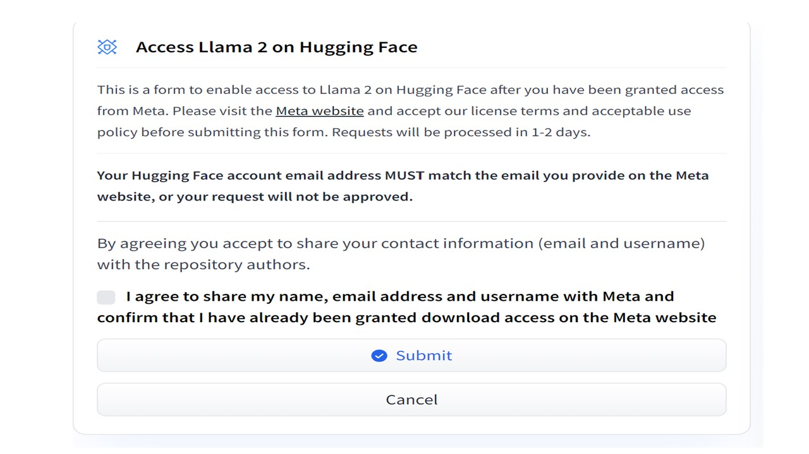

- Confirm that your request to access the repository is successful.
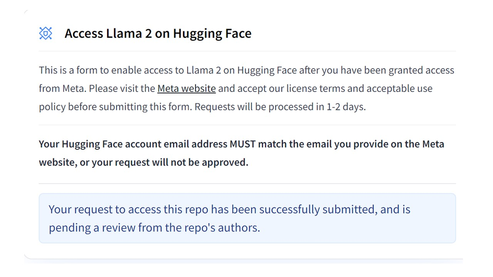

- Complete the meta form by clicking on the link `Meta website` link mentioned in the previous steps.
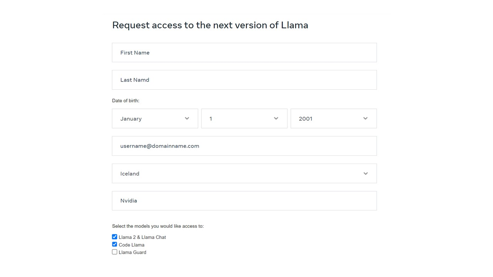

- Navigate to the "Files" section, which displays the available files. If you don't have access, it will be indicated like below.
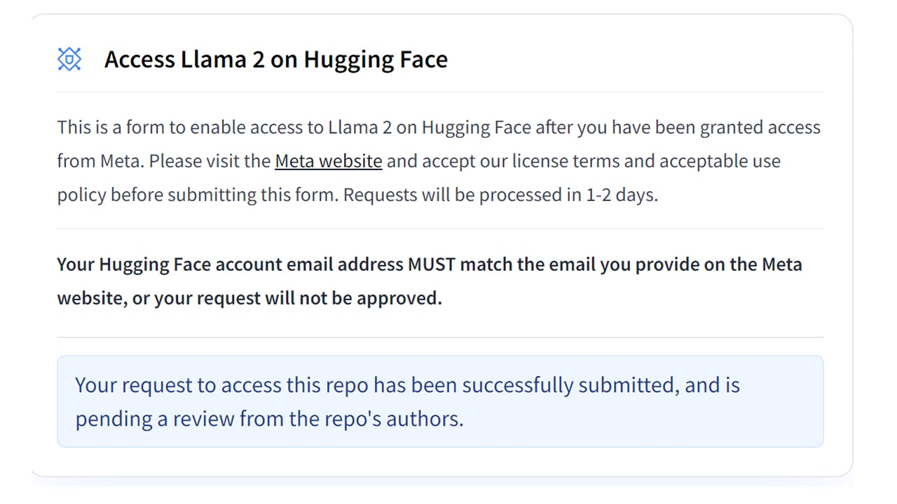

- Upon obtaining the necessary permissions, you will see all the files associated with the model on Hugging Face.
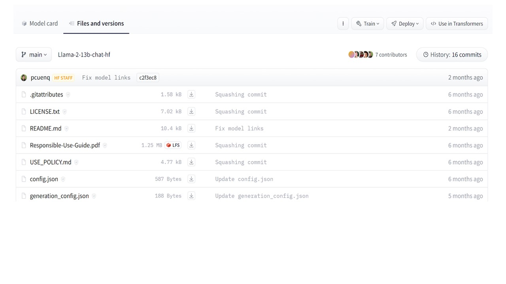

- Click on the three dots (...) next to the train.
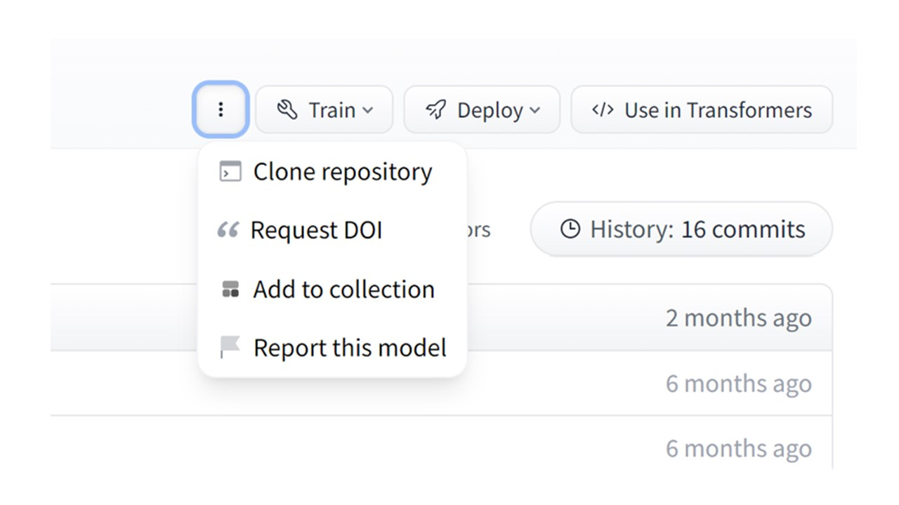

- Select "Clone repository," which will prompt the following:
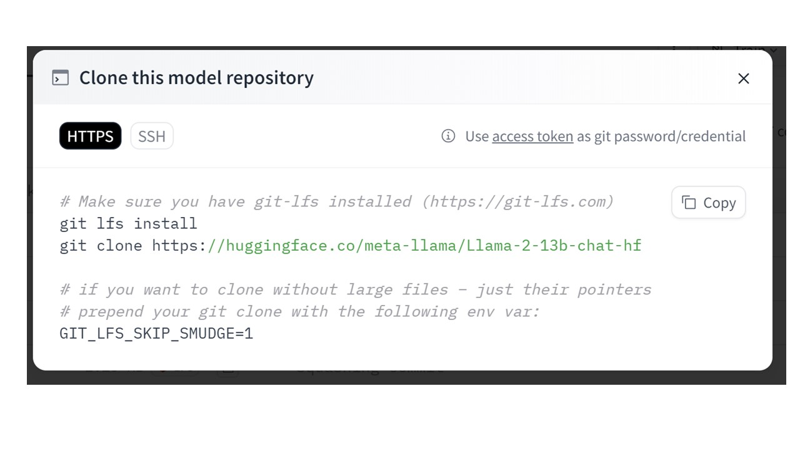

- Execute the provided command in your terminal. When prompted, enter your Hugging Face username and token.
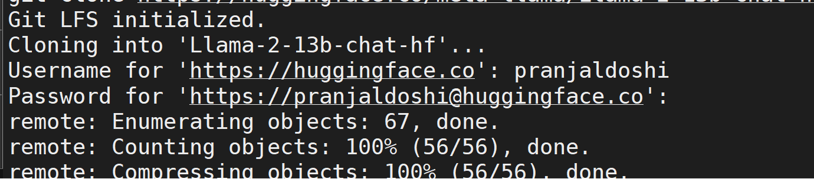

- In the password section, insert your token. If you haven't generated a token, you can do so in the Hugging Face settings.

- Access the "Access Tokens" section in the right panel.
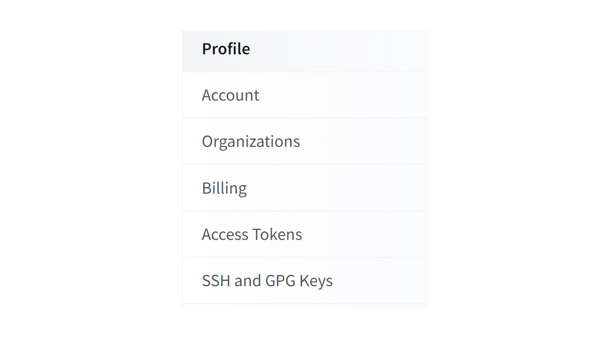

- Generate a new token or copy an existing one.
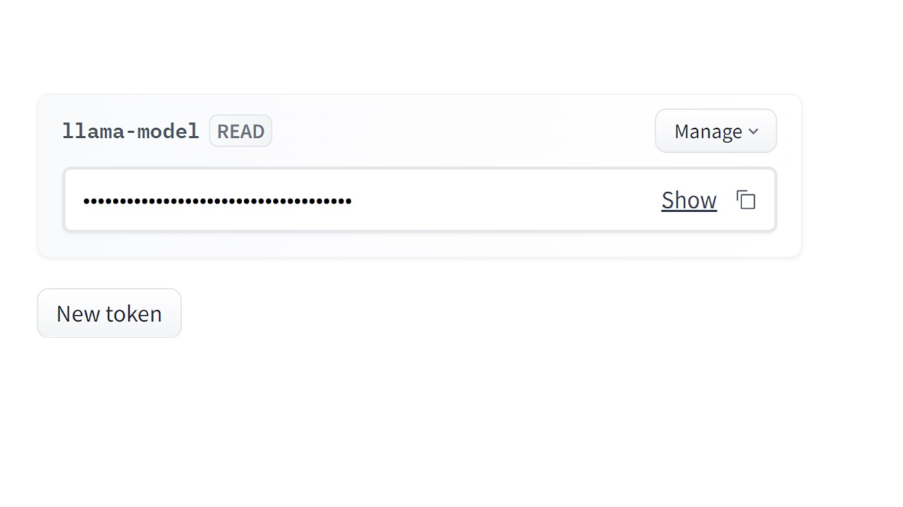

- Paste the token into your terminal.

- You may be asked for your username and password multiple times; provide the required information.

- The terminal will initiate the download process for the model. This may take some time as it involves downloading checkpoints.

- Once the download is complete, you will be able to view the contents of the downloaded model.

