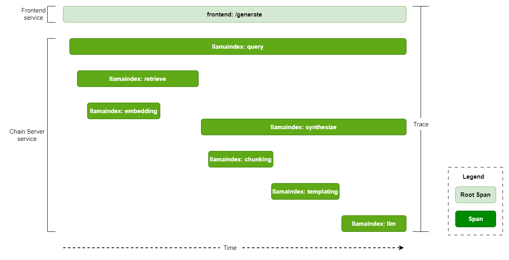

# RAG Observability Tool
## Introduction
Observability is a crucial aspect that facilitates the monitoring and comprehension of the internal state and behavior of a system or application. Applications based on RAG are intricate systems encompassing the interaction of numerous components. To enhance the performance of these RAG-based applications, observability serves as an efficient mechanism for both monitoring and debugging.

Following diagram shows high level workflow of how traces are captured in the RAG Example


The observability stack adds following containers on top of the RAG app containers:
1. **OpenTelemetry Collector**: Responsible for receiving, processing and exporting the traces.
2. **Jaeger**: Acts as OpenTelemetry backend providing storage, query service and visualizer. You can also configure any other OTLP compatible backend such as [Zipkin](https://zipkin.io/), [Prometheus](https://prometheus.io/) etc. To configure any other backend refer to [OpenTelemetry Collector configuration](https://opentelemetry.io/docs/collector/configuration/).
3. **Cassandra**: Persistent storage for traces. Jaeger supports many other [storage backends](https://www.jaegertracing.io/docs/1.18/deployment/#storage-backends) like ElasticSearch, Kafka, and Badger. Please note that for large scale production deployment the Jaeger team recommends Elasticsearch backend over Cassandra .

## Key terms
1. **Span**: A unit of work within a system, encapsulating information about a specific operation (Eg. LLM call, embedding generation etc).
2. **Traces**: The recording of a request as it goes through a system, tracking every service the request comes in contact with. Multiple spans make a trace logically bound by parent-child relationship.
3. **Root Span**: The first span in a trace, denoting the beginning and end of the entire operation.
4. **Span Attributes**: Key-value pairs a Span may consist of to provide additional context or metadata.
5. **Collectors**: Components that process and export telemetry data from instrumented applications.
6. **Context**: Signifies current location within the trace hierarchy. It determines whether a new span initiates a trace or connects to an existing parent span.
7. **Services**: Microservices that generates telemetry data

Following diagram depicts a typical trace for user query from knowledge base in our RAG example.


## Deploy
1.  Clone the Generative AI examples Git repository.

> ⚠️ **NOTE**: This example requires Git Large File Support (LFS)

```
$ sudo apt -y install git-lfs
$ git clone git@github.com:NVIDIA/GenerativeAIExamples.git
Cloning into 'GenerativeAIExamples'...
$ cd GenerativeAIExamples/
$ git lfs pull
```
2. Update the [OpenTelemetry collector configurations](../../deploy/compose/configs/otel-collector-config.yaml) and [jaeger configurations](../../deploy/compose/configs/jaeger.yaml).

To know more about available configurations please refer to [OpenTelemetry Collector configurations](https://opentelemetry.io/docs/collector/configuration/) and [Jaeger configurtions](https://github.com/jaegertracing/documentation/blob/main/data/cli/1.52/jaeger-all-in-one-cassandra.yaml)

3. Update the [compose.env](../../deploy/compose/compose.env).

4. For the frontend and query services, set the following environment variables in the [docker compose file](../../deploy/compose/docker-compose.yaml):
```
environment:
    OTEL_EXPORTER_OTLP_ENDPOINT: http://otel-collector:4317
    OTEL_EXPORTER_OTLP_PROTOCOL: grpc
    ENABLE_TRACING: true
```

5. Deploy the developer RAG example via Docker compose.
```
$ source deploy/compose/compose.env;  docker compose -f deploy/compose/docker-compose.yaml build

$ docker compose -f deploy/compose/docker-compose.yaml up -d

$ docker ps --format "table {{.ID}}\t{{.Names}}\t{{.Status}}"
CONTAINER ID   NAMES               STATUS
d11e35ee69f4   llm-playground      Up 5 minutes
68f22b3842cb   chain-server        Up 5 minutes
751dd4fd80ec   milvus-standalone   Up 5 minutes (healthy)
b435006c95c1   milvus-minio        Up 6 minutes (healthy)
9108253d058d   notebook-server     Up 6 minutes
5315a9dc9eb4   milvus-etcd         Up 6 minutes (healthy)
```

6. Deploy the observability services
```
$ docker compose -f deploy/compose/docker-compose-observability.yaml build

$ docker compose -f deploy/compose/docker-compose-observability.yaml up -d

$ docker ps --format "table {{.ID}}\t{{.Names}}\t{{.Status}}"
CONTAINER ID   NAMES               STATUS
beb1582320d6   jaeger              Up 5 minutes
674c7bbb367e   cassandra           Up 6 minutes
d11e35ee69f4   llm-playground      Up 5 minutes
68f22b3842cb   chain-server        Up 5 minutes
751dd4fd80ec   milvus-standalone   Up 5 minutes (healthy)
b435006c95c1   milvus-minio        Up 6 minutes (healthy)
9108253d058d   notebook-server     Up 6 minutes
5315a9dc9eb4   milvus-etcd         Up 6 minutes (healthy)
d314a43074c8   otel-collector      Up 6 minutes
```
7. Access the Jaeger UI at `http://host-ip:16686` from your web browser.

Below are the screenshots showcasing trace data from the Jaeger UI.

- Upload document trace:

- User query using knowledge base trace:


## Implementation Details
Currently 2 services viz. frontend and chain-server are instrumented.
### frontend
[tracing.py](../../RetrievalAugmentedGeneration/frontend/frontend/tracing.py) module in frontend application code is responsible for instrumentation. At high level it does the following:
- Set up the OpenTelemetry configurations for resource name (i.e frontend), span processor and context propagator
- Provides an instrumentation decorator functions(`instrumentation_wrapper` and `predict_instrumentation_wrapper`) for managing trace context across different services. This decorator function is used with the API functions in [chat_client.py](../../RetrievalAugmentedGeneration/frontend/frontend/chat_client.py) to create new span contexts (that can then be injected in the headers of the request made to the chain server) and log span attributes extracted from the API request.

### chain-server
[tracing.py](../../RetrievalAugmentedGeneration/common/tracing.py) module in the chain server application code is responsible for instrumentation. At high level it does the following:
- Set up the OpenTelemetry configurations for resource name(i.e chain-server), span processor and context propagator
- Initialize the [LlamaIndex OpenTelemetry callback handler](../../tools/observability/llamaindex/opentelemetry_callback.py) which uses [LlamaIndex callbacks](https://docs.llamaindex.ai/en/stable/module_guides/observability/callbacks/root.html) to track various events like llm calls, chunking, embedding etc
- Provides an instrumentation decorator function (`instrumentation_wrapper`) for managing trace context across different services. This decorator function is used with the API functions in [server.py](../../RetrievalAugmentedGeneration/common/server.py) to extract the trace context present in requests from the frontend service and attach it in the new span created by chain-server.

**NOTE**: Instrumentation decorator function (`instrumentation_wrapper`) can be used for instrumenting any LlamaIndex application as long as [LlamaIndex OpenTelemetry callback handler](../../tools/observability/llamaindex/opentelemetry_callback.py) is set as global handler in it.
