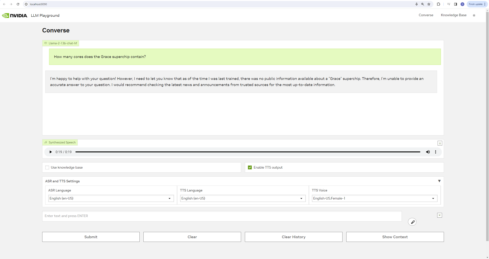
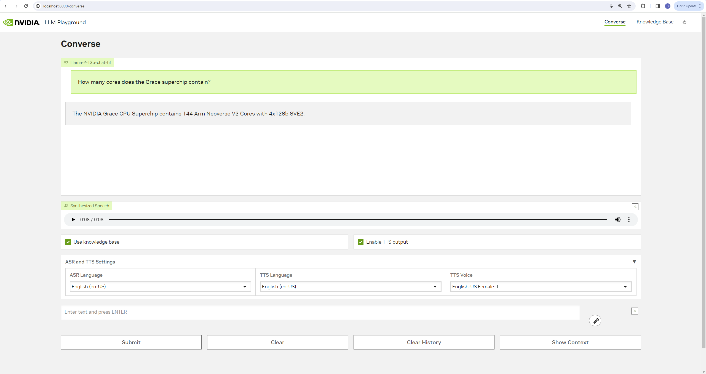

<!--
  SPDX-FileCopyrightText: Copyright (c) 2023 NVIDIA CORPORATION & AFFILIATES. All rights reserved.
  SPDX-License-Identifier: Apache-2.0
-->

# Using the Sample Chat Web Application

<!-- TOC -->

* [Access the Web Application](#access-the-web-application)
* [Use Unstructured Documents as a Knowledge Base](#use-unstructured-documents-as-a-knowledge-base)
* [Troubleshooting](#troubleshooting)

<!-- /TOC -->

## Access the Web Application

- Connect to the sample web application at <http://localhost:8090>.

  

## Use Unstructured Documents as a Knowledge Base

1. Optional: If you configured your deployment with NVIDIA Riva, check **[X] Enable TTS output** to enable the web application to read aloud the answers to your queries.

   Select the desired ASR language (`English (en-US)` for this test), TTS language (`English (en-US)` for this test) and TTS voice from the dropdown menus below the checkboxes to use the voice-to-voice interaction capabilities.

1. On the **Converse** tab, enter "How many cores does the Grace superchip contain?" in the chat box and click **Submit**.

   Alternatively, click on the microphone button to the right of the text box and ask the question verbally.

   

1. Upload the sample data to the knowledge base.

   Click the **Knowledge Base** tab and then click **Add File**.

   Navigate to the `dataset.zip` file that is located in the `notebooks` directory. Unzip the archive and upload the PDFs.

1. If you want to remove a file from knowledge base, select the file name from **Knowledge Base** tab and click **Delete**.

1. Return to **Converse** tab and select **[X] Use knowledge base**.

1. Reenter the question: "How many cores does the Grace superchip contain?"

   

   ```{tip}
   The default prompts are optimized for Llama chat model.
   If you use a completion model, then you must fine tune the prompts.
   ```

## Troubleshooting

If you receive the following "Media devices could not be accessed" error message when you first attempt to transcribe a voice query, perform the following steps.


1. Open another browser tab and enter `chrome://flags` in the location field.

1. Enter `insecure origins treated as secure` in the search field.

   

1. Enter `http://<host-ip>:8090` in the text box and select **Enabled** from the menu.

1. Click **Relaunch**.

1. After the browser opens, grant `http://host-ip:8090` access to your microphone.

1. Retry your request.
